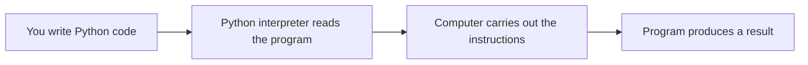

# What Is Python?

> **A beginner-friendly first chapter about Python**  
> Learn what Python is, what a programming language does, how Python runs your instructions, and where it is useful.

---

## The one-minute picture

Python is a **programming language**: a structured way for people to write instructions that a computer can carry out. A Python program is made of instructions written using Python's rules. The Python interpreter runs those instructions.



A simple program might display a message:

```python
print("Hello from Python!")
```

The code tells Python to display text. Python follows the instruction and the message appears as output.

---

## 1. What does “programming language” mean?

A computer can perform many operations, but it needs instructions in a form it can process. A programming language provides a set of rules for writing those instructions.

A program is like a recipe:

```text
1. Get the ingredients.
2. Mix them.
3. Bake the mixture.
```

A computer program follows the same idea, but its steps may calculate a result, display information, save data, or respond to a user's choices.

```python
print("Step 1: Open the Python guide")
print("Step 2: Read one section")
print("Step 3: Try the examples")
```

Python follows the statements in order. It does not guess missing instructions or infer what you meant; the code must follow the language's rules.

---

## 2. Why is Python called Python?

The language's name comes from the British comedy group **Monty Python**, not from the snake. The name is why Python examples and documentation sometimes include playful references to the comedy group.

The snake is still a familiar symbol for Python, but it is not the source of the language's name.

---

## 3. What makes Python distinctive?

### Readable syntax

Python aims to make many programs easy to read. For example, a loop over a list can look close to the way we describe the task:

```python
for topic in ["Strings", "Lists", "Functions"]:
    print(topic)
```

This says: for each topic in the collection, print that topic. The code is still precise: punctuation and indentation have meaning.

### Indentation marks blocks

Python uses indentation to show which instructions belong together. The indented `print` belongs to the `for` loop:

```python
for topic in ["Strings", "Lists"]:
    print(topic)  # part of the loop

print("Finished")  # outside the loop
```

Indentation is part of Python syntax, not merely visual formatting. Four spaces per indentation level is the common convention.

### A large ecosystem

Python includes a standard library for common tasks, and many additional packages are available for specialized work. This means you can often build on tools other people have already written.

---

## 4. What is the Python interpreter?

The **Python interpreter** is the program that runs Python code. When you ask Python to run a file, the interpreter checks the code and executes its instructions.

A beginner-friendly picture is:

```text
Python file (.py) → Python interpreter → instructions run → result
```

For example, save this as `hello.py`:

```python
print("Hello!")
```

Then run it in a terminal:

```text
python hello.py
```

Depending on your computer, you may use `python3 hello.py` or `py hello.py` instead. Python's implementation has internal stages, including compilation to bytecode; for a first understanding, what matters is that you run the `.py` program using a Python interpreter.

---

## 5. What does Python code look like?

A Python program is made from statements. A statement is an instruction Python can execute.

```python
learner = "Ada"
print(f"Welcome, {learner}!")
```

The first statement stores a value under the name `learner`. The second displays a greeting using that value.

Python code can include:

- **values**, such as `42`, `3.5`, and `"hello"`;
- **names**, such as `learner` and `score`;
- **operators**, such as `+` and `==`;
- **functions**, such as `print()`;
- **decisions and repetition**, such as `if` and `for`;
- **comments**, which are notes for people reading the code.

These ideas become the building blocks for larger programs.

---

## 6. What can Python be used for?

Python is a general-purpose language. People use it in many areas, including:

| Area | Example task |
|---|---|
| Automation | Rename files or organize repetitive work |
| Web development | Build web applications and services |
| Data analysis | Clean, summarize, and visualize data |
| Artificial intelligence | Work with machine-learning tools and models |
| Scientific computing | Analyze experiments and perform calculations |
| Education | Learn programming concepts through readable examples |
| Testing and tooling | Check software behavior or build developer utilities |

Python is not automatically the best choice for every task. The right language depends on the problem, the tools available, and the environment in which the program must run.

---

## 7. Python is not magic

Python makes many tasks approachable, but it does not remove the need to reason carefully.

- The computer follows the instructions you wrote, not the instructions you intended.
- Misspelled names or invalid syntax can stop a program.
- Different types of values support different operations.
- A program may need input validation, error handling, and testing.
- Large tasks still need to be broken into smaller understandable steps.

Python's readability helps people understand programs; it does not mean the computer understands ordinary English.

---

## 8. A tiny first example, read step by step

```python
name = "Ada"
message = f"Hello, {name}!"
print(message)
```

What happens?

1. `"Ada"` is a text value.
2. `name = "Ada"` gives that value the name `name`.
3. The f-string builds the text `"Hello, Ada!"` and stores it as `message`.
4. `print(message)` displays the result.

Output:

```text
Hello, Ada!
```

This tiny program already demonstrates an important pattern: store information, use it to create a result, and show the result.

---

## 9. A practical mini-project: a Python welcome message

This short program asks for a name and uses it in a greeting:

```python
name = input("What is your name? ")
print(f"Welcome to Python, {name}!")
```

Example interaction:

```text
What is your name? Ada
Welcome to Python, Ada!
```

The user supplies information, the program uses it to create a sentence, and `print()` displays that sentence. In the next chapters, we can unpack variables, input, and f-strings in much greater detail.

---

## 10. Common beginner questions

### Is Python the same thing as the Python interpreter?

No. Python is the language and its ecosystem; the interpreter is a program that runs Python code.

### Is Python only for beginners?

No. It is approachable for learning, and it is also used for professional and research work.

### Does Python understand English?

No. Python syntax may be readable, but it is still formal code with precise rules.

### Do I need to memorize everything before building something?

No. Learn the foundations, practice small examples, and look up details as you need them. Programming skill grows through using concepts to solve problems.

### Does every computer already have the same Python setup?

No. Python versions and installations vary. The interpreter and project environment used to run a program matter; setup is covered in the packages and virtual environments chapter.

---

## 11. Quick reference map

```text
PYTHON          a programming language and ecosystem
PROGRAM         instructions written according to Python rules
SOURCE FILE     commonly a .py file
INTERPRETER     program that runs Python code
STATEMENT       one instruction Python can execute
INDENTATION     spaces that show which statements belong to a block
OUTPUT          information displayed or produced by the program
```

### The most important mental checklist

1. **What instructions am I giving the computer?** Make each step clear.
2. **What runs those instructions?** A Python interpreter.
3. **Does the code follow Python's syntax and indentation rules?** They matter.
4. **What result should the program produce?** Be able to describe the expected output.
5. **Can I break the task into smaller steps?** That is how larger programs become manageable.

---

## 12. Practice (answers below)

1. What is Python?
2. What does a Python interpreter do?
3. What is a `.py` file?
4. Why does indentation matter in Python?
5. Is Python's name taken from the snake?
6. Name two areas where Python is used.
7. Does readable syntax mean Python is ordinary English?
8. In the greeting example, what does `print()` do?

<details>
<summary><strong>Show the answers</strong></summary>

1. A programming language used to write instructions a computer can execute.
2. It runs Python code.
3. A file that contains Python source code.
4. It shows which statements belong together in a block and is part of the syntax.
5. No. It was named after Monty Python; the snake is a symbol associated with it.
6. Examples include automation, web development, data analysis, AI, science, education, and testing.
7. No. Python has precise syntax rules even when the code is readable.
8. It displays information.

</details>

---

## Final idea

Python is a language for writing precise instructions, and the Python interpreter runs those instructions. Its readable syntax and broad ecosystem make it useful for learning and for many real-world tasks. Every larger Python program begins with the same basic cycle: write instructions, run them, inspect the result, and improve the code.
