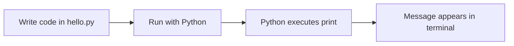

# My First Python Program

> **A complete beginner-friendly chapter on writing and running your first program**  
> Create a `.py` file, run it, understand every part of the code, and learn how to fix common first-run problems.

---

## The one-minute picture

Your first program can be a single instruction: ask Python to display a message. You write that instruction in a `.py` file, then run the file using the Python interpreter.



The program:

```python
print("Hello, world!")
```

The result:

```text
Hello, world!
```

---

## 1. What you need

To create and run a Python program, you need:

1. **Python** installed on your computer, including its interpreter.
2. A **text editor** or code editor where you can write code.
3. A **terminal** (also called a command line) where you can run the file.

VS Code can provide both an editor and an integrated terminal. Other editors work too. The important thing is to save the code as plain text with a `.py` file extension.

Check that Python is available by opening a terminal and trying one of these commands:

```text
python --version
python3 --version
py --version
```

The available command depends on your operating system and installation. A successful command prints a Python version, for example `Python 3.x.x`.

---

## 2. Create the file

Create a new file called:

```text
hello.py
```

The name `hello` can be changed, but keep the `.py` ending. That ending tells people and tools that the file contains Python source code.

Type this line exactly:

```python
print("Hello, world!")
```

Save the file. In most editors, the save shortcut is `Ctrl+S` on Windows/Linux or `Cmd+S` on macOS.

---

## 3. Understand every piece of the program

```python
print("Hello, world!")
```

- `print` is the name of a built-in Python function.
- `(` begins the function call's input.
- `"Hello, world!"` is a text value, called a **string**.
- `)` ends the function call.

When Python runs the line, it calls `print` and passes it the text. `print` displays that text in the terminal.

The quotation marks tell Python where the text begins and ends. They are not shown as part of the printed message.

Single quotes work too:

```python
print('Hello, world!')
```

Use matching quote marks at the beginning and end.

---

## 4. Run the program in a terminal

First, open a terminal in the folder where `hello.py` is saved. Then run the file using a Python command:

```text
python hello.py
```

If that command is not available, try:

```text
python3 hello.py
```

On many Windows installations, this may work:

```text
py hello.py
```

If it runs successfully, the terminal displays:

```text
Hello, world!
```

The terminal prompt returns after the program finishes. A one-line program runs quickly, so it may look like nothing happened except the output appeared.

---

## 5. Run it from VS Code

A common VS Code workflow is:

1. Open the folder containing `hello.py`.
2. Open the file and save it.
3. Open the integrated terminal from the **Terminal** menu.
4. Confirm the terminal is in the folder containing the file.
5. Run `python hello.py` (or the command that works on your system).

VS Code may also show a run button for Python files when its Python support is set up. Running through the terminal is useful to learn because the same method works in many editors.

---

## 6. Add more instructions

A program can contain multiple statements. Python normally runs them from top to bottom.

```python
print("Starting the program")
print("Python is running this line second")
print("Now the program is finished")
```

Output:

```text
Starting the program
Python is running this line second
Now the program is finished
```

Each `print()` call displays its information and moves to a new line by default.

---

## 7. Print different kinds of values

For your first program, it is helpful to see that `print()` can display more than text.

```python
print("A message")
print(42)
print(3.5)
print(True)
```

Output:

```text
A message
42
3.5
True
```

Text needs quotes in the code. Numbers and Boolean values are written without quotes. These are different values:

```python
print(42)    # the number forty-two
print("42")  # the text characters 4 and 2
```

They may look similar on screen, but Python treats them as different types. We will study types as their own topic.

---

## 8. Use comments to leave a note

A `#` begins a comment. Python ignores the comment text and runs the code around it.

```python
# This program greets the learner.
print("Hello, Python learner!")  # display a greeting
```

Comments are useful for explaining why code is written a certain way. Avoid adding comments that simply repeat an obvious instruction.

---

## 9. Make the output look different

`print()` can display several values. By default, it separates them with spaces:

```python
print("Hello", "Ada")
```

Output:

```text
Hello Ada
```

You can choose a different separator with `sep`:

```python
print("2026", "09", "28", sep="-")
```

Output:

```text
2026-09-28
```

Normally, each `print()` ends with a newline. The `end` argument changes what is placed after the output:

```python
print("Loading", end="...")
print("done")
```

Output:

```text
Loading...done
```

These options are useful, but the basic `print("message")` form is enough for many first programs.

---

## 10. A first interactive program

`input()` displays a prompt and waits for a person to type a response. This small program asks for a name, then prints a greeting:

```python
name = input("What is your name? ")
print("Hello,", name)
```

Example interaction:

```text
What is your name? Ada
Hello, Ada
```

The program pauses at `input()` until the person types a response and presses Enter. The response is used by the next line. We will explore variables and input in detail in their own chapters; for now, focus on the program's sequence: ask, receive, display.

---

## 11. Common first-run errors

### `python` command is not found

Try `python3` or `py`. If none work, Python may need to be installed or added to your system's PATH.

### `can't open file 'hello.py'`

The terminal is probably in a different folder from the file, or the file has a different name. Check the folder and exact spelling. You can open a terminal from the project folder in your editor.

### The file is actually `hello.py.txt`

Some systems hide file extensions. Make sure the actual filename ends in `.py`, not `.py.txt`.

### Missing quotes or parentheses

This is incorrect:

```python
# print("Hello, world!
```

The opening quote and parenthesis need matching closing marks:

```python
print("Hello, world!")
```

### Curly “smart quotes”

Code requires ordinary straight quotation marks (`"` or `'`). Word processors may replace them with curly quotation marks (`“ ”`), which Python does not treat as normal string delimiters.

### Saved edits do not appear

Save the file before running it again. Python runs the saved file, not unsaved text currently visible in the editor.

### Nothing appears

Check that the file contains a `print()` call, that you ran the right filename, and that the terminal is showing the program's output.

---

## 12. A practical mini-project: a three-line welcome

Create a small program with a beginning, a message, and an ending:

```python
print("========================")
print("Welcome to Python!")
print("Your programming journey starts here.")
print("========================")
```

Output:

```text
========================
Welcome to Python!
Your programming journey starts here.
========================
```

Now personalize the message by changing the text. Try printing your favorite subject or a goal you have for learning Python.

---

## 13. Quick reference

```text
FILE NAME       hello.py
DISPLAY TEXT    print("Hello, world!")
DISPLAY NUMBER  print(42)
COMMENT         # note for people reading the program
RUN             python hello.py
ALTERNATIVES    python3 hello.py     py hello.py
INPUT           input("Prompt: ")
```

### The most important mental checklist

1. **Did I save the file with a `.py` extension?**
2. **Am I running the command from the folder containing the file?**
3. **Did I use ordinary quotes and matching parentheses?**
4. **Did I save my latest edits before running?**
5. **What output did I expect, and what did Python actually show?**

---

## 14. Practice (answers below)

1. What does the `.py` ending tell you?
2. What does `print("Hello!")` do?
3. Do the quotation marks appear in the output?
4. In what order does Python normally run statements in a file?
5. Name one command you can use to run `hello.py`.
6. What does a `#` start?
7. Why might `print(42)` and `print("42")` look the same but mean different things?
8. What should you check if Python says it cannot open `hello.py`?

<details>
<summary><strong>Show the answers</strong></summary>

1. The file contains Python source code.
2. It displays the text `Hello!`.
3. No. They mark the text in the source code.
4. From top to bottom, unless later language features change the flow.
5. `python hello.py`, `python3 hello.py`, or `py hello.py`, depending on the setup.
6. A comment.
7. One is a number (`int`); the other is text (`str`).
8. Check the current folder, filename, spelling, and `.py` extension.

</details>

---

## Final idea

Your first program is a file of instructions that Python runs. Write `print("Hello, world!")`, save it as a `.py` file, run it with the Python interpreter, and compare the output with what you expected. That simple cycle—write, run, observe—is how you will learn every next Python concept.
