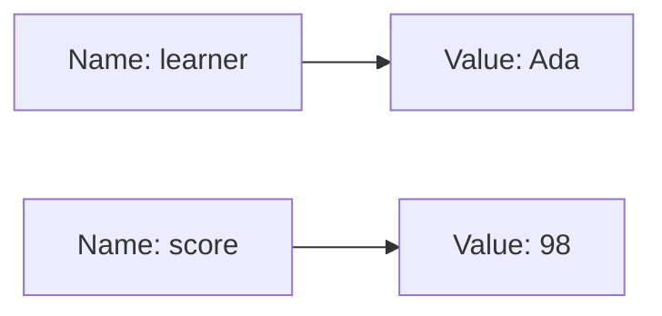
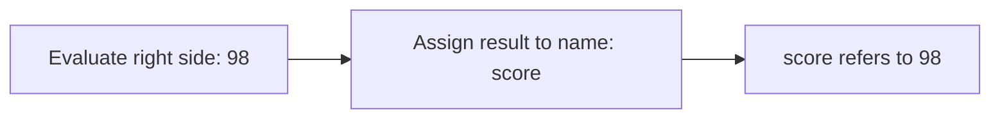
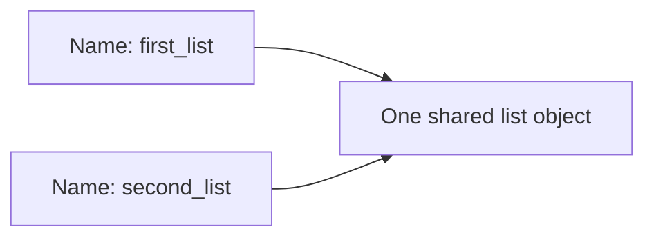

# Python Variables

> **A detailed, beginner-friendly chapter on names and assignment**  
> Learn what variables do, how assignment works, how to choose names, and why changing a variable does not always change an object.

---

## The one-minute picture

A variable is a **name that refers to a value**. Instead of repeatedly writing a value directly, give it a meaningful name and use that name wherever you need the value.

```python
learner = "Ada"
score = 98
```



A useful mental model is a label attached to a value. Assignment with `=` connects the name to the value on the right side.

---

## 1. Why use variables?

Variables make programs easier to understand, update, and reuse.

Without a variable:

```python
print("Ada completed 4 lessons.")
print("Ada has 6 lessons remaining.")
```

With variables:

```python
learner = "Ada"
completed = 4
remaining = 10 - completed

print(f"{learner} completed {completed} lessons.")
print(f"{learner} has {remaining} lessons remaining.")
```

Now the program's information has names. If the learner or lesson count changes, update the value in one place and the later calculations use the new value.

---

## 2. Assignment: what `=` means in Python

The assignment operator `=` stores the result of the expression on its right under the name on its left.

```python
score = 98
```

Python evaluates the right side first (`98`), then binds the name `score` to that value.



Assignment is not the same as mathematical equality. It is an instruction: “make this name refer to this value.”

### Assignment from another variable

```python
first_score = 98
backup_score = first_score
```

Python looks up the value referred to by `first_score` and assigns that value to `backup_score`. For immutable values such as integers and strings, both names can refer to that same value without concern.

### Assignment from an expression

```python
lesson_count = 4
remaining = 10 - lesson_count
print(remaining)  # 6
```

The expression is calculated before the assignment happens.

---

## 3. Reassignment: a name can refer to a new value

Assigning to a name again changes what value that name refers to.

```python
status = "not started"
status = "in progress"
status = "complete"

print(status)  # complete
```

Only the latest value is retrieved by `status`. The earlier assignments have been replaced for that name.

```text
status → "not started"
status → "in progress"
status → "complete"       # current binding
```

This is called **reassignment**. It is different from changing the type rules of Python; the variable name can refer to values of different types over time.

```python
result = 42
result = "forty-two"
```

Python is dynamically typed: the value has a type, and the name may be rebound to a value of another type. Clear programs still tend to use a variable consistently for one kind of information.

---

## 4. Updating a variable using its current value

An assignment can use the old value to calculate the new one.

```python
score = 10
score = score + 5
print(score)  # 15
```

Read the second line step by step:

1. Look up the old `score`: `10`.
2. Add `5`, producing `15`.
3. Assign `15` back to `score`.

Python provides augmented assignment shortcuts:

```python
score = 10
score += 5   # same effect as score = score + 5
score -= 2   # same effect as score = score - 2
score *= 3   # same effect as score = score * 3
```

Other forms include `/=`, `//=`, `%=` and `**=`.

These are useful for totals and counters:

```python
total = 0
total += 8
total += 12
print(total)  # 20
```

---

## 5. Choosing clear variable names

A good variable name communicates what the value means.

```python
student_name = "Ada"
quiz_score = 98
lesson_count = 4
```

Vague names hide the meaning:

```python
x = 98
thing = 4
```

Short names such as `i` are conventional for small loop counters, but descriptive names help with most program data.

### Python naming rules

A variable name:

- may contain letters, digits, and underscores;
- cannot start with a digit;
- cannot contain spaces or hyphens;
- is case-sensitive;
- cannot be a Python keyword such as `if`, `class`, or `for`.

Valid names:

```python
score = 98
score2 = 92
student_name = "Ada"
_private_value = "internal by convention"
```

Invalid names:

```python
# 2score = 92          # starts with a digit
# student-name = "Ada" # hyphen is interpreted as subtraction
# student name = "Ada" # spaces are not allowed
```

### Naming style

Python conventionally uses `snake_case` for variables: lowercase words separated by underscores.

```python
number_of_lessons = 10
```

Use names that are specific without becoming needlessly long. `score` is good if the context is clear; `final_quiz_score` may be better if several scores are present.

---

## 6. Variables refer to values, not boxes that contain the code

The “label” mental model is helpful, but a more precise model is that names refer to objects in memory. Assignment binds a name to an object.

```python
course = "Python"
alias = course
```

Both names refer to the same string object. Since strings are immutable, operations such as `.upper()` create another string rather than changing the original object:

```python
course = "Python"
alias = course
alias = alias.upper()

print(course)  # Python
print(alias)   # PYTHON
```

The name `alias` was rebound to a new string. `course` still refers to the original string.

---

## 7. A key difference: mutable values and shared references

Lists and dictionaries can be changed in place. If two names refer to the same list, changing the list through either name is visible through both.

```python
first_list = ["Strings", "Lists"]
second_list = first_list
second_list.append("Variables")

print(first_list)   # ['Strings', 'Lists', 'Variables']
print(second_list)  # ['Strings', 'Lists', 'Variables']
```



Assignment did not copy the list. Both names point to the same list object. If you need a separate shallow copy of a simple list, use `.copy()`:

```python
first_list = ["Strings", "Lists"]
second_list = first_list.copy()
second_list.append("Variables")

print(first_list)   # ['Strings', 'Lists']
print(second_list)  # ['Strings', 'Lists', 'Variables']
```

This distinction matters for mutable collections; assigning strings or integers does not create the same in-place mutation issue because those values are immutable.

---

## 8. Many names can refer to one value

Assignment does not rename or copy an object. It creates another binding to the same object.

```python
score = 98
best_score = score
```

For an immutable integer, you can safely reassign either name independently:

```python
best_score = 100
print(score)       # 98
print(best_score)  # 100
```

The name `best_score` now refers to the integer value `100`, while `score` still refers to `98`.

---

## 9. Multiple assignment and unpacking

Python can assign multiple names in one statement.

```python
name, score = "Ada", 98
```

This is called **unpacking**: values on the right are matched with names on the left in order.

```python
point = (4, 7)
x, y = point
print(x)  # 4
print(y)  # 7
```

The number of names normally needs to match the number of values.

### Swapping two values

Python can swap names without a temporary variable:

```python
first = "Strings"
second = "Lists"
first, second = second, first
```

Python evaluates the right-hand side first, then assigns the resulting values to the names on the left.

---

## 10. Constants by convention

Python does not have a special syntax that makes an ordinary variable impossible to change. A name written in all capital letters is a convention meaning “treat this as a constant; do not reassign it.”

```python
MAX_SCORE = 100
SECONDS_PER_MINUTE = 60
```

The convention helps readers recognize values intended to stay fixed. Python will still allow reassignment, so this is a signal rather than enforcement.

---

## 11. Variables and scope: a preview

A name is only available in the parts of the program where it is in scope. Names assigned inside functions are usually local to those functions; names assigned at the top level are module-level.

```python
course = "Python"  # module-level name

def show_course():
    message = f"Studying {course}"  # local name message; reads course
    print(message)
```

Functions and scope are covered in their own chapter. For now, remember that a variable name may not be usable everywhere in a program.

---

## 12. Common variable mistakes

### Using a name before assigning it

```python
# print(score)  # NameError if score has never been assigned
score = 98
```

### Confusing `=` with `==`

`=` assigns. `==` compares. The comparison operator is used in questions such as `score == 100`.

### Misspelling or changing capitalization

```python
student_name = "Ada"
# print(Student_name)  # NameError: capitalization differs
```

### Reusing a name for unrelated meanings

It is legal to reassign a name to a different type, but doing so without reason can make code confusing.

```python
value = 12
value = "Dictionaries"  # allowed, but now the name means something different
```

Prefer a new descriptive name if the information has changed meaning.

### Assuming assignment copies a list

`second = first` makes another reference to the same list. Use `.copy()` when you need an independent outer list.

### Using unclear names

A name like `data2` may be difficult to understand later. Choose names that describe the role of the value.

---

## 13. A practical mini-project: study progress summary

This example uses meaningful names, reassignment, arithmetic, and formatted output.

```python
learner_name = "Ada"
total_lessons = 10
completed_lessons = 4
remaining_lessons = total_lessons - completed_lessons

print(f"Learner: {learner_name}")
print(f"Completed: {completed_lessons} of {total_lessons}")
print(f"Remaining: {remaining_lessons}")

completed_lessons += 1
remaining_lessons = total_lessons - completed_lessons
print(f"After one more lesson: {completed_lessons} complete, {remaining_lessons} remaining")
```

Output:

```text
Learner: Ada
Completed: 4 of 10
Remaining: 6
After one more lesson: 5 complete, 5 remaining
```

The names make the calculations readable. The `+=` operator updates the progress count, and the remaining value is calculated again from the updated count.

---

## 14. Quick reference

```text
ASSIGN          score = 98
REASSIGN        score = 100
UPDATE          score += 1
TYPE            type(score)
MULTIPLE        name, score = "Ada", 98
CONSTANT STYLE  MAX_SCORE = 100
COPY LIST       separate = original.copy()
```

### The most important mental checklist

1. **What does this value represent?** Choose a descriptive name.
2. **Am I assigning or comparing?** `=` assigns; `==` compares.
3. **Will I update this name later?** Reassignment changes what it refers to.
4. **Is the value mutable?** Two names assigned the same list may share one object.
5. **Is this intended to stay fixed?** Use an uppercase constant-style name by convention.

---

## 15. Practice (answers below)

1. In `score = 98`, what does `=` do?
2. What does `score = score + 2` calculate if `score` was 98?
3. Are `score` and `Score` the same variable name in Python?
4. Is `2score` a valid variable name?
5. What naming style is commonly used for Python variables?
6. If `second = first` and `first` is a list, are they separate lists?
7. Why does changing `second_list` also affect `first_list` in the shared-list example?
8. What does `name, score = "Ada", 98` do?
9. Are uppercase names like `MAX_SCORE` technically enforced constants?
10. How can you make a shallow copy of a list named `topics`?

<details>
<summary><strong>Show the answers</strong></summary>

1. Assigns the value `98` to the name `score`.
2. Calculates and assigns `100`.
3. No. Names are case-sensitive.
4. No. A variable name cannot start with a digit.
5. `snake_case`, such as `student_name`.
6. No; both names refer to the same list object.
7. They point to the same mutable list.
8. Unpacks the two values into the corresponding names.
9. No. Uppercase is a convention that signals the value should not be reassigned.
10. `topics.copy()`.

</details>

---

## Final idea

Variables are meaningful names bound to values. Assignment evaluates the right side and binds the result to the name on the left; reassignment changes what that name refers to. Choose clear names, remember that mutable objects can be shared through multiple names, and your programs become easier to read and reason about.
