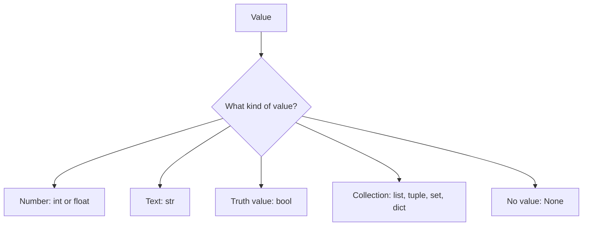

# Python Data Types

> **A detailed, beginner-friendly chapter on the kinds of values Python works with**  
> Learn numbers, text, Boolean values, `None`, collections, type inspection, mutability, and why type matters.

---

## The one-minute picture

A **data type** describes what kind of value Python is handling and what operations make sense for it. For example, Python can add two numbers, join two strings, or check whether a Boolean condition is true.



A value's appearance can be misleading:

```python
42       # integer number
"42"     # text containing the characters 4 and 2
```

They may print similarly, but they have different types and support different operations.

---

## 1. Why data types matter

The type tells Python how to interpret a value and which operations it can perform.

```python
print(4 + 5)                 # 9: numeric addition
print("Python" + " basics") # Python basics: text concatenation
```

But this does not work:

```python
# print("Score: " + 85)  # TypeError: text and integer cannot be joined directly
```

Python does not silently guess whether you intended text or arithmetic. Use an f-string or explicitly convert the number to text:

```python
score = 85
print(f"Score: {score}")
```

---

## 2. Inspect a value's type

Use `type(value)` to see a value's type:

```python
print(type(42))          # <class 'int'>
print(type(3.5))         # <class 'float'>
print(type("Python"))   # <class 'str'>
print(type(True))        # <class 'bool'>
print(type(None))        # <class 'NoneType'>
```

To check whether a value is an instance of a particular type, use `isinstance()`:

```python
score = 85
print(isinstance(score, int))    # True
print(isinstance(score, str))    # False
```

`bool` is a subclass of `int` in Python, so `isinstance(True, int)` is also `True`. If your program needs exactly a Boolean and not an integer, check `type(value) is bool` or handle that requirement explicitly.

---

## 3. Integers: `int`

An integer is a whole number: negative, zero, or positive.

```python
lesson_count = 12
temperature_change = -3
zero = 0
```

Integers support arithmetic:

```python
17 + 5   # 22
17 // 5  # 3, floor division
17 % 5   # 2, remainder
2 ** 4   # 16, exponentiation
```

Python integers can grow very large, limited mainly by available memory.

### Integers versus numeric text

```python
number = 12      # int
text = "12"      # str
```

The first can be used directly in arithmetic. Convert text with `int()` when it contains a valid whole-number representation:

```python
int("12") + 1  # 13
```

---

## 4. Floating-point numbers: `float`

A float represents a number with a fractional part or decimal point.

```python
average_score = 87.5
price = 3.99
```

Floats support arithmetic, including division:

```python
7 / 2  # 3.5
```

### Floating-point precision

Computers store floats in binary with limited precision, so some decimal fractions cannot be represented exactly.

```python
print(0.1 + 0.2)  # may display 0.30000000000000004
```

For general scientific and everyday calculations, floats are usually useful. For precise decimal money calculations, consider Python's `decimal.Decimal` type.

### Converting to a float

```python
float("3.5")  # 3.5
float(4)       # 4.0
```

---

## 5. Strings: `str`

A string stores text. Write it inside matching single or double quotes.

```python
language = "Python"
greeting = 'Hello!'
```

Digits inside quotes are text, not numbers:

```python
"4" + "5"  # '45': joins text
4 + 5      # 9: adds numbers
```

Strings are sequences, so they can be indexed and sliced, and they are immutable: string operations create new strings instead of editing the original string in place.

```python
word = "Python"
word[0]           # 'P'
word.upper()      # 'PYTHON'
word              # still 'Python'
```

Use an f-string to place values in text:

```python
name = "Ada"
score = 98
f"{name} scored {score}."  # 'Ada scored 98.'
```

Strings have their own full chapter; here the key idea is that quoted text is a `str` value.

---

## 6. Booleans: `bool`

A Boolean represents one of two logical values: `True` or `False` (capitalization matters).

```python
is_registered = True
has_finished = False
```

Comparisons produce Booleans:

```python
score = 85
is_passing = score >= 60  # True
```

Boolean operators combine them:

```python
is_passing and has_finished
is_passing or has_finished
not is_registered
```

### Truthiness

In conditions, Python can treat many values as true or false. Common falsey values include `False`, `None`, numeric zero, and empty strings or collections. Non-empty strings and collections are usually truthy.

```python
bool(0)        # False
bool(5)        # True
bool("")       # False
bool("False") # True: it is non-empty text
```

Truthiness is useful for checking whether a collection has contents, but it does not parse words such as `"yes"` and `"no"` as Boolean values.

---

## 7. `None`: absence of a value

`None` is a special value meaning “no value” or “not provided.” Its type is `NoneType`.

```python
quiz_result = None
```

It is not the same as zero, `False`, or an empty string:

```python
0       # a numeric value
False   # a Boolean value
""      # an empty string
None    # absence of a value
```

Check for it with `is None` or `is not None`:

```python
if quiz_result is None:
    print("The quiz has not been taken yet.")
```

Use `None` when it makes sense to represent a missing or not-yet-known value.

---

## 8. Collections: multiple values together

Python has several built-in collection types. They each organize multiple values differently.

| Type | Example | Ordered? | Changeable? | Main idea |
|---|---|---:|---:|---|
| `list` | `["Strings", "Lists"]` | Yes | Yes | Ordered collection that can change |
| `tuple` | `("x", 10)` | Yes | No | Ordered group with fixed positions |
| `set` | `{"Ada", "Grace"}` | No fixed order | Yes | Unique values; duplicates collapse |
| `dict` | `{"name": "Ada"}` | In insertion order | Yes | Key–value pairs |

### List: `list`

```python
topics = ["Strings", "Lists"]
topics.append("Data Types")
```

Lists preserve order and can be changed.

### Tuple: `tuple`

```python
point = (4, 7)
```

Tuples preserve order but do not allow reassignment of their item positions.

### Set: `set`

```python
unique_scores = {90, 85, 90}
# Contains 90 and 85 once each; display order may vary.
```

Sets contain unique values and do not promise positional order. The empty set is `set()`, because `{}` creates an empty dictionary.

### Dictionary: `dict`

```python
student = {"name": "Ada", "score": 98}
```

Dictionaries map unique keys to values. Modern Python preserves insertion order for dictionaries, but dictionaries are primarily used for lookup by key, not numeric indexing.

Each collection type has a dedicated chapter; choose based on whether order, uniqueness, key-based lookup, and changeability matter.

---

## 9. Mutable and immutable types

A **mutable** object can be changed in place. An **immutable** object cannot be changed after creation.

Common examples:

| Type | Usually mutable? |
|---|---:|
| `int` | No |
| `float` | No |
| `bool` | No |
| `str` | No |
| `tuple` | No (though it may contain mutable objects) |
| `list` | Yes |
| `set` | Yes |
| `dict` | Yes |

### See the difference with assignment

With an immutable string, a transformation makes a new string:

```python
first = "Python"
second = first
second = second.upper()
print(first)   # Python
print(second)  # PYTHON
```

With a mutable list, two names can refer to the same list:

```python
first = ["Strings"]
second = first
second.append("Lists")
print(first)  # ['Strings', 'Lists']
```

This matters when passing lists or dictionaries into functions or assigning them to another name. A shallow copy can make a separate outer list: `copy = original.copy()`.

---

## 10. Conversion between common types

Conversion functions make a new value of a requested type when the input is valid.

```python
int("12")       # 12
float("3.5")    # 3.5
str(42)          # '42'
bool(0)          # False
list("abc")     # ['a', 'b', 'c']
```

Invalid conversions can raise exceptions:

```python
# int("twelve")  # ValueError
```

For user input that may be invalid, use exception handling. Type conversion has a full chapter in Fundamentals; these examples show how types can be changed when needed.

---

## 11. A practical mini-project: inspect a learner record

This example uses several types together and checks their types explicitly.

```python
learner = {
    "name": "Ada",                 # str
    "lessons_completed": 4,        # int
    "average_score": 91.5,         # float
    "is_active": True,             # bool
    "graduation_date": None,        # NoneType
    "topics": ["Variables", "Data Types"],  # list
}

for field, value in learner.items():
    print(f"{field}: {value!r} ({type(value).__name__})")
```

Output:

```text
name: 'Ada' (str)
lessons_completed: 4 (int)
average_score: 91.5 (float)
is_active: True (bool)
graduation_date: None (NoneType)
topics: ['Variables', 'Data Types'] (list)
```

The dictionary's values have different types because each field represents a different kind of information.

---

## 12. Common type confusions

### `42` versus `"42"`

One is an integer and one is text. They behave differently with `+`.

### `bool` versus `str`

`True` is a Boolean. `"True"` is text. The second is truthy because it is non-empty, not because Python interpreted the word.

### `None` versus `0`

`None` means absent; zero is a numeric value. Use `is None` for checking absence.

### List versus tuple

Both preserve order, but a list is changeable while a tuple's item positions are fixed.

### Set versus dictionary

`{1, 2}` is a set. `{"name": "Ada"}` is a dictionary. Empty braces `{}` make an empty dictionary; use `set()` for an empty set.

### `type()` versus `isinstance()`

`type(value)` reports the exact type. `isinstance(value, SomeType)` checks whether the value is of that type or a subtype. For most everyday checks, `isinstance()` is more flexible.

---

## 13. Quick reference

```text
WHOLE NUMBER    int       42
DECIMAL NUMBER  float     3.5
TEXT            str       "Python"
TRUTH VALUE     bool      True / False
NO VALUE        NoneType  None
CHANGEABLE LIST list      [1, 2]
FIXED GROUP     tuple     (1, 2)
UNIQUE GROUP    set       {1, 2}
KEY/VALUE MAP   dict      {"name": "Ada"}
INSPECT         type(value), isinstance(value, Type)
```

### The most important mental checklist

1. **What kind of information is this value?** Choose its data type accordingly.
2. **Do similar-looking values have different types?** `42` and `"42"` do.
3. **Does this collection need order, uniqueness, or key lookup?** Choose list, tuple, set, or dictionary.
4. **Can this object change in place?** Lists, sets, and dictionaries can; strings and numbers cannot.
5. **Is the value absent, or merely empty/zero/false?** Use `None` only for absence.

---

## 14. Practice (answers below)

1. What type is `42`? What type is `"42"`?
2. Which type represents a decimal number such as `3.5`?
3. What are the two Boolean values?
4. How should you test whether `result` is `None`?
5. Which collection automatically removes duplicates?
6. Which collection stores key–value pairs?
7. Is a list mutable?
8. Why is `bool("False")` true?
9. What is the difference between `type()` and `isinstance()`?
10. What type does `{}` create, and how do you make an empty set?

<details>
<summary><strong>Show the answers</strong></summary>

1. `int` and `str`.
2. `float`.
3. `True` and `False`.
4. `result is None`.
5. A set.
6. A dictionary.
7. Yes; it can be changed in place.
8. It is non-empty text, and non-empty strings are truthy.
9. `type()` reports the exact type; `isinstance()` checks membership in a type or subtype relationship.
10. `{}` makes an empty dictionary; `set()` makes an empty set.

</details>

---

## Final idea

A data type is the kind of value Python is working with. Types explain why `42 + 1` is arithmetic while `"42" + "1"` joins text, and why lists can change while strings cannot. Recognizing the type helps you choose the right operations and the right collection for each job.
