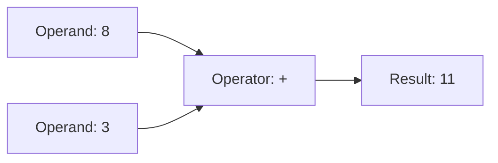

# Python Operators

> **A detailed, beginner-friendly chapter on the symbols and keywords that work with values**  
> Learn arithmetic, assignment, comparison, logical, membership, identity, and bitwise operators—with examples of what each expression produces.

---

## The one-minute picture

An **operator** tells Python to perform an action on one or more values. The values it works with are called **operands**.

```python
answer = 8 + 3
```

Here, `+` is the operator; `8` and `3` are operands; and the expression produces `11`.



Python has operators for calculations, comparisons, logic, and more. Some symbols can do different jobs depending on the operand types: `+` adds numbers but joins strings.

---

## 1. Arithmetic operators

Arithmetic operators perform calculations on numbers.

Let `a = 17` and `b = 5`:

| Operator | Name | Example | Result |
|---|---|---|---:|
| `+` | Addition | `a + b` | `22` |
| `-` | Subtraction | `a - b` | `12` |
| `*` | Multiplication | `a * b` | `85` |
| `/` | Division | `a / b` | `3.4` |
| `//` | Floor division | `a // b` | `3` |
| `%` | Modulo (remainder) | `a % b` | `2` |
| `**` | Exponentiation | `a ** 2` | `289` |

### Division `/`

`/` performs regular division and usually returns a float—even when the answer is a whole number.

```python
10 / 2  # 5.0
```

### Floor division `//`

`//` rounds the quotient **down** to the next whole-number boundary. For positive numbers, it looks like dropping the decimal part; with negatives, “down” means toward negative infinity.

```python
17 // 5   # 3
-7 // 2   # -4, because -3.5 rounded down is -4
```

### Modulo `%`

`%` gives the remainder after floor division. It is often used to test even and odd values:

```python
10 % 3  # 1
8 % 2   # 0: 8 divides evenly by 2
9 % 2   # 1: 9 is odd
```

A number is even if `number % 2 == 0`.

### Exponentiation `**`

`**` raises the left value to the power of the right value:

```python
2 ** 3  # 8, because 2 × 2 × 2 = 8
```

### Unary plus and minus

Unary operators act on one value:

```python
value = 5
-value  # -5
+value  # 5
```

---

## 2. Assignment operators

The assignment operator `=` stores the result of the right-hand expression under the name on the left.

```python
score = 80
```

This is not a comparison. It is an instruction to assign a value.

### Augmented assignment

Augmented assignment combines an operation with reassignment:

```python
score = 80
score += 5  # same result as score = score + 5; now 85
score -= 2  # now 83
score *= 2  # now 166
score //= 10  # now 16
```

Common augmented operators:

| Form | Similar to |
|---|---|
| `x += y` | `x = x + y` |
| `x -= y` | `x = x - y` |
| `x *= y` | `x = x * y` |
| `x /= y` | `x = x / y` |
| `x //= y` | `x = x // y` |
| `x %= y` | `x = x % y` |
| `x **= y` | `x = x ** y` |

For mutable objects such as lists, augmented assignment can update the existing object in place. For immutable values such as integers, it calculates a result and rebinds the name.

---

## 3. Comparison operators

Comparison operators ask a question and produce a Boolean: `True` or `False`.

| Operator | Meaning | Example |
|---|---|---|
| `==` | Equal to | `score == 100` |
| `!=` | Not equal to | `status != "complete"` |
| `<` | Less than | `age < 18` |
| `<=` | Less than or equal to | `score <= 100` |
| `>` | Greater than | `price > 10` |
| `>=` | Greater than or equal to | `score >= 60` |

```python
score = 85
print(score >= 60)  # True
print(score == 100) # False
```

### `=` versus `==`

```python
score = 85      # assign 85 to score
score == 85     # ask whether score equals 85; result is True
```

Using one in place of the other changes the meaning. In an `if` statement, use `==` when you mean to compare.

### Chained comparisons

Python can combine range checks:

```python
score = 85
0 <= score <= 100  # True
```

This means `0 <= score and score <= 100`.

---

## 4. Logical operators: `and`, `or`, `not`

Logical operators combine conditions or reverse a truth value.

### `and`

`A and B` is true only when both conditions are true.

```python
score = 85
submitted = True
score >= 60 and submitted  # True
```

### `or`

`A or B` is true when at least one condition is true.

```python
is_weekend = False
is_holiday = True
is_weekend or is_holiday  # True
```

### `not`

`not A` reverses the truth value of `A`.

```python
is_complete = False
not is_complete  # True
```

### Short-circuit behavior

Python may skip evaluating the right side when the left side already decides the answer:

- `False and ...` is already false, so the right side is skipped.
- `True or ...` is already true, so the right side is skipped.

This is called **short-circuiting**. It is useful when the second condition should only be checked if the first makes it safe:

```python
name = "Ada"
name != "" and name[0].isupper()
```

Because the left side checks that `name` is not empty, Python only indexes `name[0]` if the string has a character.

### Precedence

`not` binds more tightly than `and`, which binds more tightly than `or`. Use parentheses to make complex logic easier to understand:

```python
(score >= 60 and submitted) or teacher_approved
```

---

## 5. Membership operators: `in` and `not in`

Membership checks whether a value occurs in a collection or substring.

```python
topics = ["Strings", "Lists", "Operators"]
"Lists" in topics        # True
"Functions" not in topics  # True
```

They also work with strings:

```python
"Py" in "Python"  # True
```

For dictionaries, `in` checks **keys**:

```python
student = {"name": "Ada", "score": 98}
"name" in student  # True
"Ada" in student   # False: Ada is a value, not a key
```

Check dictionary values with `.values()`:

```python
"Ada" in student.values()  # True
```

---

## 6. Identity operators: `is` and `is not`

Identity asks whether two names refer to the **same object**, not merely equal values.

```python
first = [1, 2]
second = first
third = [1, 2]

first == second  # True: same contents
first is second  # True: same object
first == third   # True: same contents
first is third   # False: separate list objects
```

For almost all ordinary value comparisons, use `==`. The common beginner use of `is` is checking for the special singleton value `None`:

```python
result = None
if result is None:
    print("No result yet.")
```

Use `is not None` to check that a value is present. Do not use `is` to compare ordinary strings or numbers.

---

## 7. Bitwise operators (a first look)

Bitwise operators work on the binary digits (bits) of integers. They are common in low-level programming, flags, and some specialized algorithms; many beginner programs will not need them immediately.

For `a = 6` (`0b0110`) and `b = 3` (`0b0011`):

| Operator | Name | What it does | Example result |
|---|---|---|---:|
| `&` | Bitwise AND | bit is 1 if both bits are 1 | `a & b` → `2` |
| `|` | Bitwise OR | bit is 1 if either bit is 1 | `a | b` → `7` |
| `^` | Bitwise XOR | bit is 1 if the bits differ | `a ^ b` → `5` |
| `~` | Bitwise NOT | flips bits (Python integers are signed/unbounded) | `~a` → `-7` |
| `<<` | Left shift | shifts bits left | `a << 1` → `12` |
| `>>` | Right shift | shifts bits right | `a >> 1` → `3` |

Do not confuse bitwise `&` and `|` with logical `and` and `or`. For ordinary conditions, use the word operators `and` and `or`.

---

## 8. Operators depend on the value types

The same operator can have different meanings for different types.

```python
4 + 5                    # 9: numeric addition
"Python" + " basics"    # 'Python basics': string concatenation
"ha" * 3                 # 'hahaha': string repetition
```

An unsupported combination raises an error rather than guessing:

```python
# "Score: " + 85  # TypeError
```

Make the conversion or formatting explicit:

```python
"Score: " + str(85)
f"Score: {85}"
```

---

## 9. Operator precedence and parentheses

When an expression contains several operators, Python follows precedence rules. Parentheses make a desired grouping explicit.

```python
2 + 3 * 4      # 14: multiplication first
(2 + 3) * 4    # 20: parentheses first
```

A simplified order from tighter to looser for operators introduced here is:

1. parentheses;
2. exponentiation;
3. unary `+`, `-`, `~`;
4. `*`, `/`, `//`, `%`;
5. `+`, `-`;
6. shifts, bitwise operators;
7. comparisons, membership, identity;
8. `not`;
9. `and`;
10. `or`.

You do not need to memorize every precedence rule immediately. Add parentheses when they help communicate your intent.

---

## 10. A practical mini-project: calculate a study result

This example combines arithmetic, comparisons, logical operators, membership, and assignment.

```python
score = 86
submitted = True
bonus_points = 5
completed_topics = ["Variables", "Data Types"]

final_score = min(100, score + bonus_points)
passed = final_score >= 60 and submitted
studied_data_types = "Data Types" in completed_topics

print(f"Final score: {final_score}")
print(f"Passed: {passed}")
print(f"Studied data types: {studied_data_types}")
```

Output:

```text
Final score: 91
Passed: True
Studied data types: True
```

Each expression answers a different question: calculate a score, check multiple requirements, and test collection membership.

---

## 11. Common operator mistakes

### Using `=` instead of `==`

`=` assigns; `==` compares.

### Using `is` instead of `==`

Use equality (`==`) for comparing values. Use identity (`is`) primarily for `None`.

### Mixing logical and bitwise operators

Use `and`/`or` for Boolean conditions. `&`/`|` operate on bits (and may have other type-specific uses).

### Forgetting floor division rounds down

With negative numbers, `-7 // 2` is `-4`, because floor means toward negative infinity.

### Forgetting the type affects `+`

`"4" + "5"` produces text `"45"`; `4 + 5` produces number `9`.

### Writing a hard-to-read expression

Use parentheses or named intermediate variables when the order or meaning is not immediately clear.

---

## 12. Quick reference

```text
ARITHMETIC    +  -  *  /  //  %  **
ASSIGNMENT    =  +=  -=  *=  /=  //=  %=  **=
COMPARISON    ==  !=  <  <=  >  >=
LOGIC         and  or  not
MEMBERSHIP    in  not in
IDENTITY      is  is not
BITWISE       &  |  ^  ~  <<  >>
```

### The most important mental checklist

1. **What type are the operands?** Operators can behave differently by type.
2. **Am I assigning, comparing, or checking identity?** `=`, `==`, and `is` do different jobs.
3. **Do I need both conditions, either one, or the opposite?** Choose `and`, `or`, or `not`.
4. **Am I checking membership in a dictionary?** `in` checks keys by default.
5. **Could parentheses make this expression easier to read?** Use them when helpful.

---

## 13. Practice (answers below)

1. What does `17 // 5` produce?
2. What does `17 % 5` produce?
3. What is the difference between `=` and `==`?
4. What does `score >= 60 and submitted` require?
5. What does `"Py" in "Python"` produce?
6. What is the difference between `first == second` and `first is second` for lists?
7. Which is the common way to check if `result` has no value (`None`)?
8. What does `"4" + "5"` produce? What does `4 + 5` produce?
9. What does `2 + 3 * 4` evaluate to?
10. Which operators should you use for normal Boolean logic: `and`/`or` or `&`/`|`?

<details>
<summary><strong>Show the answers</strong></summary>

1. `3`.
2. `2`.
3. `=` assigns a value; `==` compares two values.
4. Both conditions must be true.
5. `True`.
6. `==` compares contents; `is` checks whether they are the same object.
7. `result is None`.
8. `"45"` and `9`.
9. `14` because multiplication happens first.
10. `and` and `or`.

</details>

---

## Final idea

Operators are the tools Python uses to calculate, compare, combine conditions, and inspect collections. Their meaning depends partly on the types they work with. Learn the difference between assignment, equality, and identity; use the right logical operator; and add parentheses whenever they make your intent clearer.
