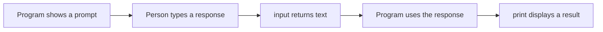

# Python Input and Output

> **A detailed, beginner-friendly chapter on communicating with a Python program**  
> Learn how `input()` receives text, how `print()` displays results, and how to make interactions clear and robust.

---

## The one-minute picture

**Input** brings information into a program. **Output** sends information from a program to a person or another destination. For a beginner's terminal program, `input()` reads what a person types and `print()` displays information.



```python
name = input("What is your name? ")
print(f"Hello, {name}!")
```

The prompt asks a question, the person's response is stored as text, and the f-string places that text into the output.

---

## 1. Output with `print()`

`print()` displays one or more values. A simple call displays text:

```python
print("Hello, Python!")
```

Output:

```text
Hello, Python!
```

You can also print numbers, Booleans, variables, and results of expressions:

```python
print(42)
print(True)
score = 85
print(score)
print(score + 5)
```

`print()` converts its arguments to readable text for display. This does not necessarily change the values' types in your program.

---

## 2. Printing more than one value

Pass multiple arguments separated by commas. By default, `print()` puts one space between them.

```python
name = "Ada"
score = 98
print("Learner:", name, "Score:", score)
```

Output:

```text
Learner: Ada Score: 98
```

This is handy for quick debugging. For polished sentences, f-strings are usually easier to control.

---

## 3. F-strings: format useful output

An f-string lets you place values and expressions directly into text. Put `f` immediately before the opening quote, and put each value inside `{}`.

```python
name = "Ada"
score = 98
print(f"{name} scored {score} points.")
```

Output:

```text
Ada scored 98 points.
```

Expressions work inside braces too:

```python
completed = 4
total = 10
print(f"You have {total - completed} lessons remaining.")
```

### Formatting numbers

A format specification comes after a colon inside the braces:

```python
price = 3.5
progress = 0.735

print(f"Price: ${price:.2f}")    # $3.50
print(f"Progress: {progress:.1%}")  # 73.5%
print(f"Score: {98:03d}")        # 098
```

- `.2f` means display a floating-point number with two digits after the decimal point;
- `.1%` means display as a percentage with one decimal place;
- `03d` means display an integer in a field of width three, padded with zeroes.

Keep formatting readable. If a sentence becomes difficult to scan, calculate intermediate values on separate lines.

---

## 4. Control the separator with `sep`

When `print()` receives multiple arguments, `sep` specifies the text placed between them. The default is a space.

```python
print("2026", "09", "28", sep="-")
```

Output:

```text
2026-09-28
```

Another example:

```python
print("Strings", "Lists", "Functions", sep=" → ")
```

This displays:

```text
Strings → Lists → Functions
```

---

## 5. Control the ending with `end`

By default, `print()` ends with a newline, so the next printed output starts on a new line. Set `end` to change that ending.

```python
print("Loading", end="...")
print("done")
```

Output:

```text
Loading...done
```

This is useful for progress messages or printing pieces of one line. Be aware that suppressing the newline can make later output run together if you do not add spacing or a final newline.

---

## 6. Newlines and tabs in output

Escape sequences let strings include special spacing characters:

- `\n` starts a new line;
- `\t` inserts a horizontal tab.

```python
print("First line\nSecond line")
print("Name:\tAda")
```

Output:

```text
First line
Second line
Name:   Ada
```

The exact visual width of a tab depends on the terminal, so use spaces or formatted columns when precise alignment matters.

---

## 7. Input with `input()`

`input()` displays an optional prompt, waits for a line of text, and returns that text as a string (`str`).

```python
name = input("What is your name? ")
```

The prompt appears without a newline at the end, so the person types on the same line. When they press Enter, their response is returned.

Example interaction:

```text
What is your name? Ada
```

After this, the variable `name` refers to the string `"Ada"`.

### The prompt is optional

```python
response = input()
```

This waits for a response without displaying a question. In most beginner programs, a clear prompt is more helpful.

---

## 8. Important: `input()` always returns a string

Even if the person types digits, `input()` returns text.

```python
age_text = input("How old are you? ")
print(type(age_text))  # <class 'str'>
```

If the person types `12`, `age_text` is `"12"`. That means:

```python
"12" + "1"  # '121': joins text
int("12") + 1  # 13: numeric addition after conversion
```

Convert input to `int` or `float` when you need numeric behavior. Handle invalid text when the input may not be a valid number; detailed conversion patterns belong in the Type Conversion chapter.

---

## 9. Ask more than one question

Each `input()` call pauses and waits for one response. Store each response in a clearly named variable.

```python
name = input("Name: ")
favorite_topic = input("Favorite Python topic: ")
print(f"{name}'s favorite topic is {favorite_topic}.")
```

A useful interaction asks one clear question at a time and explains what kind of answer is expected.

---

## 10. Clean up text input

People may accidentally type extra spaces or use different capitalization. String methods can clean or normalize a response.

```python
name = input("Your name: ").strip()
answer = input("Continue? yes/no: ").strip().lower()
```

- `.strip()` removes whitespace at the beginning and end;
- `.lower()` makes letters lowercase for a case-insensitive comparison.

Then compare against allowed choices:

```python
if answer in {"yes", "y"}:
    print("Continuing")
elif answer in {"no", "n"}:
    print("Stopping")
else:
    print("Please answer yes or no.")
```

Do not use `bool(answer)` to parse text responses. Every non-empty string is truthy, including `"no"` and `"False"`.

---

## 11. Output can go somewhere other than the terminal

`print()` can write to a file-like object with its `file` argument. For example:

```python
with open("report.txt", "w", encoding="utf-8") as file:
    print("Study summary", file=file)
```

The file handling chapter explains opening and managing files. Other Python programs can also send output to logs, web responses, or graphical interfaces; `print()` is just the simplest terminal output tool.

---

## 12. A practical mini-project: interactive study summary

This program asks for a name and favorite topic, then prints a small report. It also cleans extra spaces from both responses.

```python
name = input("Your name: ").strip()
topic = input("Topic you are studying: ").strip()

print("\n" + "=" * 32)
print(f"Learner: {name}")
print(f"Current topic: {topic}")
print("Keep making progress!")
print("=" * 32)
```

Example interaction:

```text
Your name:  Ada
Topic you are studying:  Input and Output

================================
Learner: Ada
Current topic: Input and Output
Keep making progress!
================================
```

The `.strip()` calls remove the accidental spaces at the edges, while the f-strings make the output easy to personalize.

---

## 13. Common input/output mistakes

### Forgetting that input is text

`input()` does not automatically produce a number. Convert it for arithmetic.

### Using `bool()` to interpret yes/no text

`bool("no")` is `True` because `"no"` is not empty. Compare the response with accepted text instead.

### Forgetting that `print()` adds a newline

Multiple calls appear on separate lines by default. Set `end` if you intentionally want to keep output on the same line.

### Confusing `sep` and `end`

- `sep` goes **between** arguments in one call;
- `end` goes **after** the output of a call.

### Printing quotes accidentally

If you write `print('"Hello"')`, the double quote characters are part of the string and will appear in output. The quote marks used to define the string are not printed.

### Making unclear prompts

A prompt such as `input("Value: ")` may not tell someone what to enter. Prefer `input("Enter your age in years: ")`.

---

## 14. Quick reference

```text
DISPLAY              print("Hello")
MULTIPLE VALUES      print("Name:", name, "Score:", score)
F-STRING             print(f"Hello, {name}!")
SEPARATOR            print(a, b, sep=" | ")
ENDING               print("Loading", end="...")
NEW LINE             \n
TAB                  \t
READ TEXT            answer = input("Question: ")
CLEAN INPUT          answer = input("... ").strip()
```

### The most important mental checklist

1. **What should the user see?** Make prompts and output specific.
2. **What response am I expecting?** Say so in the prompt.
3. **Did `input()` give me text?** Always yes; convert only when needed.
4. **Do spaces and capitalization matter?** Clean text when appropriate.
5. **Should output start a new line?** Remember the default `end="\n"`.

---

## 15. Practice (answers below)

1. What does `input()` return?
2. Does `print()` add a newline by default?
3. What does the `sep` argument control?
4. What does the `end` argument control?
5. What is the difference between `"4" + "5"` and `4 + 5`?
6. Which method removes leading and trailing whitespace from a string?
7. Why does `bool("no")` evaluate to `True`?
8. How can you format a variable named `name` inside a sentence?
9. What does `\n` represent inside a string?
10. How should a program compare a yes/no response from `input()`?

<details>
<summary><strong>Show the answers</strong></summary>

1. A string.
2. Yes.
3. The text placed between multiple arguments.
4. The text placed after the call's output; it defaults to a newline.
5. The first joins text to produce `"45"`; the second adds numbers to produce `9`.
6. `.strip()`.
7. Because it is a non-empty string; `bool()` checks emptiness/truthiness, not the word's meaning.
8. Use an f-string such as `f"Hello, {name}!"`.
9. A newline.
10. Clean and compare it to expected choices, for example `.strip().lower()` and then `in` or `if`/`elif`.

</details>

---

## Final idea

`input()` receives a line of text; `print()` displays information. Make prompts clear, remember that input is always a string, and use f-strings plus `sep` and `end` when they make output easier to understand. Good input/output turns a program's internal work into a useful conversation.
