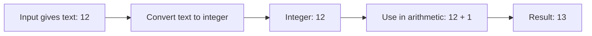

# Python Type Conversion

> **A detailed, beginner-friendly chapter on changing values from one type to another**  
> Learn explicit conversion, input parsing, truthiness, collection conversions, common failures, and safe patterns.

---

## The one-minute picture

**Type conversion** creates a value of one type from a value of another type. It is useful when the same information needs to be used in a different way—for example, turning the text typed by a person into a number for arithmetic.



```python
lesson_text = "12"       # str
lessons = int(lesson_text) # int
print(lessons + 1)         # 13
```

The original string is still text. `int()` creates an integer value; it does not change the original string in place.

---

## 1. Why convert values?

Python keeps track of types because different kinds of values support different operations.

```python
print("4" + "5")  # 45: strings join
print(4 + 5)      # 9: integers add
```

`input()` always returns a string, even when the person types digits:

```python
age_text = input("Age: ")  # if the person types 12, this is "12"
age = int(age_text)        # now it is the integer 12
```

Conversion is also useful for turning numbers into text for output, parsing decimal text, or converting collections.

---

## 2. Converting text to an integer with `int()`

`int(value)` creates an integer when the input represents a valid whole number.

```python
int("42")    # 42
int("-7")    # -7
int(3.9)      # 3
```

Whitespace around a numeric string is allowed:

```python
int("  42  ")  # 42
```

A decimal point in a string is not accepted by `int()`:

```python
# int("3.9")  # ValueError
```

Convert decimal text to a float first if a decimal value is intended:

```python
float("3.9")  # 3.9
```

### `int(float_value)` truncates; it does not round

```python
int(3.9)    # 3
int(-3.9)   # -3
```

This removes the fractional part toward zero. It is different from floor division, which rounds down, and from rounding:

```python
int(3.9)       # 3: truncate
round(3.9)     # 4: round to nearest integer
3.9 // 1       # 3.0: floor division
```

Use the operation that matches the intention. Do not use `int()` when you mean “round.”

---

## 3. Converting to a float with `float()`

`float(value)` creates a floating-point number:

```python
float("3.5")  # 3.5
float("4")    # 4.0
float(7)       # 7.0
```

Ordinary Python numeric text uses a period for the decimal separator. A comma such as `"3,5"` does not represent a float in Python's standard syntax.

Floating-point representation can have small precision surprises:

```python
0.1 + 0.2  # 0.30000000000000004 (commonly)
```

For precise decimal money calculations, use `decimal.Decimal` rather than relying on binary floating-point.

---

## 4. Converting a value to text with `str()`

`str(value)` creates a readable string representation.

```python
str(42)       # '42'
str(3.5)      # '3.5'
str(True)     # 'True'
str(None)     # 'None'
```

This can make values joinable with text:

```python
score = 85
message = "Score: " + str(score)
```

For most formatted output, an f-string is shorter and clearer:

```python
message = f"Score: {score}"
```

`str()` is for a human-readable representation, not a promise that the text can always be converted back into the exact original object.

---

## 5. Converting to Boolean with `bool()`

`bool(value)` converts according to **truthiness**: whether Python treats the value as true or false in a condition.

Common falsey values include:

```python
bool(False)  # False
bool(None)    # False
bool(0)       # False
bool(0.0)     # False
bool("")      # False
bool([])      # False
bool({})      # False
bool(set())   # False
```

Most other values are truthy:

```python
bool(True)      # True
bool(5)         # True
bool("Python") # True
bool([0])       # True: list is not empty
```

### Important: `bool("False")` is `True`

`bool()` does not read the meaning of words. It checks whether the string is empty:

```python
bool("False")  # True
bool("no")     # True
bool("")       # False
```

To parse yes/no text, compare against accepted responses:

```python
answer = " YES ".strip().lower()
wants_to_continue = answer in {"yes", "y"}
```

---

## 6. Converting collections

Built-in collection constructors can convert iterables into collections.

### `list()`

```python
list("cat")       # ['c', 'a', 't']
list((1, 2, 3))    # [1, 2, 3]
list(range(3))     # [0, 1, 2]
```

### `tuple()`

```python
tuple([1, 2, 3])   # (1, 2, 3)
tuple("cat")      # ('c', 'a', 't')
```

### `set()`

```python
set([1, 2, 2, 3])  # {1, 2, 3}; order is not promised
set("letter")     # unique characters; order is not promised
```

Sets remove duplicates and do not provide positional order.

### `dict()`

`dict()` can build a dictionary from key–value pairs:

```python
dict([("name", "Ada"), ("score", 98)])
# {'name': 'Ada', 'score': 98}
```

Collection conversions can change structure or discard information, such as duplicate values when converting to a set. Always consider what might be lost.

---

## 7. Conversion versus formatting

Conversion changes the type of a value. Formatting changes how a value is displayed in text.

```python
score = 85
score_text = str(score)           # conversion: int → str
formatted = f"Score: {score:03d}" # formatting for display: Score: 085
```

For decimal places, formatting does not necessarily change the original float:

```python
price = 3.5
print(f"{price:.2f}")  # 3.50 for display
print(price)            # underlying float is still 3.5
```

If you need a rounded numeric value for later calculations, use `round()` and understand its behavior. If you only need a particular appearance, use formatting.

---

## 8. Conversions that fail

Conversion functions cannot invent a valid value when the input does not match the requested type.

```python
int("twelve")  # ValueError
float("three") # ValueError
```

A type may also be completely unsuitable:

```python
# int(None)  # TypeError
```

Expected invalid user input should be handled with a specific exception:

```python
text = "twelve"
try:
    number = int(text)
except ValueError:
    print("Please enter a whole number, such as 12.")
else:
    print(f"Converted number: {number}")
```

Use `ValueError` for content that cannot be parsed and `TypeError` when the supplied kind of object is not appropriate. Do not catch every exception if you only expect a conversion failure.

---

## 9. A reusable safe integer-input pattern

This example separates reading text, converting it, and responding to invalid input:

```python
text = input("How many lessons have you finished? ")

try:
    lessons = int(text)
except ValueError:
    print("Please enter a whole number, such as 4.")
else:
    print(f"You finished {lessons} lessons.")
```

Add a range check when the number has a valid interval:

```python
if lessons < 0:
    print("The lesson count cannot be negative.")
elif lessons > 10:
    print("There are only 10 lessons in this course.")
else:
    print(f"Progress: {lessons} of 10 lessons.")
```

Conversion checks that the text can become an integer. The `if` statements check whether that integer makes sense for the application. These are two separate validations.

---

## 10. A practical mini-project: score and progress report

This program converts score text to a number, validates its range, then formats the result for display.

```python
score_text = "87"

try:
    score = int(score_text)
except ValueError:
    print("Score must be a whole number.")
else:
    if not 0 <= score <= 100:
        print("Score must be between 0 and 100.")
    else:
        progress = score / 100
        print(f"Score: {score}")
        print(f"Progress: {progress:.0%}")
```

Output:

```text
Score: 87
Progress: 87%
```

Try changing `score_text` to `"eighty-seven"`, `"120"`, and `"87"`. Each value exercises a different stage: parsing, range validation, or successful reporting.

---

## 11. Common conversion mistakes

### Expecting `input()` to return a number

It returns a string. Convert it before arithmetic.

### Calling `int()` on decimal text

`int("3.5")` raises `ValueError`. Use `float("3.5")` when the decimal matters.

### Thinking `int()` rounds

It truncates toward zero: `int(3.9)` is `3`. Use `round()` when rounding is intended.

### Treating `bool()` as a text parser

`bool("False")` is `True` because the text is non-empty. Compare text to expected choices instead.

### Forgetting conversions can lose information

`set([1, 1, 2])` removes a duplicate. `int(3.9)` removes the fractional part. Choose conversions deliberately.

### Catching every error

Catch the exception you expect, commonly `ValueError` for text parsing. A broad handler can hide unrelated bugs.

### Confusing display formatting with conversion

`f"{price:.2f}"` changes how the value is shown, not the stored float itself.

---

## 12. Quick reference

```text
TO INTEGER       int("42")          → 42
TO FLOAT         float("3.5")       → 3.5
TO TEXT          str(42)            → "42"
TO BOOLEAN       bool(value)        → truthiness
TO LIST          list(iterable)
TO TUPLE         tuple(iterable)
TO SET           set(iterable)      → unique values
TO DICTIONARY    dict(pairs)
ROUND            round(3.9)         → 4
SAFE PARSE       try: int(text) / except ValueError: ...
```

### The most important mental checklist

1. **What type do I have now?** Check with `type()` if unsure.
2. **What type do I need for this operation?** Convert deliberately.
3. **Could the conversion fail?** Handle invalid external input.
4. **Could the conversion discard information?** Watch truncation and duplicate removal.
5. **Am I converting a value or only changing its display?** Keep formatting separate from conversion.

---

## 13. Practice (answers below)

1. What does `int("12")` return?
2. Why does `int("3.5")` fail?
3. What does `int(3.9)` return? Does it round?
4. What does `float("4")` return?
5. Why does `bool("False")` evaluate to `True`?
6. What does `set([1, 1, 2])` contain?
7. Which exception should you usually catch when text cannot be converted to an integer?
8. Does `f"{3.5:.2f}"` change the original float?
9. How can you interpret a text response of `"yes"` or `"no"` safely?
10. What is the difference between parsing a score and validating its allowed range?

<details>
<summary><strong>Show the answers</strong></summary>

1. The integer `12`.
2. `int()` expects whole-number text; a decimal point is not valid integer syntax.
3. `3`; it truncates toward zero rather than rounding.
4. The float `4.0`.
5. It is a non-empty string; `bool()` checks truthiness, not the word's meaning.
6. `{1, 2}`; duplicate values collapse.
7. `ValueError`.
8. No. It formats the displayed text; the original value remains `3.5`.
9. Normalize the text, such as `.strip().lower()`, and compare it to accepted choices.
10. Parsing turns suitable text into an integer; range validation checks whether that integer is acceptable for the program.

</details>

---

## Final idea

Type conversion changes how Python represents or uses a value. Use `int()` and `float()` to parse numeric text, `str()` to create text, and collection constructors when their data behavior fits. Remember that conversions can fail or lose information, and distinguish converting a value from formatting it for display.
