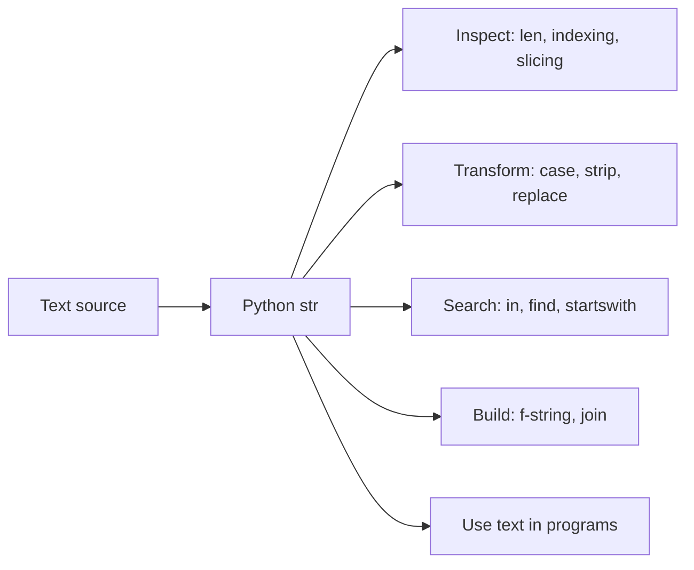
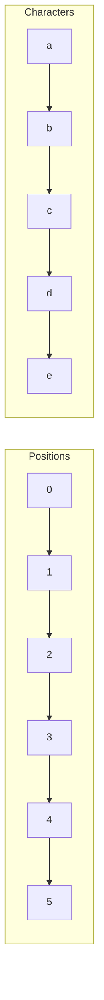
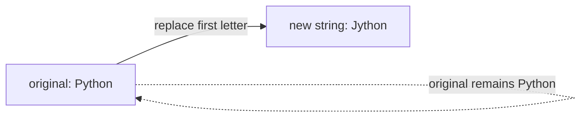

# Python Strings, Explained Beautifully

> **A visual, beginner-friendly deep dive into Python’s `str` type**  
> Learn to read text, shape it, inspect it, search it, and format it with confidence.

---

## The one-minute picture

A Python string is an **immutable sequence of characters**. That sentence contains the core idea:

- **sequence**: it has an order, a length, positions, and slices;
- **characters**: it stores text in order, such as words, sentences, and symbols;
- **immutable**: operations make new strings; they do not edit the original in place.



Think of a string as a **numbered row of text symbols**. Python numbers positions from zero, and slicing selects a half-open range: start included, stop excluded.

```text
Text:       P  y  t  h  o  n
Position:   0  1  2  3  4  5
Negative:  -6 -5 -4 -3 -2 -1
```

```python
word = "Python"
word[0]       # 'P'
word[-1]      # 'n'
word[1:4]     # 'yth'  (positions 1, 2, 3; stop before 4)
```

---

## 1. Creating strings

### Quotes

Single and double quotes both create strings. Pick whichever makes the text easiest to read.

```python
name = 'Ada'
message = "Hello, Ada!"
quote = "She said, 'hello.'"
```

To include the same quote used around the string, escape it with a backslash or choose the other quote style:

```python
line = "She said, \"hello\"."
line = 'She said, "hello".'  # usually easier to read
```

### Multiline strings

Triple quotes preserve line breaks and are handy for long text and docstrings.

```python
poem = """Roses are red,
Violets are blue."""
```

The line breaks are part of the value. Triple quotes do not automatically remove indentation or trim whitespace.

### Escape sequences

A backslash introduces a special character in many ordinary string literals.

| Spell | Meaning | Example result |
|---|---|---|
| `\n` | newline | next line |
| `\t` | tab | horizontal spacing |
| `\\` | literal backslash | `C:\\Users` in source → `C:\Users` |
| `\'` | single quote | `'` |
| `\"` | double quote | `"` |

```python
print("first\nsecond")
# first
# second
```

### What is the empty string?

`""` contains zero characters. It is still a string, and it is false in a Boolean context.

```python
empty = ""
bool(empty)  # False
bool("0")   # True: non-empty text is truthy
```

---

## 2. Strings are sequences

A sequence is an ordered collection. Strings support many of the same operations as lists, but strings are immutable.

### Length

`len` counts how many characters are in the string.

```python
len("Python")  # 6
```

### Indexing

Indexing gets one element. Valid positive indices go from `0` through `len(text) - 1`; negative indices count from the end.

```python
text = "planet"
text[0]     # 'p'
text[2]     # 'a'
text[-1]    # 't'
text[-2]    # 'e'
```

An index outside the range raises `IndexError`. To safely get a possibly missing position, check the length or use a slice.

### Slicing: start, stop, step

The general form is `text[start:stop:step]`. The stop is excluded. Missing values use sensible defaults.

```python
text = "abcdefgh"
text[1:5]     # 'bcde'
text[:3]      # 'abc'
text[3:]      # 'defgh'
text[::2]     # 'aceg'
text[::-1]    # 'hgfedcba'
text[2:7:2]  # 'ceg'
```



For `"abcde"[1:4]`, start at position 1 (`b`), keep moving, and stop *before* position 4 (`e`): result `"bcd"`. Half-open ranges make adjacent slices fit neatly: `text[:3] + text[3:] == text`.

### Membership

`in` asks whether a substring occurs inside another string. It is case-sensitive.

```python
"py" in "python"  # True
"Py" in "python"  # False
```

---

## 3. Immutability: strings do not change in place

You can read a string, slice it, or create a transformed copy. You cannot assign to one of its positions.

```python
word = "Python"
# word[0] = "J"  # TypeError: 'str' object does not support item assignment
word = "J" + word[1:]  # make a new string: 'Jython'
```



Names point to objects. Rebinding `word` makes the name refer to a new string; it does not mutate the old string. This matters when strings are passed into functions or shared between variables.

```python
a = "hello"
b = a
b = b.upper()
# a is still 'hello'; b is 'HELLO'
```

Repeated concatenation in a loop is often inefficient because each concatenation creates another string. Accumulate pieces in a list and use `"".join(parts)` instead.

```python
parts = []
for item in ["red", "green", "blue"]:
    parts.append(item)
result = ", ".join(parts)  # 'red, green, blue'
```

---

## 4. Combining and repeating text

### Concatenation with `+`

`+` joins strings. Both sides must be strings.

```python
first = "good"
second = " morning"
first + second  # 'good morning'
```

Python does not silently convert numbers to strings:

```python
age = 8
# "Age: " + age  # TypeError
f"Age: {age}"    # 'Age: 8'
```

### Repetition with `*`

Multiply a string by an integer to repeat it.

```python
"ha" * 3   # 'hahaha'
"-" * 8    # '--------'
```

### Joining many pieces

`separator.join(iterable)` inserts the separator **between** items. Every item must be a string.

```python
words = ["small", "steps", "big", "skills"]
" ".join(words)  # 'small steps big skills'
" / ".join(["home", "projects", "guide"])  # 'home / projects / guide'
```

The separator belongs to the join operation, not to the list elements. For many pieces, `join` is the clear and efficient builder.

---

## 5. Useful string methods

Methods are operations called with dot notation: `text.method(...)`. Most string methods return a new string and leave `text` unchanged.

### Changing letter case

```python
text = "PyThOn strings"
text.lower()       # 'python strings'
text.upper()       # 'PYTHON STRINGS'
text.capitalize()  # 'Python strings'
text.title()       # 'Python Strings'
text.swapcase()    # 'pYtHoN STRINGS'
```

For ordinary Python text, use `lower()` when you want a lowercase version. Do not assume `title()` perfectly handles every name; it applies a general rule, not human editorial judgment.

### Trimming surrounding characters

`strip`, `lstrip`, and `rstrip` remove characters from the ends—not from the middle. With no argument, they remove whitespace. With an argument, they remove any of the listed characters repeatedly.

```python
"  hello \n".strip()        # 'hello'
"...hello...".strip(".")   # 'hello'
"unhappy".strip("un")      # 'happy'
```

Important: the argument is a **set of characters**, not a full prefix or suffix. To remove an exact prefix or suffix, use `removeprefix` and `removesuffix`.

```python
"unhappy".removeprefix("un")        # 'happy'
"report.csv".removesuffix(".csv")   # 'report'
```

### Replacing text

`replace(old, new, count)` returns a copy with matches replaced. `count` is optional and limits the number of replacements.

```python
"one fish, two fish".replace("fish", "bird")
# 'one bird, two bird'
"banana".replace("a", "o", 1)  # 'bonana'
```

### Splitting text

`split` turns a string into a list of pieces.

```python
"red green blue".split()       # ['red', 'green', 'blue']
"red,green,blue".split(",")    # ['red', 'green', 'blue']
"a--b--c".split("--", 1)       # ['a', 'b--c']
```

Without a separator, runs of whitespace act as one separator and leading/trailing whitespace is ignored. With an explicit separator, repeated separators can produce empty fields:

```python
"a,,b".split(",")  # ['a', '', 'b']
```

`rsplit` splits from the right. `splitlines()` splits on line boundaries.

```python
"first\nsecond\n".splitlines()  # ['first', 'second']
```

### Searching

| Method | What it gives you |
|---|---|
| `find(part)` | first index, or `-1` if absent |
| `rfind(part)` | last index, or `-1` if absent |
| `index(part)` | first index, or raises `ValueError` |
| `count(part)` | number of non-overlapping occurrences |
| `startswith(prefix)` | whether it begins with the prefix |
| `endswith(suffix)` | whether it ends with the suffix |

```python
text = "bananas"
text.find("na")       # 2
text.rfind("na")      # 4
text.count("na")      # 2
text.startswith("ba") # True
text.endswith("as")   # True
```

Use `in` for a simple yes/no check; use `find` when you need a position. A subtlety: `count` counts **non-overlapping** matches.

```python
"aaaa".count("aa")  # 2, not 3
```

### Character tests

These return `True` or `False` and require at least one character for the positive result.

```python
"123".isdigit()       # True
"abc".isalpha()       # True
"abc123".isalnum()    # True
"   \t".isspace()     # True
"Hello".isupper()     # False (contains lowercase letters)
"HELLO".isupper()     # True
```

These methods check whether characters belong to broad categories. For validating a strict format such as a programming language identifier, define the allowed characters explicitly.

---

## 6. Formatting: put values into text

### F-strings (recommended for most everyday formatting)

Put `f` before the quote and expressions inside `{}`.

```python
name = "Ada"
years = 36
f"{name} is {years} years old."
```

Expressions can include calculations and simple formatting instructions after `:`.

```python
price = 19.5
f"Total: ${price:.2f}"  # 'Total: $19.50'
f"{0.375:.1%}"          # '37.5%'
f"{42:06d}"             # '000042'
```

A format specification has the shape `[[fill]align][width][.precision][type]` (with additional options available). Start with the everyday building blocks:

| Spec | Example | Result |
|---|---|---|
| `>10` | `f"{'Python':>10}"` | right-aligned in width 10 |
| `<10` | `f"{'Python':<10}"` | left-aligned in width 10 |
| `^10` | `f"{'Python':^10}"` | centered in width 10 |
| `,.2f` | `f"{12345.6:,.2f}"` | `12,345.60` |
| `.3f` | `f"{1/3:.3f}"` | `0.333` |

F-strings evaluate expressions when the line runs. Never build an f-string by inserting untrusted text as Python source and evaluating it.

### `format()` and older formatting

`str.format()` is useful for reusable templates; the `%` operator is an older style still found in existing code.

```python
"Hello, {}!".format("Ada")
"Hello, %s!" % "Ada"
```

New code generally reads most clearly with f-strings; know the other forms so you can understand code you encounter.

---

## 7. Common string puzzles and traps

### `strip()` is not exact-prefix removal

```python
"Python programming".strip("Png")  # removes any P, n, or g from both ends
"Python programming".removeprefix("Python ")  # exact prefix
```

### `split()` has two useful modes

```python
" a   b ".split()     # ['a', 'b']
"a,,b".split(",")     # ['a', '', 'b']
```

### `find()` can return zero

Zero means “found at the beginning,” not “not found.” Check against `-1`, or use `in`.

```python
text = "python"
text.find("p") != -1  # True
"p" in text            # clearer for yes/no
```

### `replace()` does not modify the original

```python
text = "tea"
text.replace("t", "s")  # returns 'sea'
text                    # still 'tea'
```

Save the result if you need it: `text = text.replace("t", "s")`.

### String comparisons are lexicographic

Strings compare character by character, not as numbers or by every dictionary’s language-specific rules.

```python
"apple" < "banana"  # True
"10" < "2"          # True: text order, not numeric order
```

Convert numeric text before numerical comparison: `int("10") < int("2")`.

### Whitespace is data

A trailing space or newline can affect equality, splitting, and file output.

```python
"hello" == "hello "  # False
```

Use `.strip()` only when removing boundary whitespace is actually appropriate; whitespace can be meaningful in code, fixed-width data, or user input.

---

## 8. A practical mini-project: build a Python study card

Use string variables, `strip`, `upper`, `len`, and an f-string to turn rough notes into a neat study card.

```python
topic = "  python strings  "
definition = "text stored as an ordered sequence of characters"

topic = topic.strip().title()
label = topic.upper()

study_card = f"{label}\n{definition}\nTopic length: {len(topic)} characters"
print(study_card)
```

Output:

```text
PYTHON STRINGS
text stored as an ordered sequence of characters
Topic length: 13 characters
```

What happened, step by step?

1. `strip()` removed the extra spaces around the topic.
2. `title()` made the topic easier to read as a heading.
3. `upper()` created an uppercase label for the card.
4. `len()` counted the characters in `"Python Strings"`, including its space.
5. The f-string placed each value into the final text; `\n` started a new line.

Try changing `topic` and `definition`, then predict the output before running the code.

---

## 9. Quick reference map

```text
CREATE       'text'   "text"   '''many lines'''
INSPECT      len(s)   s[i]   s[a:b:c]   part in s
COMBINE      a + b   s * n   separator.join(parts)
TRANSFORM    lower upper strip replace removeprefix
SPLIT        split rsplit splitlines
SEARCH       find rfind index count startswith endswith
FORMAT       f"{value}"   f"{number:.2f}"
```

### The most important mental checklist

1. **Am I making a new string?** String methods do not edit the original.
2. **Is my slice stop excluded?** It is.
3. **Am I trimming a set of characters or removing an exact prefix?** Choose the right method.
4. **Does the string contain spaces or line breaks I should preserve?** Check before trimming.
5. **Would an f-string make this output easier to read?** Usually.

---

## 10. Practice (answers below)

Try these before scrolling to the solutions.

1. What is `"programming"[3:7]`?
2. What does `"Py" * 3` produce?
3. Why does `"Python".upper()` leave the original value `"Python"` unchanged?
4. What is the difference between `"a,,b".split(",")` and `"a  b".split()`?
5. How do you check if `"py"` appears in `"python"`?
6. What does `"banana".find("z")` return?
7. How can you format `3.14159` with two digits after the decimal point?
8. How do you remove the exact prefix `"Py"` from `"Python strings"`?
9. Which method turns `"python strings"` into uppercase text?
10. What does `"python"[::-1]` produce?

<details>
<summary><strong>Show the answers</strong></summary>

1. `"gram"` (indices 3 through 6; the stop index 7 is excluded).
2. `"PyPyPy"`.
3. Strings are immutable; `.upper()` returns a new string.
4. Explicit separators preserve empty fields (`['a', '', 'b']`); whitespace splitting treats runs as one separator (`['a', 'b']`).
5. `"py" in "python"`.
6. `-1`, the “not found” result for `find`.
7. `f"{3.14159:.2f}"`, which produces `'3.14'`.
8. `"Python strings".removeprefix("Py")`.
9. `.upper()`.
10. `"nohtyp"`.

</details>

---

## Final idea

Strings are not mysterious: they are ordered, immutable text sequences. Once you can **index and slice** them and understand that methods **return new strings**, you can read nearly any string-handling code with confidence.

> **Tiny rule, big payoff:** when text surprises you, inspect its exact representation with `repr(text)`, then inspect its length with `len(text)`. Hidden spaces and line breaks often become visible clues.
