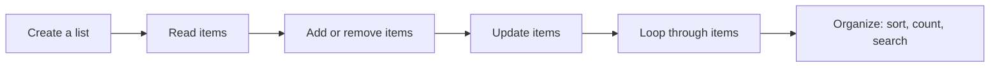
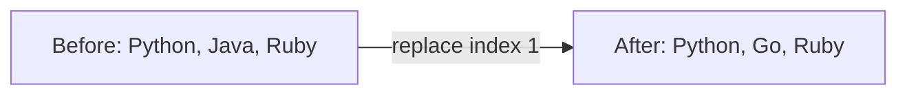

# Python Lists

> **A visual, beginner-friendly deep dive into Python’s list type**  
> Learn to store, inspect, change, sort, and process groups of values.

---

## The one-minute picture

A Python list is an **ordered, changeable collection of items**. It is one of the most useful tools in Python because real programs often work with groups: quiz scores, names, tasks, products, or lines of data.



Picture a list as a row of labeled compartments:

```text
List:       [ "Python", "Java", "Ruby" ]
Index:          0        1       2
Negative:      -3       -2      -1
```

The list keeps its order, and Python starts counting positions at zero.

```python
languages = ["Python", "Java", "Ruby"]
languages[0]   # 'Python'
languages[-1]  # 'Ruby'
```

---

## 1. Creating lists

Square brackets `[]` create a list. Separate items with commas.

```python
languages = ["Python", "Java", "Ruby"]
scores = [92, 85, 98]
mixed = ["Ada", 36, True]  # lists can hold different types
empty = []
```

Use a list when you want several related values under one name. An empty list is useful when your program will collect items later.

```python
tasks = []
tasks.append("Review list indexing")
tasks.append("Practice loops")
```

Lists can even contain other lists. This is called a nested list and can represent rows and columns.

```python
classroom = [
    ["Ada", 92],
    ["Grace", 98],
    ["Linus", 88],
]
```

---

## 2. Lists are ordered and mutable

**Ordered** means items stay in a particular sequence. **Mutable** means you can change the list after creating it: replace an item, add new ones, or remove some.



```python
languages = ["Python", "Java", "Ruby"]
languages[1] = "Go"
# languages is now ['Python', 'Go', 'Ruby']
```

Unlike strings, lists allow item assignment. The list itself can be changed without making a whole new list.

---

## 3. Length, indexing, and membership

### Length

`len()` tells you how many items are in a list.

```python
languages = ["Python", "Java", "Ruby"]
len(languages)  # 3
```

### Indexing: one position, one item

Indexing means asking a list for the item at a particular position. Python starts positive indexes at **0**: `0` means first item, `1` means second item, and so on.

```python
languages = ["Python", "Java", "Ruby", "Go"]
languages[0]  # 'Python' — first item
languages[1]  # 'Java'   — second item
languages[3]  # 'Go'     — fourth item
```

Negative indexes count backward from the end. This is useful when you want the last item without needing to know how long the list is.

```text
Items:              [ "Python"  "Java"  "Ruby"  "Go" ]
Positive indexes:        0         1        2       3
Negative indexes:       -4        -3       -2      -1
```

```python
languages[-1]  # 'Go'     — last item
languages[-2]  # 'Ruby'   — second-to-last item
```

An index that does not exist raises `IndexError`. Here `languages[4]` and `languages[-5]` are out of range: the list has four items, so valid indexes are `0` through `3` or `-4` through `-1`.

### Membership

Use `in` to check whether a value appears in a list.

```python
"Java" in languages      # True
"JavaScript" in languages  # False
```

`not in` checks the opposite.

```python
"JavaScript" not in languages  # True
```

---

## 4. Slicing a list

Indexing picks **one** item; slicing picks a **range** of items. The general form is `items[start:stop:step]`:

- `start`: where to begin (included);
- `stop`: where to stop (excluded);
- `step`: how far to move each time.

```python
scores = [72, 85, 91, 88, 96, 78]
scores[1:4]   # [85, 91, 88]
```

The slice begins at index `1` (value `85`) and takes items at indexes `1`, `2`, and `3`. It stops before index `4` (value `96`). That “stop before” rule is why `[1:4]` contains three items.

```text
Values:          [ 72,  85,  91,  88,  96,  78 ]
Positive index:      0    1    2    3    4    5
Negative index:     -6   -5   -4   -3   -2   -1
Slice [1:4]:              [---- included ----)     → [85, 91, 88]
```

Negative indexes also work in slices. For example, `scores[-3:-1]` starts at the third item from the end and stops before the last item:

```python
scores[-3:-1]  # [88, 96]
scores[-2:]    # [96, 78] — last two items
scores[:-1]    # [72, 85, 91, 88, 96] — everything except the last
```

If you leave out a boundary, Python uses the beginning or end. If you leave out the step, it uses `1`.

```python
scores[:3]    # [72, 85, 91] — start at beginning
scores[3:]    # [88, 96, 78] — continue to end
scores[::2]   # [72, 91, 96] — take every second item
scores[::-1]  # [78, 96, 88, 91, 85, 72] — reversed copy
```

A slice creates a new list containing the selected items. It does not remove them from the original list. Unlike a single invalid index, many out-of-range slice boundaries are simply clipped to the available list.

---

## 5. Changing a list

### Replacing an item

Assign a new value at an existing index.

```python
colors = ["red", "blue", "green"]
colors[1] = "purple"
# ['red', 'purple', 'green']
```

### Adding items

| Operation | What it does | Example |
|---|---|---|
| `append(item)` | Adds one item to the end | `tasks.append("Read")` |
| `extend(items)` | Adds each item from another collection | `tasks.extend(["Code", "Review"])` |
| `insert(index, item)` | Inserts one item at a position | `tasks.insert(0, "Plan")` |

```python
tasks = ["Read", "Code"]
tasks.append("Review")
# ['Read', 'Code', 'Review']

tasks.insert(1, "Practice")
# ['Read', 'Practice', 'Code', 'Review']
```

A common beginner surprise: `append` adds its argument as **one item**, while `extend` adds items one by one.

```python
letters = ["a", "b"]
letters.append(["c", "d"])
# ['a', 'b', ['c', 'd']]  — a nested list was added as one item

letters = ["a", "b"]
letters.extend(["c", "d"])
# ['a', 'b', 'c', 'd']
```

### Removing items

| Operation | What it removes |
|---|---|
| `remove(value)` | First matching value; raises `ValueError` if absent |
| `pop()` | Last item, and returns it |
| `pop(index)` | Item at that position, and returns it |
| `del items[index]` | Item at that position |
| `clear()` | All items |

```python
tasks = ["Plan", "Code", "Review"]
tasks.remove("Code")       # remove by value
done = tasks.pop()          # removes and returns 'Review'
# tasks is now ['Plan']; done is 'Review'
```

Use `pop()` when you need the removed value, such as taking the next item off a stack.

---

## 6. Combining, repeating, and copying

### Combining with `+`

The `+` operator creates a new list containing the items from both lists.

```python
morning = ["Read", "Plan"]
afternoon = ["Code", "Test"]
day = morning + afternoon
# ['Read', 'Plan', 'Code', 'Test']
```

### Repeating with `*`

The `*` operator repeats the list’s items.

```python
zeros = [0] * 4  # [0, 0, 0, 0]
```

Avoid using repetition to create a list of nested mutable lists:

```python
rows = [[0]] * 3
rows[0][0] = 9
# All rows show [9], because they refer to the same inner list.
```

Create each inner list independently instead:

```python
rows = [[0] for _ in range(3)]
```

### Copying

Assigning a list to another variable does **not** make a separate list. Both names refer to the same list.

```python
original = ["Python", "Java"]
alias = original
alias.append("Ruby")
# original is also ['Python', 'Java', 'Ruby']
```

Use `.copy()` or a full slice for a shallow copy:

```python
original = ["Python", "Java"]
separate = original.copy()
separate.append("Ruby")
# original stays ['Python', 'Java']; separate includes 'Ruby'
```

A shallow copy duplicates the outer list, but nested lists inside it are still shared. For beginner programs with a flat list, `.copy()` is usually exactly what you need.

---

## 7. Looping through a list

A `for` loop visits each item in order. This is the natural way to process every item.

```python
languages = ["Python", "Java", "Ruby"]
for language in languages:
    print(f"I am learning {language}.")
```

The loop variable (`language`) takes the value of each item in turn.

### Need the position too?

Use `enumerate()` to get both the index and item.

```python
for index, language in enumerate(languages):
    print(f"{index}: {language}")
```

By default, `enumerate` begins counting at 0. To start at 1 for display, pass `start=1`:

```python
for number, language in enumerate(languages, start=1):
    print(f"{number}. {language}")
```

### Transforming items with a list comprehension

A list comprehension builds a new list by applying an expression to each item.

```python
scores = [72, 85, 91]
curved_scores = [score + 5 for score in scores]
# [77, 90, 96]
```

Read it as: “make a list of `score + 5` for each `score` in `scores`.” A regular `for` loop is a fine choice when the comprehension feels hard to read.

You can also filter while building:

```python
scores = [72, 85, 91, 64, 98]
passing = [score for score in scores if score >= 70]
# [72, 85, 91, 98]
```

---

## 8. Finding, counting, sorting

### Finding a value

`index(value)` returns the position of the first match, and raises `ValueError` if it is not present. Check membership first when absence is possible.

```python
languages = ["Python", "Java", "Python"]
languages.index("Python")  # 0
languages.count("Python")  # 2
```

```python
if "Ruby" in languages:
    position = languages.index("Ruby")
else:
    position = -1
```

### Sorting

`sort()` sorts the list **in place** and returns `None`. `sorted()` returns a new sorted list and leaves the original unchanged.

```python
scores = [88, 72, 96, 85]
scores.sort()
# scores is now [72, 85, 88, 96]

languages = ["Ruby", "Python", "Java"]
alphabetical = sorted(languages)
# alphabetical is ['Java', 'Python', 'Ruby']; languages is unchanged
```

Use `reverse=True` for descending order:

```python
sorted([88, 72, 96], reverse=True)  # [96, 88, 72]
```

For strings, sorting uses Python’s text ordering, which may differ from a language-specific dictionary order.

### Reversing

`reverse()` reverses a list in place. `items[::-1]` creates a reversed copy.

```python
numbers = [1, 2, 3]
numbers.reverse()
# [3, 2, 1]
```

---

## 9. Lists and functions: the `None` surprise

Several list methods change the list and return `None`. Do not assign their result back to the list.

```python
numbers = [3, 1, 2]
result = numbers.sort()
print(numbers)  # [1, 2, 3]
print(result)   # None
```

The list was sorted in place. If you want a sorted value as the result of an expression, use `sorted(numbers)`.

---

## 10. A practical mini-project: Python study tracker

This small program tracks which Python topics you want to study. It uses list creation, adding items, removing items, membership checks, loops, and `len()`.

```python
topics = ["Strings", "Lists", "Loops"]

# Add a new topic to the end.
topics.append("Dictionaries")

# Mark a topic as completed by removing it.
completed_topic = "Strings"
topics.remove(completed_topic)

print("Python topics still to study:")
for number, topic in enumerate(topics, start=1):
    print(f"{number}. {topic}")

print(f"Topics remaining: {len(topics)}")

# Check before removing so we do not get a ValueError.
if "Functions" in topics:
    topics.remove("Functions")
else:
    print("Functions is not on the list yet.")
```

Output:

```text
Python topics still to study:
1. Lists
2. Loops
3. Dictionaries
Topics remaining: 3
Functions is not on the list yet.
```

Try adding your own topic, or change `completed_topic` to see what happens. Notice that `remove()` changes the list itself, while `len()` simply reports how many items are currently in it.

---

## 11. Common list mistakes

### Using an index that does not exist

```python
items = ["Python", "Lists"]
# items[2]  # IndexError: the valid positions are 0 and 1
```

### Confusing `append` and `extend`

`append([3, 4])` adds one nested list. `extend([3, 4])` adds two individual items.

### Expecting `sort()` to produce a sorted list

`sort()` changes the list and returns `None`. Choose `sorted(items)` when you need a new sorted list.

### Accidentally sharing a list

`second = first` gives both variables the same list. Use `first.copy()` for a separate shallow copy.

### Removing a value that is absent

`remove(value)` raises `ValueError` if there is no match. Check `value in items` first when the value might not be present.

### Changing a list while looping over it

Removing items while iterating can cause some items to be skipped. Build a new filtered list instead:

```python
scores = [45, 82, 59, 91]
passing = [score for score in scores if score >= 60]
```

---

## 12. Quick reference map

```text
CREATE       [a, b, c]        empty = []
INSPECT      len(items)       items[i]       value in items
SLICE        items[start:stop:step]
CHANGE       items[i] = value
ADD          append(value)    extend(values)    insert(index, value)
REMOVE       remove(value)    pop(index)    del items[index]    clear()
COMBINE      first + second   items * count
COPY         items.copy()
LOOP         for item in items: ...
BUILD        [expression for item in items if condition]
ORGANIZE     items.sort()     sorted(items)     items.reverse()
COUNT        items.count(value)    items.index(value)
```

### The most important mental checklist

1. **Do I want to change this list or keep the original?** `sort()` changes it; `sorted()` makes a new list.
2. **Am I adding one item or several?** `append()` adds one; `extend()` adds each item.
3. **Could this index be out of range?** The first is `0`, and the last is `len(items) - 1`.
4. **Are these two names sharing the same list?** Assignment creates an alias; `.copy()` makes a shallow copy.
5. **Could the item be missing before I remove or find it?** Check with `in` first.

---

## 13. Practice (answers below)

1. What is `languages[1]` for `languages = ["Python", "Java", "Ruby"]`?
2. What does `scores[-1]` mean?
3. What is the result of `[10, 20, 30, 40][1:3]`?
4. What is the difference between `append([3, 4])` and `extend([3, 4])`?
5. Which method removes an item by its value?
6. What does `pop()` return if no index is supplied?
7. What is the difference between `sort()` and `sorted()`?
8. How do you loop through a list with item numbers starting at 1?
9. Why can `alias = original` cause a surprise when you change `alias`?
10. How would you build a new list containing only scores at least 60?

<details>
<summary><strong>Show the answers</strong></summary>

1. `"Java"`.
2. The last item in the list.
3. `[20, 30]` (the stop index 3 is excluded).
4. `append` adds `[3, 4]` as one nested item; `extend` adds `3` and `4` separately.
5. `remove(value)`.
6. It removes and returns the last item.
7. `sort()` changes the list in place and returns `None`; `sorted()` returns a new sorted list.
8. `for number, item in enumerate(items, start=1):`.
9. Both names refer to the same list object.
10. `[score for score in scores if score >= 60]`.

</details>

---

## Final idea

Lists are ordered containers you can change. Learn to **index and slice** to read them, use **append and remove** to manage their contents, and use **loops** to work through every item. Keep in mind whether an operation changes the existing list or creates a new one, and lists become a clear, dependable tool for building real programs.
