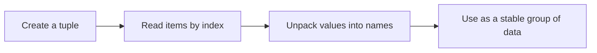
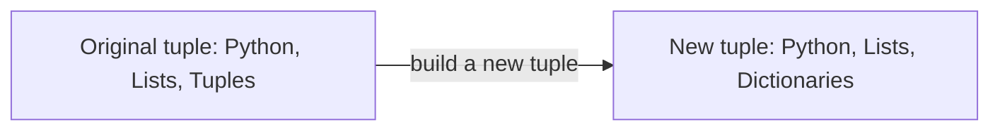

# Python Tuples

> **A visual, beginner-friendly deep dive into Python’s tuple type**  
> Learn to group values, read them by position, unpack them, and decide when a tuple is the right choice.

---

## The one-minute picture

A tuple is an **ordered collection of items that cannot be changed after it is created**. It is useful when a group of values belongs together and should stay as it is—for example, a screen size, a point on a map, or a student's name and score.



Think of a tuple as a row of labeled positions, much like a list. The key difference is that a tuple is **fixed** after creation.

```text
Tuple:          ("Python", 3, "beginner")
Position:            0     1       2
Negative position:  -3    -2      -1
```

---

## 1. Creating tuples

Parentheses are often used to show a tuple, and commas are what actually make it a tuple.

```python
language_info = ("Python", 3, "beginner")
point = (4, 7)
empty = ()
```

You can also write a tuple without parentheses when the commas make the grouping clear:

```python
language_info = "Python", 3, "beginner"
```

### The one-item tuple

A one-item tuple needs a trailing comma. Without the comma, parentheses simply group the value.

```python
one_item_tuple = ("Python",)
not_a_tuple = ("Python")

print(type(one_item_tuple))  # <class 'tuple'>
print(type(not_a_tuple))     # <class 'str'>
```

The comma is the important part: `("Python",)` is a tuple; `("Python")` is just the string inside parentheses.

---

## 2. Ordered and immutable

**Ordered** means items have positions and keep their order. **Immutable** means the tuple's item positions cannot be reassigned after creation.

```python
course = ("Python", "Lists", "Tuples")
print(course[0])  # 'Python'

# course[1] = "Dictionaries"  # TypeError: tuples do not support item assignment
```

You can create a new tuple based on an old one, but that does not change the old tuple:

```python
course = ("Python", "Lists", "Tuples")
updated_course = course[:2] + ("Dictionaries",)
# course         is still ('Python', 'Lists', 'Tuples')
# updated_course is ('Python', 'Lists', 'Dictionaries')
```



### An important detail about mutable items

A tuple cannot replace its own items, but an item inside it may itself be changeable. For example, a list stored inside a tuple can still be modified.

```python
record = ("Study plan", ["Strings", "Lists"])
record[1].append("Tuples")
# ('Study plan', ['Strings', 'Lists', 'Tuples'])
```

The tuple still points to the same inner list; the list changed. So “immutable tuple” means its slots cannot be reassigned—it does not freeze every object stored inside it.

---

## 3. Length, indexing, and membership

### Length

`len()` tells you how many items are in a tuple.

```python
languages = ("Python", "Java", "Ruby")
len(languages)  # 3
```

### Indexing

Indexing retrieves one item. Positive indexes start at `0`; negative indexes count backward from the end.

```text
Items:              ("Python"  "Java"  "Ruby"  "Go")
Positive indexes:        0         1       2      3
Negative indexes:       -4        -3      -2     -1
```

```python
languages = ("Python", "Java", "Ruby", "Go")
languages[0]   # 'Python' — first item
languages[1]   # 'Java'   — second item
languages[-1]  # 'Go'     — last item
languages[-2]  # 'Ruby'   — second-to-last item
```

If an index is outside the tuple's positions, Python raises `IndexError`. Here, valid indexes are `0` through `3` and `-4` through `-1`.

### Membership

Use `in` to ask whether a value appears in a tuple.

```python
"Java" in languages       # True
"JavaScript" in languages # False
```

---

## 4. Slicing a tuple

Indexing selects one item; slicing selects a range. The syntax is `items[start:stop:step]`. The start is included and the stop is excluded.

```python
lessons = ("Strings", "Lists", "Tuples", "Loops", "Functions")
lessons[1:4]  # ('Lists', 'Tuples', 'Loops')
```

That slice begins at index 1 and takes positions 1, 2, and 3, stopping before index 4.

```text
Items:          ( Strings  Lists  Tuples  Loops  Functions )
Positive index:      0       1      2      3       4
Negative index:     -5      -4     -3     -2      -1
Slice [1:4]:                 [------ included ------)       → (Lists, Tuples, Loops)
```

Negative indexes work in slices too:

```python
lessons[-3:-1]  # ('Tuples', 'Loops')
lessons[-2:]    # ('Loops', 'Functions') — last two items
lessons[:-1]    # all except the last item
lessons[::2]    # every second item
lessons[::-1]   # a reversed tuple
```

A slice creates a new tuple. It does not remove items from the original.

---

## 5. Tuple packing and unpacking

### Packing: put values together

Writing comma-separated values creates a tuple. This is sometimes called **packing**.

```python
student = "Ada", 36, "Python learner"
# The three values are packed into one tuple.
```

### Unpacking: assign items to names

If the number of names matches the number of tuple items, Python can assign each item to a name in one step.

```python
student = ("Ada", 36, "Python learner")
name, age, description = student

print(name)         # Ada
print(age)          # 36
print(description)  # Python learner
```

Think of unpacking as opening the tuple and placing each item into its matching named slot:

```text
Tuple:     ("Ada", 36, "Python learner")
             |     |          |
Names:     name   age    description
```

If the item count and name count do not match, Python raises `ValueError`.

### Swapping values

Tuple unpacking makes it easy to swap two values without a temporary variable:

```python
first = "Strings"
second = "Lists"
first, second = second, first
# first is 'Lists'; second is 'Strings'
```

### Extended unpacking with `*`

Use `*name` to collect the remaining items into a list.

```python
first, *middle, last = ("Strings", "Lists", "Tuples", "Loops")
# first  is 'Strings'
# middle is ['Lists', 'Tuples']
# last   is 'Loops'
```

There must still be enough items for the names that do not use `*`.

---

## 6. Tuple methods and useful operations

Tuples have fewer methods than lists because their contents cannot be edited. Two common methods are:

| Method | What it does |
|---|---|
| `count(value)` | Counts how many times a value appears |
| `index(value)` | Finds the position of the first match; raises `ValueError` if absent |

```python
scores = (88, 92, 88, 75)
scores.count(88)  # 2
scores.index(92)  # 1
```

Other familiar operations work too:

```python
scores = (88, 92, 88, 75)
len(scores)       # 4
92 in scores      # True
scores + (100,)   # (88, 92, 88, 75, 100)
scores * 2        # repeats the items into a new tuple
```

Remember the comma when adding one item: `(100,)` is a one-item tuple.

---

## 7. When to use a tuple instead of a list

Choose a **tuple** when the values belong together as one fixed group and should not be reassigned:

```python
screen_size = (1920, 1080)
point = (10, 25)
student_record = ("Ada", 98)
```

Choose a **list** when the collection is expected to grow, shrink, or have items replaced:

```python
study_topics = ["Strings", "Lists"]
study_topics.append("Tuples")
```

| Question | Tuple | List |
|---|---|---|
| Keeps item order? | Yes | Yes |
| Can replace/add/remove items? | No (tuple positions are fixed) | Yes |
| Written with? | Usually `(...)` | `[...]` |
| Good for? | Fixed grouped values | Collections that change |

A tuple is not automatically “better” or “faster” for every situation. Pick the type that best communicates whether the collection is meant to change.

---

## 8. Tuples inside functions and loops

Tuples are often used to return a few related results together. You can unpack the returned tuple directly.

```python
def get_course_info():
    return "Python", 12

course_name, lesson_count = get_course_info()
print(course_name)   # Python
print(lesson_count)  # 12
```

If functions are new, read this as: `get_course_info()` gives back two values grouped as a tuple; the left side places them into two names.

You can also loop through tuple items just as you would with a list:

```python
for language in ("Python", "Java", "Ruby"):
    print(language)
```

For pairs, unpack while looping:

```python
scores = (("Ada", 98), ("Grace", 100))
for name, score in scores:
    print(f"{name}: {score}")
```

---

## 9. A practical mini-project: Python topic cards

Each topic card is a tuple containing a topic name and a short description. The collection of cards is a tuple too, because this example treats the prepared cards as a fixed set.

```python
topic_cards = (
    ("Strings", "Work with text"),
    ("Lists", "Store an ordered group that can change"),
    ("Tuples", "Group ordered values that stay fixed"),
)

for number, (topic, description) in enumerate(topic_cards, start=1):
    print(f"{number}. {topic}: {description}")

first_topic, first_description = topic_cards[0]
print(f"First card is about {first_topic}.")
```

Output:

```text
1. Strings: Work with text
2. Lists: Store an ordered group that can change
3. Tuples: Group ordered values that stay fixed
First card is about Strings.
```

This example combines tuples, indexing, unpacking, looping, and f-strings. Try adding another card by writing another `(topic, description)` pair with a comma after it.

---

## 10. Common tuple surprises

### Parentheses alone do not make a tuple

```python
value = (5)   # int
pair = (5,)   # tuple
```

The comma makes the tuple.

### A tuple cannot be edited by index

```python
point = (4, 7)
# point[0] = 8  # TypeError
```

Create a new tuple if you need different values.

### A tuple can contain a changeable object

A tuple holding a list cannot replace that list, but the inner list can still be modified. Immutability applies to the tuple's references, not recursively to every object inside it.

### One-item results need a comma

When creating or slicing a one-item tuple, Python keeps the trailing comma visible:

```python
one_topic = ("Tuples",)
```

### Unpacking needs a matching number of values

```python
name, score = ("Ada", 98)  # works
# name, score = ("Ada", 98, "Python")  # ValueError: too many values
```

---

## 11. Quick reference map

```text
CREATE       (a, b, c)     one_item = (a,)     empty = ()
INSPECT      len(items)    items[i]    value in items
SLICE        items[start:stop:step]
UNPACK       first, second = pair
EXTENDED     first, *middle, last = items
COUNT        items.count(value)    items.index(value)
COMBINE      first + second    items * count
LOOP         for item in items: ...
```

### The most important mental checklist

1. **Should this group stay fixed?** A tuple may communicate that clearly.
2. **Is this really a one-item tuple?** Include the comma: `(value,)`.
3. **Am I indexing one item or slicing a range?** Indexing uses one position; slicing uses `start:stop`.
4. **Do my unpacking names match the number of items?** They must, unless you use `*name` for the remainder.
5. **Does a tuple contain a mutable object like a list?** That inner object can still change.

---

## 12. Practice (answers below)

1. What type is `("Python")`?
2. What makes `("Python",)` a tuple?
3. What is `languages[-1]` for `languages = ("Python", "Java", "Ruby")`?
4. What does `(10, 20, 30, 40)[1:3]` produce?
5. How can you unpack `("Ada", 98)` into `name` and `score`?
6. What does `("a", "b").count("a")` return?
7. Can you assign to `point[0]` if `point = (4, 7)`?
8. When is a tuple a better fit than a list?
9. What values do `first, *rest = ("Strings", "Lists", "Tuples")` give `rest`?
10. If a tuple contains a list, can that inner list change?

<details>
<summary><strong>Show the answers</strong></summary>

1. A string; parentheses group the value, but there is no comma.
2. The trailing comma.
3. `"Ruby"`.
4. `(20, 30)`; the stop index 3 is excluded.
5. `name, score = ("Ada", 98)`.
6. `1`.
7. No. Tuple item assignment raises `TypeError`.
8. When the values form an ordered group that should remain fixed.
9. `['Lists', 'Tuples']`.
10. Yes. The tuple's item reference stays fixed, but the list object itself is mutable.

</details>

---

## Final idea

A tuple is an ordered group with fixed positions. Use indexing and slicing to read it, unpacking to give its values meaningful names, and a list instead when the collection itself needs to change. The trailing comma is the small piece of syntax that makes one-item tuples work.
