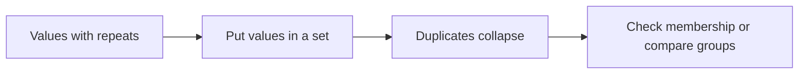
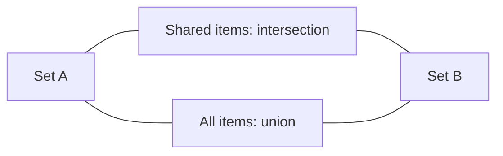

# Python Sets

> **A visual, beginner-friendly deep dive into Python’s `set` type**  
> Learn to keep unique values, check membership quickly, and compare collections with set operations.

---

## The one-minute picture

A set is a collection of **unique items**. It is useful when duplicates do not matter and you want to ask questions such as: “Which topics are in both lists?”, “Which values are new?”, or “Have I seen this name before?”

A set is **unordered**: it does not promise a position for each item. Use a list or tuple when order and positions matter.



```text
Input values:  Python, Lists, Python, Loops, Lists
Set:           {Python, Lists, Loops}
                 one copy of each value; no fixed order
```

The braces above illustrate the idea. Python may display set items in a different order, and that order can vary.

---

## 1. Creating sets

Use curly braces with comma-separated values to create a non-empty set. Duplicate values are automatically stored once.

```python
topics = {"Strings", "Lists", "Loops"}
unique_numbers = {1, 2, 2, 3, 3, 3}
print(unique_numbers)  # {1, 2, 3} (display order can vary)
```

An empty pair of braces `{}` creates an empty **dictionary**, not a set. To make an empty set, use `set()`.

```python
empty_set = set()
empty_dictionary = {}
```

You can also make a set from another collection, such as a list. Duplicates disappear as the values are added.

```python
names = ["Ada", "Grace", "Ada", "Linus"]
unique_names = set(names)
# contains Ada, Grace, and Linus once each; order is not guaranteed
```

---

## 2. Sets are unique and unordered

### Unique

A set keeps only one copy of each value. Adding a value already present leaves the set with one copy.

```python
languages = {"Python", "Java", "Python"}
# The set contains Python and Java once each.
languages.add("Python")
# Still only one Python.
```

### Unordered

Sets are designed for membership and group comparison, not for position. They do not support indexing or slicing.

```python
languages = {"Python", "Java", "Ruby"}
# languages[0]  # TypeError: sets cannot be indexed
```

If you need a predictable order for display, create a sorted list:

```python
sorted_languages = sorted(languages)
```

Do not rely on the order in which a set happens to print.

---

## 3. Adding and removing items

### Add one item

`add(value)` inserts one value. If it is already there, the set remains unique.

```python
topics = {"Strings", "Lists"}
topics.add("Sets")
```

### Add several items

`update(iterable)` adds each value from an iterable, such as a list or another set.

```python
topics = {"Strings", "Lists"}
topics.update(["Sets", "Loops"])
```

### Remove items

| Method | What it does |
|---|---|
| `remove(value)` | Removes the value; raises `KeyError` if it is absent |
| `discard(value)` | Removes the value if present; does nothing if absent |
| `pop()` | Removes and returns an arbitrary item; raises `KeyError` if empty |
| `clear()` | Removes all items |

```python
topics = {"Strings", "Lists", "Sets"}
topics.remove("Lists")
topics.discard("Functions")  # no error even though it is absent
```

Because a set has no positional order, `pop()` cannot mean “remove the last item.” It removes an arbitrary item. Use `discard` when you are unsure whether an item exists.

---

## 4. Membership and length

Sets are especially useful for checking whether a value is present.

```python
completed = {"Strings", "Lists", "Loops"}
"Lists" in completed       # True
"Functions" in completed   # False
"Functions" not in completed  # True
len(completed)              # 3
```

Membership checks in sets are typically very efficient, even as the collection grows. That makes sets handy for “have I seen this before?” tasks.

---

## 5. Set operations: compare groups

Set operations create new sets that describe how two groups relate. Venn diagrams are a useful mental picture: each circle is a set; overlap means shared values.



Suppose two learners have studied these Python topics:

```python
alex = {"Strings", "Lists", "Loops"}
sam = {"Lists", "Sets", "Functions"}
```

### Union: everything in either set

Use `|` or `.union()`. Duplicates are included only once.

```python
alex | sam
# {'Strings', 'Lists', 'Loops', 'Sets', 'Functions'} (order may vary)
```

Read `A | B` as “A or B, including both.”

### Intersection: what they share

Use `&` or `.intersection()`.

```python
alex & sam
# {'Lists'}
```

Read `A & B` as “A and B.”

### Difference: in the first set, but not the second

Use `-` or `.difference()`.

```python
alex - sam  # {'Strings', 'Loops'}
sam - alex  # {'Sets', 'Functions'}
```

Difference depends on direction: `A - B` and `B - A` can be different.

### Symmetric difference: in one set or the other, but not both

Use `^` or `.symmetric_difference()`.

```python
alex ^ sam
# {'Strings', 'Loops', 'Sets', 'Functions'}
```

```text
A | B   union                everything in either group
A & B   intersection         shared by both groups
A - B   difference           in A, not in B
A ^ B   symmetric difference in one group, not both
```

---

## 6. Set comparison questions

Python can compare sets to ask whether they contain the same items or whether one is contained in another.

```python
{1, 2, 3} == {3, 2, 1}  # True: order does not matter
{1, 2} < {1, 2, 3}      # True: left is a proper subset of right
{1, 2} <= {1, 2, 3}     # True: subset (equality is allowed too)
{1, 2, 3} > {1, 2}      # True: left is a proper superset
```

- **Subset**: every item in the smaller set appears in the larger set.
- **Superset**: a set contains every item in another set.

Named methods such as `.issubset()` and `.issuperset()` can make this intent especially clear.

```python
required = {"Strings", "Lists"}
completed = {"Strings", "Lists", "Sets"}
required.issubset(completed)  # True
completed.issuperset(required)  # True
```

---

## 7. What can go inside a set?

Set items must be **hashable**, which for beginner use means they need a stable value and cannot be changed in place. Numbers, strings, and tuples of hashable values work. Lists and dictionaries do not.

```python
valid = {"Python", 42, (10, 20)}
# invalid = {[1, 2], {"name": "Ada"}}  # TypeError: unhashable types
```

A tuple can be put in a set if all of its contents are hashable. A tuple containing a list cannot be used as a set item because that inner list can change.

---

## 8. Removing duplicates while keeping order

A set is great for uniqueness, but it does not preserve the original sequence as a promised order. If you want unique values **in their first-seen order**, use `dict.fromkeys()`:

```python
topics = ["Lists", "Strings", "Lists", "Tuples", "Strings"]
unique_in_order = list(dict.fromkeys(topics))
# ['Lists', 'Strings', 'Tuples']
```

This is a useful distinction: use `set(values)` when order does not matter; use this pattern when you want to remove duplicates but keep the first appearance order.

---

## 9. A practical mini-project: compare study progress

Use sets to compare completed Python topics for two learners.

```python
alex_completed = {"Strings", "Lists", "Loops"}
sam_completed = {"Lists", "Sets", "Functions"}
all_completed = alex_completed | sam_completed
shared = alex_completed & sam_completed
alex_only = alex_completed - sam_completed

print(f"Topics completed by either learner: {sorted(all_completed)}")
print(f"Topics both learners completed: {sorted(shared)}")
print(f"Topics only Alex completed: {sorted(alex_only)}")
```

Output:

```text
Topics completed by either learner: ['Functions', 'Lists', 'Loops', 'Sets', 'Strings']
Topics both learners completed: ['Lists']
Topics only Alex completed: ['Loops', 'Strings']
```

The set operations answer the comparison questions. `sorted()` is used only for tidy, predictable display; the sets themselves remain unordered.

---

## 10. Common set surprises

### `{}` is not an empty set

It creates an empty dictionary. Write `set()` for an empty set.

### Sets do not have indexes

There is no first or last set item. Convert to a sorted list if you need position-based display.

### `remove` and `discard` behave differently

`remove(value)` complains if the item is missing. `discard(value)` quietly does nothing.

### `pop()` does not mean “last”

Sets have no positional order, so `pop()` removes an arbitrary item.

### Set display order is not a promise

Do not write programs that depend on the order shown when printing a set. Sort the values for predictable presentation.

### Duplicate values disappear

If repeats matter—such as counting words—keep a list or use a counting tool instead. A set remembers whether a value is present, not how many times it appeared.

---

## 11. Quick reference map

```text
CREATE       {a, b, c}       empty = set()
UNIQUE       set(values)
ADD          items.add(value)       items.update(values)
REMOVE       remove(value)          discard(value)          pop()
INSPECT      len(items)             value in items
UNION        A | B                  A.union(B)
INTERSECTION A & B                  A.intersection(B)
DIFFERENCE   A - B                  A.difference(B)
SYMMETRIC    A ^ B                  A.symmetric_difference(B)
COMPARE      A.issubset(B)          A.issuperset(B)
ORDER        sorted(items)
```

### The most important mental checklist

1. **Do duplicates matter?** If not, a set may fit.
2. **Does item order or position matter?** If yes, use a list or tuple.
3. **Am I making an empty set?** Use `set()`, not `{}`.
4. **Could the value be missing?** Use `discard`, or check with `in` before `remove`.
5. **Do I want shared values or all values?** Use intersection (`&`) for shared; union (`|`) for all.

---

## 12. Practice (answers below)

1. What happens to duplicates when values are added to a set?
2. How do you create an empty set?
3. Can you write `topics[0]` to get a set item?
4. What does `{1, 2, 3} & {2, 3, 4}` produce?
5. What does `{1, 2, 3} - {2}` produce?
6. What is the difference between `remove()` and `discard()`?
7. Does `pop()` remove the “last” item from a set?
8. Which operation gives all values from either set, with duplicates removed?
9. Why can’t a list be an item inside a set?
10. How can you display the set values in a predictable order?

<details>
<summary><strong>Show the answers</strong></summary>

1. Only one copy of each value remains.
2. `set()`.
3. No. Sets do not support indexing because they are unordered.
4. `{2, 3}`.
5. `{1, 3}`.
6. `remove` raises `KeyError` if missing; `discard` does nothing if missing.
7. No. It removes an arbitrary item.
8. Union: `A | B`.
9. Lists can change, so they are unhashable and cannot be set items.
10. Use `sorted(my_set)`.

</details>

---

## Final idea

A set is a bag of unique values with no promised order. Use it to remove duplicates, check whether something has appeared, or compare groups with union, intersection, and difference. When order matters, use a list or sort the set values for display.
