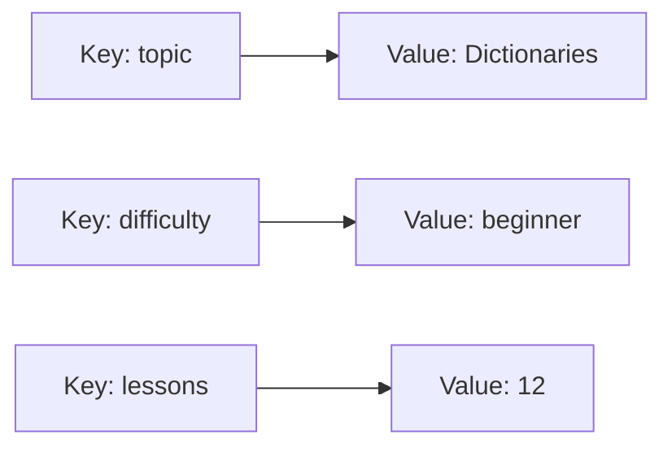
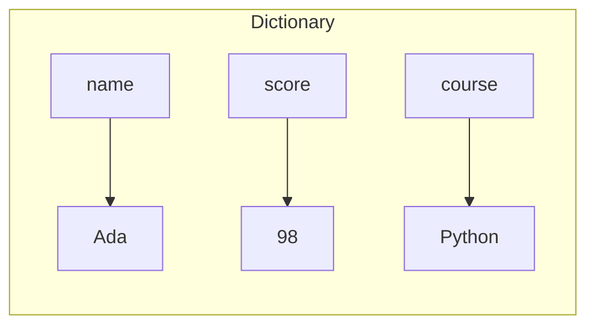

# Python Dictionaries

> **A visual, beginner-friendly deep dive into Python’s `dict` type**  
> Learn to store information as key–value pairs, look it up by key, update it, and organize related data.

---

## The one-minute picture

A dictionary stores information as **key–value pairs**. A key is the label you use to find a value—like looking up a word in a glossary or a student's name in a score record.



```python
course = {
    "topic": "Dictionaries",
    "difficulty": "beginner",
    "lessons": 12,
}
```

Read the pairs as: key `"topic"` points to value `"Dictionaries"`; key `"difficulty"` points to value `"beginner"`; and so on. You use the key to retrieve its matching value.

---

## 1. Creating dictionaries

Dictionaries use curly braces `{}` and `key: value` pairs separated by commas.

```python
student = {
    "name": "Ada",
    "score": 98,
    "passed": True,
}
```

An empty pair of braces creates an empty dictionary:

```python
empty = {}
```

You can also create one with `dict()`:

```python
student = dict(name="Ada", score=98)
# {'name': 'Ada', 'score': 98}
```

Keys are unique. If the same key appears more than once in a dictionary literal, the later value replaces the earlier one. Prefer writing each key once so the result is clear.

```python
settings = {"theme": "light", "theme": "dark"}
# The resulting value for 'theme' is 'dark'.
```

---

## 2. Keys and values

A dictionary has **keys** (labels) and **values** (the data attached to each label).



Keys must be unique and immutable (more precisely, hashable). Strings and numbers are common keys. Lists cannot be keys because lists can change.

```python
record = {"name": "Ada", 1: "first lesson"}
# invalid = {["unit", 1]: "Dictionaries"}  # a list cannot be a dictionary key
```

Values can be any kind of Python object: strings, numbers, booleans, lists, or even other dictionaries.

```python
profile = {
    "name": "Ada",
    "topics": ["Strings", "Lists", "Dictionaries"],
    "active": True,
}
```

---

## 3. Reading values

### Square brackets

Use the key inside square brackets to retrieve a value.

```python
student = {"name": "Ada", "score": 98}
student["name"]   # 'Ada'
student["score"]  # 98
```

If the key is missing, square brackets raise `KeyError`:

```python
# student["course"]  # KeyError because 'course' is not a key
```

### Safe lookup with `get()`

`get(key)` returns the value if the key exists, or `None` if it does not. You can provide a default value as a second argument.

```python
student.get("name")                 # 'Ada'
student.get("course")               # None
student.get("course", "not set")   # 'not set'
```

Use square brackets when a missing key should be treated as an error. Use `get()` when a key may be absent and you want a safe default.

### Check whether a key exists

`in` checks dictionary **keys**, not values.

```python
student = {"name": "Ada", "score": 98}
"name" in student    # True
"Ada" in student     # False — 'Ada' is a value, not a key
```

To check values, use `in` with `.values()`:

```python
"Ada" in student.values()  # True
```

---

## 4. Adding and changing entries

Assign a value to a key to add a new pair or replace the value for an existing key.

```python
student = {"name": "Ada", "score": 98}
student["course"] = "Python"  # adds a new key
student["score"] = 100         # updates an existing key
```

```text
Before:  name → Ada       score → 98
After:   name → Ada       score → 100       course → Python
```

`update()` adds or replaces several pairs at once:

```python
student.update({"score": 100, "passed": True})
```

If a key already exists, its value is updated. If it is new, a new pair is added.

---

## 5. Removing entries

| Operation | What it does |
|---|---|
| `del data[key]` | Removes a key and its value; missing key raises `KeyError` |
| `pop(key)` | Removes the pair and returns its value |
| `pop(key, default)` | Returns the default instead of raising if the key is missing |
| `popitem()` | Removes and returns the most recently added pair |
| `clear()` | Removes all pairs |

```python
student = {"name": "Ada", "score": 98, "course": "Python"}
removed_score = student.pop("score")
del student["course"]
# student is {'name': 'Ada'}; removed_score is 98
```

Use `pop(key, default)` if the key may not exist:

```python
nickname = student.pop("nickname", "no nickname")
```

---

## 6. Looping through a dictionary

A `for` loop over a dictionary visits its keys.

```python
student = {"name": "Ada", "score": 98}
for key in student:
    print(key)
```

To read each value, use the key:

```python
for key in student:
    print(f"{key}: {student[key]}")
```

For both key and value together, use `.items()`—often the clearest pattern:

```python
for key, value in student.items():
    print(f"{key}: {value}")
```

Use `.keys()` to get the keys and `.values()` to get the values:

```python
student.keys()    # dict_keys(['name', 'score'])
student.values()  # dict_values(['Ada', 98])
```

These are views of the dictionary, so they reflect later changes to it. Convert to a list if you need a separate list of the current keys or values.

---

## 7. Useful dictionary methods

| Method | Purpose |
|---|---|
| `get(key, default)` | Read safely with an optional default |
| `keys()` | View all keys |
| `values()` | View all values |
| `items()` | View key–value pairs |
| `update(other)` | Add or replace several pairs |
| `pop(key, default)` | Remove a pair and return its value |
| `clear()` | Remove all pairs |
| `setdefault(key, default)` | Return the value; if absent, add the key with the default |

Example of `setdefault()`:

```python
scores = {"Ada": 98}
scores.setdefault("Grace", 0)  # adds Grace with 0; returns 0
scores.setdefault("Ada", 0)    # leaves Ada's 98 unchanged
```

For beginners, explicit checks or `get()` are often easier to understand. `setdefault()` is handy when you want to create a missing entry only once.

---

## 8. Nested dictionaries

A value can itself be a dictionary. This lets you group related information under a shared key.

```python
students = {
    "Ada": {"score": 98, "course": "Python"},
    "Grace": {"score": 100, "course": "Computer Science"},
}
```

To get a value, follow the keys one by one:

```python
students["Ada"]["score"]  # 98
```

Think of it like opening a labeled drawer, then looking inside the smaller organizer:

```text
students
  ├── "Ada"   → {"score": 98, "course": "Python"}
  │                           └── "score" → 98
  └── "Grace" → {"score": 100, "course": "Computer Science"}
```

For safer nested lookup, use `.get()` at each level when a key may be missing:

```python
score = students.get("Ada", {}).get("score", "not available")
```

---

## 9. A practical mini-project: Python topic tracker

Track the status of several topics. Each topic is a key; its status is the value.

```python
topics = {
    "Strings": "complete",
    "Lists": "complete",
    "Tuples": "in progress",
}

# Add a topic and update another one.
topics["Sets"] = "not started"
topics["Tuples"] = "complete"

print("Python learning progress:")
for topic, status in topics.items():
    print(f"- {topic}: {status}")

complete_count = list(topics.values()).count("complete")
print(f"Completed topics: {complete_count} of {len(topics)}")

# Safe lookup if a topic has not been added yet.
print("Dictionaries status:", topics.get("Dictionaries", "not started"))
```

Possible output (the insertion order shown here follows the order in which the keys were added):

```text
Python learning progress:
- Strings: complete
- Lists: complete
- Tuples: complete
- Sets: not started
Completed topics: 3 of 4
Dictionaries status: not started
```

Try adding a topic, changing a status, or looking up a topic that is not yet in the dictionary.

---

## 10. Dictionary comprehension

A dictionary comprehension creates a new dictionary from an iterable. It follows the pattern `{key_expression: value_expression for item in items}`.

```python
numbers = [1, 2, 3, 4]
squares = {number: number * number for number in numbers}
# {1: 1, 2: 4, 3: 9, 4: 16}
```

Read it as: “for each number, use the number as the key and its square as the value.” A regular loop is also a good choice if that feels clearer.

You can also filter entries:

```python
even_squares = {n: n * n for n in numbers if n % 2 == 0}
# {2: 4, 4: 16}
```

---

## 11. Common dictionary surprises

### `in` checks keys

`"Ada" in student` checks whether `"Ada"` is a key. Use `"Ada" in student.values()` to search values.

### A missing bracket lookup raises an error

Use `.get()` if the key may be missing and you want a default.

### Keys must be hashable

Strings and numbers work well as keys. Lists do not, because they can change.

### A key appears only once

Assigning a value to an existing key replaces its old value; dictionaries do not keep duplicate keys.

### `keys()`, `values()`, and `items()` are views

They show the current contents. Convert them to lists if you need a separate snapshot.

---

## 12. Quick reference map

```text
CREATE       {key: value}       empty = {}
READ         data[key]          data.get(key, default)
CHECK KEY    key in data
ADD/CHANGE   data[key] = value  data.update(other)
REMOVE       del data[key]      data.pop(key, default)
LOOP         for key, value in data.items(): ...
VIEWS        data.keys()        data.values()        data.items()
NEST         data[key1][key2]
BUILD        {key_expr: value_expr for item in items}
```

### The most important mental checklist

1. **What label will I use to look up this value?** That is the key.
2. **Could the key be missing?** Use `.get()` or check with `in`.
3. **Am I checking keys or values?** `in data` checks keys.
4. **Do I need to process both labels and data?** Loop over `.items()`.
5. **Could this key change?** Keys must be immutable/hashable; strings are a common choice.

---

## 13. Practice (answers below)

1. In `{"name": "Ada"}`, what is the key and what is the value?
2. How do you get the value for `"score"` from `student`?
3. What happens when you assign to a key that already exists?
4. What does `student.get("course", "unknown")` do if `"course"` is missing?
5. Does `"Ada" in student` check keys or values?
6. Which method gives key–value pairs for looping?
7. Can a list be a dictionary key?
8. How do you remove a key and receive its value back?
9. How do you read `98` from `students = {"Ada": {"score": 98}}`?
10. What does a dictionary comprehension build?

<details>
<summary><strong>Show the answers</strong></summary>

1. `"name"` is the key; `"Ada"` is the value.
2. `student["score"]` (or `student.get("score")` for safe lookup).
3. The old value is replaced by the new value.
4. It returns the value if present, otherwise `"unknown"`.
5. It checks keys.
6. `.items()`.
7. No. Lists are mutable and unhashable.
8. `student.pop(key)`.
9. `students["Ada"]["score"]`.
10. A new dictionary from an iterable using key and value expressions.

</details>

---

## Final idea

A dictionary connects **keys to values**. Choose meaningful keys, use bracket lookup when a key must exist and `.get()` when it may not, and loop over `.items()` when you need both parts. When your data naturally answers “which value belongs to this label?”, a dictionary is usually the right tool.
