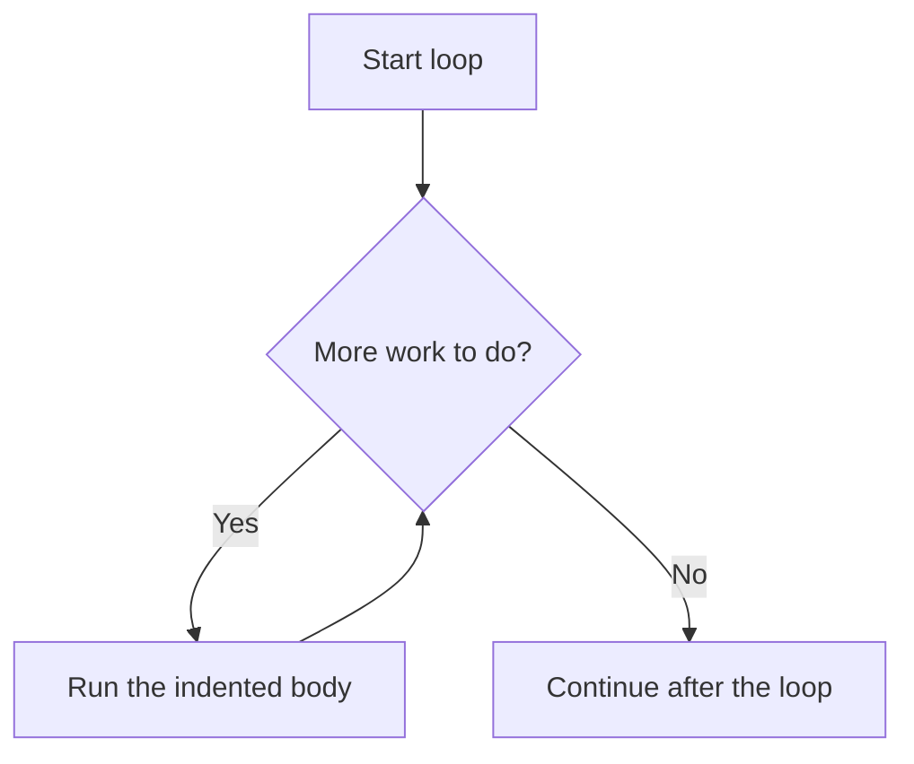

# Python Loops

> **A visual, beginner-friendly deep dive into Python loops**  
> Learn to repeat actions with `for` and `while`, control repetition, and process collections one item at a time.

---

## The one-minute picture

A loop repeats a block of code. Instead of writing the same instruction many times, write it once and tell Python when to repeat it.



Use a `for` loop when you want to visit each item in a collection or repeat a known number of times. Use a `while` loop when repetition should continue as long as a condition stays true.

---

## 1. A `for` loop: visit each item

A `for` loop takes each item from an iterable—such as a list, tuple, string, or set—and runs the indented body once for that item.

```python
languages = ["Python", "Java", "Ruby"]

for language in languages:
    print(f"I am learning {language}.")
```

The loop variable `language` receives one item at a time:

```text
First pass:  language = "Python"
Second pass: language = "Java"
Third pass:  language = "Ruby"
Then the loop ends.
```

The loop variable is assigned by the loop. You do not need to create it beforehand.

### Looping through a string

A string is a sequence, so a `for` loop visits its characters in order.

```python
for letter in "code":
    print(letter)
```

This prints `c`, then `o`, then `d`, then `e`, each on its own line.

---

## 2. `range()`: repeat a known number of times

`range()` provides a sequence of integers, commonly used when you want to repeat something a certain number of times or need a counter.

```python
for number in range(4):
    print(number)
```

Output:

```text
0
1
2
3
```

The stop value is excluded: `range(4)` starts at 0 and stops before 4. It produces four numbers.

### Start and stop

`range(start, stop)` starts at `start` and stops before `stop`.

```python
for number in range(1, 5):
    print(number)
# 1, 2, 3, 4
```

### Start, stop, and step

`range(start, stop, step)` moves by `step` each time.

```python
for number in range(0, 10, 2):
    print(number)
# 0, 2, 4, 6, 8
```

A negative step counts backward:

```python
for number in range(5, 0, -1):
    print(number)
# 5, 4, 3, 2, 1
```

`range()` describes the numbers to use; when you need a list of them for display, use `list(range(...))`.

---

## 3. Get both the position and the item with `enumerate()`

Use `enumerate()` when a loop needs both an item's index and its value.

```python
topics = ["Strings", "Lists", "Loops"]

for index, topic in enumerate(topics):
    print(index, topic)
```

By default, indexes start at 0. For a numbered list intended for people, pass `start=1`:

```python
for number, topic in enumerate(topics, start=1):
    print(f"{number}. {topic}")
```

This is clearer and safer than manually creating and updating a counter.

---

## 4. A `while` loop: repeat while a condition is true

A `while` loop checks a condition before each pass. If it is true, the body runs; then Python checks again.

```python
count = 1

while count <= 3:
    print(count)
    count += 1
```

Execution:

```text
count is 1 → condition true → print 1 → increase count
count is 2 → condition true → print 2 → increase count
count is 3 → condition true → print 3 → increase count
count is 4 → condition false → stop
```

Make sure something in the loop body eventually makes the condition false. If not, the loop may run forever.

### The infinite-loop trap

```python
# This never changes count, so count <= 3 stays true forever.
# count = 1
# while count <= 3:
#     print(count)
```

When a `while` loop seems endless, check that its condition can eventually change and that the body updates the values used by the condition.

---

## 5. Choosing `for` or `while`

| Situation | Usually choose | Example |
|---|---|---|
| Process every item in a list | `for` | `for topic in topics:` |
| Repeat a known number of times | `for` with `range()` | `for _ in range(3):` |
| Continue until a condition changes | `while` | Keep asking while input is invalid |
| Count through a sequence | `for` with `range()` | `for number in range(1, 6):` |

A `for` loop handles the next item for you. A `while` loop gives you more control but makes you responsible for updating the condition.

---

## 6. `break`: leave a loop early

`break` immediately ends the nearest enclosing loop. Python continues at the first statement after that loop.

```python
topics = ["Strings", "Lists", "Loops", "Functions"]

for topic in topics:
    if topic == "Loops":
        print("Found the topic!")
        break
    print(f"Checking {topic}")
```

Once the loop finds `"Loops"`, it prints the message and stops; it does not check `"Functions"`.

---

## 7. `continue`: skip to the next pass

`continue` skips the rest of the current loop body and starts the next pass.

```python
for number in range(1, 6):
    if number == 3:
        continue
    print(number)
```

This prints 1, 2, 4, and 5. When `number` is 3, Python skips the `print` and continues with 4.

Use `continue` for a clear skip case. If it makes the logic harder to understand, an `if` condition around the work may be clearer.

---

## 8. Loop `else`: when no `break` happened

Python loops can have an `else` block. It runs when the loop finishes normally, but **does not run if the loop exits with `break`**.

```python
numbers = [2, 4, 6, 8]

for number in numbers:
    if number % 2 != 0:
        print("Found an odd number.")
        break
else:
    print("No odd numbers found.")
```

The `else` belongs to the loop, not to an `if`. It is useful for search tasks where you want to do something only if no match was found.

---

## 9. Nested loops

A nested loop is a loop inside another loop. For every pass of the outer loop, the inner loop completes all its passes.

```python
for language in ["Python", "Java"]:
    for level in ["beginner", "advanced"]:
        print(language, level)
```

```text
Outer: Python → inner: beginner, advanced
Outer: Java   → inner: beginner, advanced
```

If the outer loop runs 2 times and the inner loop runs 3 times, the inner body runs `2 × 3 = 6` times. Nested loops are useful for grids and combinations, but they can grow expensive when both collections are large.

### A simple grid

```python
for row in range(3):
    for column in range(4):
        print("*", end=" ")
    print()  # move to the next output line after each row
```

---

## 10. Looping through dictionaries and sets

### Dictionaries

Looping directly over a dictionary gives its keys. Use `.items()` when you need both each key and its value.

```python
progress = {"Strings": "complete", "Lists": "in progress"}

for topic, status in progress.items():
    print(f"{topic}: {status}")
```

### Sets

A set has no promised order. A loop visits its items, but do not rely on which one comes first. Use `sorted()` when predictable order matters for display.

```python
languages = {"Python", "Java", "Ruby"}
for language in sorted(languages):
    print(language)
```

---

## 11. Accumulating a result in a loop

A common pattern is to start with an initial value and update it during each pass.

### Sum values

```python
scores = [72, 85, 91]
total = 0

for score in scores:
    total += score

print(total)  # 248
```

Python also provides `sum(scores)`, but writing the loop makes the accumulation pattern visible.

### Build a new list

```python
scores = [72, 85, 91]
passing = []

for score in scores:
    if score >= 80:
        passing.append(score)

print(passing)  # [85, 91]
```

When the transformation is simple, a list comprehension is a compact alternative:

```python
passing = [score for score in scores if score >= 80]
```

---

## 12. Looping over indexes: when needed, use `range(len(...))` carefully

Most of the time, loop over the items directly. If you genuinely need to replace items by position, use indexes or `enumerate()`.

```python
topics = ["strings", "lists", "loops"]
for index, topic in enumerate(topics):
    topics[index] = topic.title()

print(topics)  # ['Strings', 'Lists', 'Loops']
```

This avoids manually pairing an index from `range(len(topics))` with `topics[index]`. Direct iteration is usually the simplest choice when you only need values.

---

## 13. A practical mini-project: quiz attempts

This `while` loop lets a learner keep trying until they enter the correct answer. In this example, the answer is fixed so you can see the loop structure without needing interactive input.

```python
correct_answer = "for"
attempts = ["if", "while", "for"]
tries = 0

while tries < len(attempts):
    answer = attempts[tries]
    tries += 1

    if answer == correct_answer:
        print(f"Correct! You got it in {tries} tries.")
        break
    else:
        print(f"{answer!r} is not the answer. Try again.")
else:
    print("No attempts left.")
```

Output:

```text
'if' is not the answer. Try again.
'while' is not the answer. Try again.
Correct! You got it in 3 tries.
```

The `tries` value increases on each pass, so the loop has a clear stopping point. `break` stops as soon as the answer is correct. If all attempts are used without `break`, the loop's `else` runs.

---

## 14. Common loop mistakes

### Forgetting to update a `while` condition

If the condition never changes, the loop may never stop.

### Off-by-one ranges

`range(5)` produces 0 through 4, not 1 through 5. The stop value is excluded.

### Modifying a collection while iterating over it

Removing items from a list while looping over that same list can skip values. Build a new list instead:

```python
scores = [45, 82, 59, 91]
passing = [score for score in scores if score >= 60]
```

### Using indexes when you only need values

Prefer `for item in items:` to `for index in range(len(items)):` unless the index itself is needed.

### Confusing `break` and `continue`

- `break`: stop the loop completely.
- `continue`: skip the rest of this pass and move to the next one.

### Assuming set order

Sets do not promise item order. Sort them if output order matters.

---

## 15. Quick reference map

```text
EACH ITEM       for item in collection:
REPEAT N TIMES  for number in range(n):
COUNT RANGE     range(start, stop, step)   # stop is excluded
WHILE TRUE      while condition:
INDEX + VALUE   for index, item in enumerate(items):
KEY + VALUE     for key, value in data.items():
STOP LOOP       break
SKIP PASS       continue
LOOP ELSE       else:  # runs only if loop ended without break
ACCUMULATE      total += value
BUILD LIST      result.append(value)
```

### The most important mental checklist

1. **What controls the repetition?** A collection or count suggests `for`; a changing condition suggests `while`.
2. **Will the loop stop?** A `while` loop needs a path that makes its condition false.
3. **Do I need the index?** If so, use `enumerate()` where possible.
4. **Should I stop or only skip this item?** Choose `break` or `continue` intentionally.
5. **Am I changing the same collection I am looping over?** Build a new collection when filtering.

---

## 16. Practice (answers below)

1. How many times does `for n in range(5):` run?
2. What values does `range(2, 6)` produce?
3. Which loop is usually best for visiting every item in a list?
4. What does `break` do?
5. What does `continue` do?
6. When does a loop's `else` block run?
7. What does `enumerate(items, start=1)` provide?
8. Why can a `while` loop become infinite?
9. If an outer loop runs 3 times and an inner loop runs 2 times, how many times does the inner body run?
10. What is the usual safe pattern for keeping only items that meet a condition?

<details>
<summary><strong>Show the answers</strong></summary>

1. Five times; `n` is 0, 1, 2, 3, and 4.
2. 2, 3, 4, 5.
3. A `for` loop.
4. It exits the nearest enclosing loop immediately.
5. It skips to the next loop pass.
6. When the loop finishes normally without `break`.
7. Each item paired with a counter starting at 1.
8. Its condition never becomes false and there is no `break`.
9. Six times.
10. Build a new filtered list, with a loop and `append()` or a list comprehension.

</details>

---

## Final idea

Loops let you express repetition without repeating yourself. Use `for` to visit items or count with `range()`, and `while` when a condition should control how long work continues. Track how and when the loop ends, and use `break`, `continue`, and nested loops only when they make the flow clearer.
