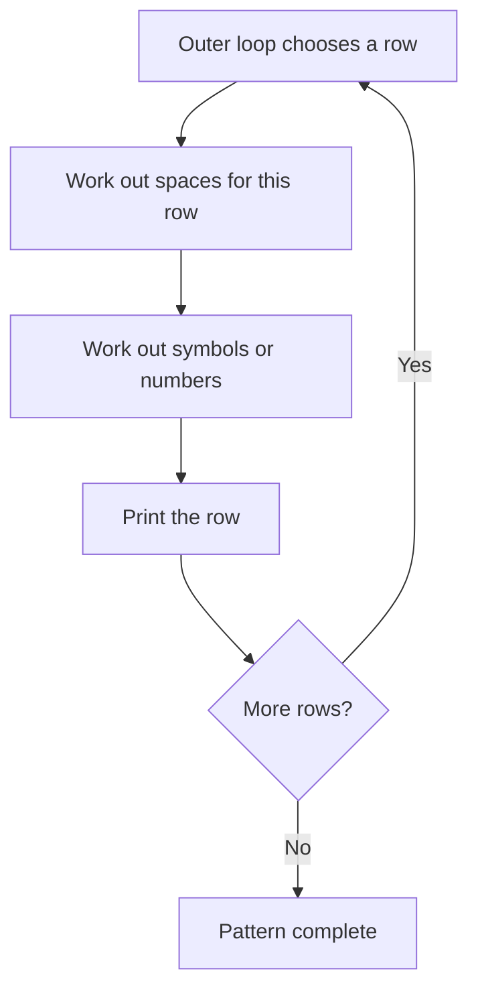

# Python Loop Patterns: Stars, Pyramids, and More

> **A visual, beginner-friendly guide to drawing text patterns with loops and conditionals**  
> Learn the row-and-column logic behind triangles, pyramids, diamonds, and number designs.

---

## The key idea: a pattern is a grid

A printed pattern is made of **rows**. Each row contains some combination of spaces, symbols, or numbers. An outer loop chooses the row; an inner loop (or string repetition) decides what appears on that row.



Before coding, ask:

1. How many rows are there?
2. What changes from one row to the next?
3. How many spaces and symbols belong on each row?
4. Does a condition decide whether a position gets a symbol or a space?

A small row table often reveals the rule:

```text
Row       Leading spaces       Stars
1               4                1
2               3                3
3               2                5
4               1                7
5               0                9
```

---

## 1. The simplest rectangle

A rectangle has the same number of symbols on every row. The outer loop repeats the row; the inner loop prints symbols across it.

```python
rows = 3
columns = 5

for row in range(rows):
    for column in range(columns):
        print("*", end=" ")
    print()  # newline after finishing this row
```

Output:

```text
* * * * *
* * * * *
* * * * *
```

`print()` normally ends with a newline. `end=" "` changes that ending so each star stays on the current line. The empty `print()` after the inner loop moves to the next row.

For a solid rectangle, string repetition is a concise alternative:

```python
for _ in range(3):
    print("* " * 5)
```

---

## 2. Right-angled triangle

A growing triangle adds one star on each row. If the row number starts at 1, row `r` contains `r` stars.

```python
height = 5

for row in range(1, height + 1):
    print("* " * row)
```

Output:

```text
*
* *
* * *
* * * *
* * * * *
```

The range ends at `height + 1` because `range` excludes its stop value.

### Same triangle with a nested loop

This version makes the inner repetition explicit:

```python
height = 5

for row in range(1, height + 1):
    for column in range(row):
        print("*", end=" ")
    print()
```

On row 1, the inner loop runs once; on row 2 it runs twice, and so on.

---

## 3. Inverted right-angled triangle

An inverted triangle starts wide and loses one star per row.

```python
height = 5

for row in range(height, 0, -1):
    print("* " * row)
```

Output:

```text
* * * * *
* * * *
* * *
* *
*
```

The range uses a negative step: start at `height`, move down by 1, and stop before 0.

---

## 4. Right-aligned triangle

A right-aligned triangle has leading spaces before its stars. As the stars grow, the spaces shrink.

```python
height = 5

for row in range(1, height + 1):
    spaces = height - row
    stars = row
    print(" " * spaces + "* " * stars)
```

Output:

```text
        *
      * *
    * * *
  * * * *
* * * * *
```

The row formula is the useful part:

```text
spaces = height - row
stars  = row
```

Each row's spaces and stars are combined into one string, then printed once.

---

## 5. Centered pyramid

A pyramid is centered by reducing leading spaces and increasing the number of stars by two each row.

```python
height = 5

for row in range(1, height + 1):
    spaces = height - row
    stars = 2 * row - 1
    print(" " * spaces + "*" * stars)
```

Output:

```text
    *
   ***
  *****
 *******
*********
```

Why `2 * row - 1`?

```text
Row 1: 1 star
Row 2: 3 stars
Row 3: 5 stars
Row 4: 7 stars
```

The count starts at 1 and increases by 2 each time. For row number `r`, that count is `2r - 1`.

### Pyramid row table

| Row `r` | Leading spaces `height - r` | Stars `2 * r - 1` |
|---:|---:|---:|
| 1 | 4 | 1 |
| 2 | 3 | 3 |
| 3 | 2 | 5 |
| 4 | 1 | 7 |
| 5 | 0 | 9 |

This table is often easier to reason about than trying to “see” the full pattern in code.

---

## 6. Inverted pyramid

An inverted pyramid starts with the widest row, then removes two stars and adds one leading space each time.

```python
height = 5

for row in range(height, 0, -1):
    spaces = height - row
    stars = 2 * row - 1
    print(" " * spaces + "*" * stars)
```

Output:

```text
*********
 *******
  *****
   ***
    *
```

---

## 7. Diamond

A diamond combines a growing pyramid and a shrinking inverted pyramid. To avoid printing the widest row twice, start the bottom half one row below the top half.

```python
height = 4

# Top half, including the widest row.
for row in range(1, height + 1):
    spaces = height - row
    stars = 2 * row - 1
    print(" " * spaces + "*" * stars)

# Bottom half, beginning just below the widest row.
for row in range(height - 1, 0, -1):
    spaces = height - row
    stars = 2 * row - 1
    print(" " * spaces + "*" * stars)
```

Output:

```text
   *
  ***
 *****
*******
 *****
  ***
   *
```

---

## 8. Hollow rectangle: use a condition for borders

A hollow shape prints stars on the border and spaces inside. For each position, ask: “Is this the first or last row, or the first or last column?”

```python
rows = 4
columns = 7

for row in range(rows):
    for column in range(columns):
        on_border = (
            row == 0
            or row == rows - 1
            or column == 0
            or column == columns - 1
        )
        if on_border:
            print("*", end="")
        else:
            print(" ", end="")
    print()
```

Output:

```text
*******
*     *
*     *
*******
```

This pattern demonstrates why nested loops and conditionals work well together: loops visit every grid position, and the condition decides what to print at that position.

---

## 9. Number triangle

The outer loop selects the row number. The inner loop prints numbers from 1 up to that row.

```python
height = 5

for row in range(1, height + 1):
    for number in range(1, row + 1):
        print(number, end=" ")
    print()
```

Output:

```text
1
1 2
1 2 3
1 2 3 4
1 2 3 4 5
```

The inner loop's stop is `row + 1` because the stop value is excluded.

---

## 10. Repeated-number triangle

Use the row number as the value printed on every position in that row.

```python
height = 5

for row in range(1, height + 1):
    for column in range(row):
        print(row, end=" ")
    print()
```

Output:

```text
1
2 2
3 3 3
4 4 4 4
5 5 5 5 5
```

---

## 11. Alternating pattern with `if` and `else`

A conditional can choose a symbol based on whether a row or column is even or odd.

```python
size = 5

for row in range(size):
    for column in range(size):
        if (row + column) % 2 == 0:
            print("*", end=" ")
        else:
            print(".", end=" ")
    print()
```

Output:

```text
* . * . *
. * . * .
* . * . *
. * . * .
* . * . *
```

`% 2` gives the remainder after division by 2. Even numbers have remainder 0; odd numbers have remainder 1. The row and column indexes together determine which symbol appears.

---

## 12. The nested-loop pattern recipe

For patterns where every position needs a decision, use this general shape:

```python
for row in range(number_of_rows):
    for column in range(number_of_columns):
        if condition_for_a_symbol:
            print("*", end="")
        else:
            print(" ", end="")
    print()  # finish this row
```

Translate the pattern into questions:

- **Outer loop:** How many rows?
- **Inner loop:** How many positions across each row?
- **Condition:** Is this position part of the shape?
- **Printing:** Should the position contain a symbol or a blank?
- **Newline:** When is the row complete?

For simple solid triangles and pyramids, string repetition (`"*" * count`) is shorter. For hollow shapes, checkerboards, borders, or position-dependent designs, nested loops plus `if` are more flexible.

---

## 13. A practical mini-project: choose a pattern

This program draws one of two patterns based on a variable. It combines an `if` choice with loops.

```python
pattern = "pyramid"
height = 4

if pattern == "triangle":
    for row in range(1, height + 1):
        print("* " * row)
elif pattern == "pyramid":
    for row in range(1, height + 1):
        spaces = height - row
        stars = 2 * row - 1
        print(" " * spaces + "*" * stars)
else:
    print("Choose 'triangle' or 'pyramid'.")
```

Change `pattern` to `"triangle"`, `"pyramid"`, or another value and observe which branch runs.

---

## 14. Common pattern-printing mistakes

### Forgetting the newline after a row

If you do not call `print()` after the inner loop, the next row continues on the same line.

### Using the wrong `range()` stop

Remember that `range(start, stop)` excludes `stop`. For rows numbered 1 through `height`, use `range(1, height + 1)`.

### Spaces do not match the shape

For a centered pyramid, leading spaces decrease by 1 per row while stars increase by 2.

### Repeating a symbol with `end` unintentionally

`print("*", end="")` suppresses the newline. This is useful inside a row, but remember to print a newline after the row is complete.

### Starting the bottom half of a diamond at the wrong row

If it starts at the full height, the widest row prints twice. Start at `height - 1`.

### Printing spaces that are hard to count

Use formulas such as `spaces = height - row` and `stars = 2 * row - 1`, then build the row with string multiplication.

---

## 15. Quick reference formulas

For row number `r` from 1 through `height`:

| Pattern | Leading spaces | Symbols |
|---|---:|---:|
| Growing left triangle | 0 | `r` |
| Inverted left triangle | 0 | `height - r + 1` |
| Right-aligned triangle | `height - r` | `r` |
| Pyramid | `height - r` | `2 * r - 1` |
| Inverted pyramid | `r - 1` | `2 * (height - r) + 1` |

Pattern skeleton:

```text
for each row:
    calculate spaces and symbols
    print one complete row
```

### The most important mental checklist

1. **How many rows should print?** Set the outer loop range.
2. **What changes each row?** Write a row table.
3. **Can repetition be expressed as string multiplication?** Use it for simple solid shapes.
4. **Does each grid position need a decision?** Use an inner loop and `if` for hollow or alternating designs.
5. **Did I finish each row with a newline?** Print once after the inner loop.

---

## 16. Practice (answers below)

1. How many times does `range(1, 5)` run?
2. For a growing triangle, how many stars belong on row 4?
3. For a pyramid with `height = 5`, how many stars are on row 3?
4. Why does a pyramid add two stars per row rather than one?
5. In a hollow rectangle, when should a star be printed?
6. What does `print("*", end="")` change?
7. Why does the bottom half of a diamond start at `height - 1`?
8. Which pattern is easier to implement with a condition for every cell: a solid rectangle or a checkerboard?

<details>
<summary><strong>Show the answers</strong></summary>

1. Four times: 1, 2, 3, and 4.
2. Four stars.
3. Five stars (`2 * 3 - 1`).
4. Each row extends one star on both the left and right sides to stay centered.
5. If the position is in the first/last row or first/last column.
6. It prevents `print` from ending with a newline, so more output stays on the same row.
7. To avoid printing the widest middle row a second time.
8. A checkerboard, because the symbol depends on each cell's row and column.

</details>

---

## Final idea

Pattern printing becomes much simpler when you stop treating each design as a magic trick. See it as rows and positions: the outer loop selects a row, formulas calculate spaces and symbols, and conditions decide what belongs at each position. Once those rules are clear, stars, pyramids, diamonds, and number patterns are all variations on the same idea.
