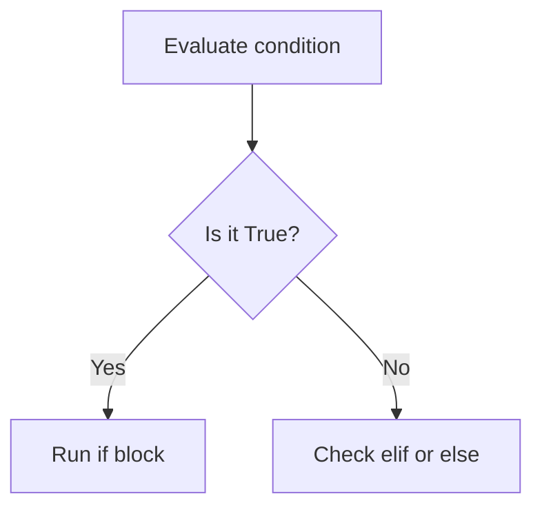
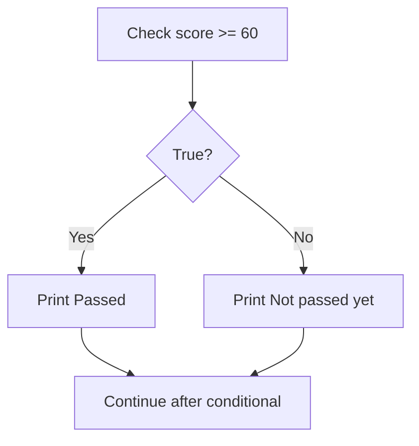
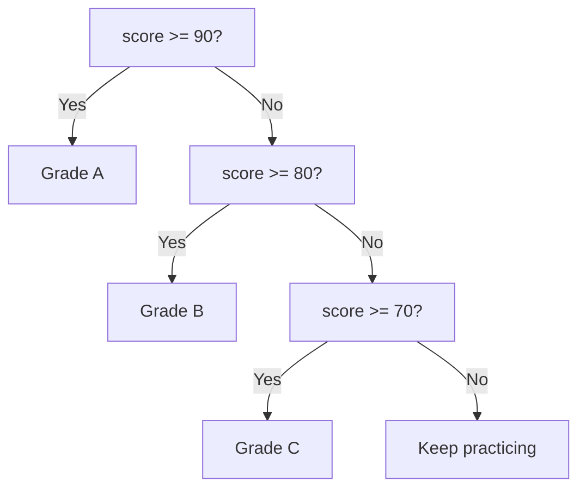
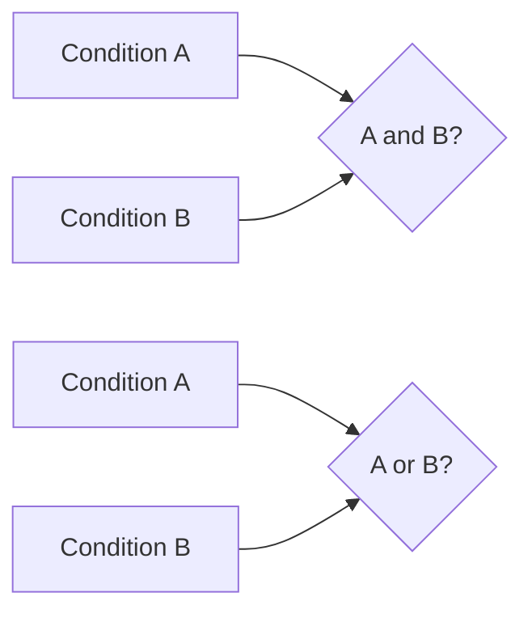

# Python Conditionals: `if`, `elif`, and `else`

> **A visual, beginner-friendly deep dive into decision-making in Python**  
> Learn how programs test conditions and choose which code to run.

---

## The one-minute picture

A conditional lets a program choose what to do based on whether a condition is `True` or `False`.



```python
score = 82

if score >= 60:
    print("You passed!")
else:
    print("Keep practicing!")
```

Python checks the condition `score >= 60`. Since it is true, Python runs the indented `if` block and skips the `else` block.

---

## 1. The basic `if` statement

An `if` statement runs its indented body only when its condition is true.

```python
has_homework = True

if has_homework:
    print("Set aside time to study.")
```

The structure is:

```text
if condition:
    indented code to run when condition is True
```

The colon `:` starts the block. Indentation (usually four spaces) tells Python which statements belong to it.

If the condition is false, Python skips the block and continues after it.

```python
score = 40

if score >= 60:
    print("Passed")

print("This line runs either way.")
```

---

## 2. Adding `else`

Use `else` for the alternative path: it runs if the `if` condition was false.

```python
score = 54

if score >= 60:
    print("Passed")
else:
    print("Not passed yet")
```

An `if`/`else` chooses exactly one of two paths:



`else` does not have its own condition. It means “if none of the earlier conditions matched.”

---

## 3. Choosing among several paths with `elif`

Use `elif` (short for “else if”) when you have more than two possibilities. Python checks conditions from top to bottom and runs the **first matching block only**.

```python
score = 84

if score >= 90:
    grade = "A"
elif score >= 80:
    grade = "B"
elif score >= 70:
    grade = "C"
else:
    grade = "Keep practicing"

print(grade)  # B
```



Order matters. For example, if `score >= 70` is checked first, then a score of 95 also matches it, so later checks for 80 and 90 are never reached. Put the most specific or highest threshold first.

You can use as many `elif` branches as needed, but a chain can have only one `if` and at most one final `else`.

---

## 4. Comparisons: conditions that produce `True` or `False`

Comparison operators compare values and produce a Boolean result (`True` or `False`).

| Operator | Meaning | Example |
|---|---|---|
| `==` | equal to | `language == "Python"` |
| `!=` | not equal to | `status != "complete"` |
| `>` | greater than | `score > 80` |
| `<` | less than | `age < 18` |
| `>=` | greater than or equal to | `score >= 60` |
| `<=` | less than or equal to | `attempts <= 3` |

```python
score = 80
print(score >= 80)  # True
print(score == 100) # False
```

### `=` versus `==`

- `=` assigns a value to a variable: `score = 80`
- `==` asks whether two values are equal: `score == 80`

Using `=` where you meant `==` in a condition causes a syntax error. This distinction is one of the most common beginner mistakes.

---

## 5. Combining conditions: `and`, `or`, and `not`

Boolean operators combine or reverse conditions.

### `and`: both conditions must be true

```python
score = 86
submitted = True

if score >= 60 and submitted:
    print("The work is passing and submitted.")
```

### `or`: at least one condition must be true

```python
is_weekend = False
is_holiday = True

if is_weekend or is_holiday:
    print("No class today.")
```

### `not`: reverse a truth value

```python
is_complete = False

if not is_complete:
    print("This topic still needs work.")
```



### Precedence and parentheses

`not` is evaluated before `and`, and `and` before `or`. Use parentheses when they make the intended grouping clearer.

```python
if (score >= 60 and submitted) or teacher_approved:
    print("Count this assignment as accepted.")
```

Read it as: “the score is passing and work was submitted, or the teacher approved it.”

---

## 6. Chained comparisons

Python lets you combine comparisons in a readable range check:

```python
score = 84

if 0 <= score <= 100:
    print("Score is in the valid range.")
```

This means `0 <= score and score <= 100`. It does **not** mean compare 0 to 100 and then compare the result to `score`.

This is often cleaner than repeating the variable:

```python
if score >= 0 and score <= 100:
    print("Valid")
```

---

## 7. Truthiness: conditions do not always need comparisons

In an `if`, Python can treat a value as true or false directly. Common false values include:

- `False`
- `None`
- numeric zero, such as `0` or `0.0`
- empty strings and collections: `""`, `[]`, `()`, `{}`, `set()`

Most other values are truthy, including non-empty strings and collections.

```python
name = "Ada"
if name:
    print(f"Hello, {name}!")

names = []
if not names:
    print("No names have been added yet.")
```

A truthiness check is handy for “is this collection empty?” When you specifically need to distinguish `None` from other false values (such as zero), use an identity check:

```python
score = 0
if score is not None:
    print("A score was provided, even though it is zero.")
```

---

## 8. Membership and identity conditions

### Membership: `in` and `not in`

Use membership checks to see whether a value is in a collection or whether text appears in another string.

```python
completed = ["Strings", "Lists"]

if "Lists" in completed:
    print("Lists are complete.")

if "Sets" not in completed:
    print("Sets are still on the plan.")
```

### Identity: `is` and `is not`

Identity checks whether two names refer to the exact same object. The common beginner use is checking for `None`:

```python
result = None
if result is None:
    print("There is no result yet.")
```

Use `==` to compare values for equality, and `is` to check identity. Do not use `is` for ordinary numbers or strings.

---

## 9. Nested conditionals

An `if` can appear inside another `if`. This is called nesting. The inner decision is only reached if the outer condition passes.

```python
logged_in = True
is_admin = False

if logged_in:
    if is_admin:
        print("Open the admin dashboard.")
    else:
        print("Open the standard dashboard.")
else:
    print("Please sign in.")
```

Nesting is useful when the second question only matters after the first is answered. If nesting becomes deep, combine conditions or return early from a function to make the logic easier to follow.

---

## 10. Independent `if` statements versus an `if`/`elif` chain

An `if`/`elif`/`else` chain selects **one** matching branch. Independent `if` statements each run whenever their own condition is true.

```python
score = 95

# These are independent checks, so both messages print.
if score >= 60:
    print("Passed")
if score >= 90:
    print("Excellent")
```

Compare with:

```python
# This is a single choice: only the first matching branch runs.
if score >= 60:
    print("Passed")
elif score >= 90:
    print("Excellent")  # never reached when score is 95
```

For categories where each value belongs to one category, use an `if`/`elif` chain and put conditions in the right order. For separate facts that may both be true, use independent `if` statements.

---

## 11. Conditional expressions (the compact one-line form)

A conditional expression chooses between two values and returns the chosen one. Its form is `value_if_true if condition else value_if_false`.

```python
score = 72
result = "pass" if score >= 60 else "try again"
print(result)  # pass
```

Use this for a simple value choice. For multiple branches or actions, a regular `if`/`elif`/`else` block is easier to read.

---

## 12. `pass`: a deliberately empty block

Python requires an indented body after `if`, `elif`, and `else`. `pass` means “do nothing here for now.”

```python
if score < 0:
    pass  # placeholder while this case is being designed
else:
    print("Score is non-negative.")
```

In finished code, an empty branch often signals unfinished logic. Replace the placeholder with a real action or restructure the condition.

---

## 13. A practical mini-project: study progress message

Combine comparisons, `and`, `elif`, membership, and f-strings to choose a helpful message.

```python
topic = "Lists"
score = 78
completed = ["Strings", "Tuples"]

if topic in completed:
    message = f"You have already completed {topic}."
elif score >= 80:
    message = f"Great work on {topic}! You are ready to move on."
elif score >= 60 and topic:
    message = f"You passed {topic}. A little more practice will help."
else:
    message = f"Keep practicing {topic} before moving on."

print(message)
```

Output:

```text
You passed Lists. A little more practice will help.
```

The chain checks in order. `"Lists"` is not in `completed`, and 78 is below 80, so Python continues until the `score >= 60 and topic` condition succeeds.

Try changing `topic`, `score`, or `completed` and predict which branch will run before executing the code.

---

## 14. Common conditional mistakes

### Using `=` instead of `==`

`=` assigns. `==` compares.

### Forgetting the colon

Every `if`, `elif`, and `else` header ends with `:`.

### Wrong indentation

The statements belonging to a branch must be indented consistently. Indentation is part of Python syntax, not decoration.

### Putting broad conditions first

In an `elif` chain, later branches are skipped after the first match. Check high thresholds before low thresholds when assigning grades.

### Using `and` where `or` is needed

`age < 13 and age > 19` can never be true. If the meaning is “under 13 or over 19,” use `or`.

### Comparing with `None` using `==`

Prefer `value is None` and `value is not None` for this special singleton.

### Overusing nested `if` statements

If conditions fit naturally together, use `and` or `or`. Keep nesting only when the inner question depends on the outer decision.

---

## 15. Quick reference map

```text
TWO PATHS       if condition: ... else: ...
MANY PATHS      if condition: ... elif other_condition: ... else: ...
COMPARE         ==  !=  <  <=  >  >=
COMBINE         and   or   not
RANGE           low <= value <= high
MEMBERSHIP      item in collection   item not in collection
IDENTITY        value is None   value is not None
TRUTHINESS      if collection: ...   if not collection: ...
ONE VALUE       answer = yes_value if condition else no_value
PLACEHOLDER     pass
```

### The most important mental checklist

1. **What question is the program asking?** Write the condition so it reads clearly.
2. **Can more than one branch be true?** Use `elif` for one choice; independent `if`s for separate checks.
3. **Are the conditions ordered correctly?** The first true branch wins in a chain.
4. **Do I need `and`, `or`, or parentheses?** Make the intended logic easy to see.
5. **Am I checking a value or checking for `None`?** Use `==` for values and `is None` for `None`.

---

## 16. Practice (answers below)

1. Which block runs if an `if` condition is false and there is an `else`?
2. In an `if`/`elif` chain, how many matching blocks run?
3. What is the difference between `=` and `==`?
4. Which operator requires both conditions to be true?
5. What does `not is_complete` do when `is_complete` is `False`?
6. Is an empty list truthy or falsey?
7. What does `"Lists" in ["Strings", "Lists"]` evaluate to?
8. What is the value of `"pass" if 72 >= 60 else "retry"`?
9. Why should a high grade threshold usually come before a lower one?
10. When should you use `is None`?

<details>
<summary><strong>Show the answers</strong></summary>

1. The `else` block.
2. At most one; Python runs the first matching branch.
3. `=` assigns a value; `==` compares two values.
4. `and`.
5. It becomes `True`.
6. Falsey.
7. `True`.
8. `"pass"`.
9. A high score also meets lower thresholds, and the first matching branch wins.
10. To test whether a value is exactly `None`.

</details>

---

## Final idea

Conditionals let a program make choices. Write a clear Boolean question, remember that an `elif` chain stops at its first true branch, and use indentation to show which actions belong to each path. With those habits, `if`, `elif`, and `else` turn program logic into readable decisions.
