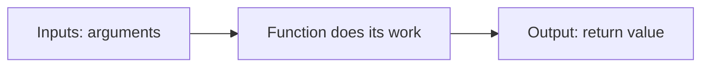
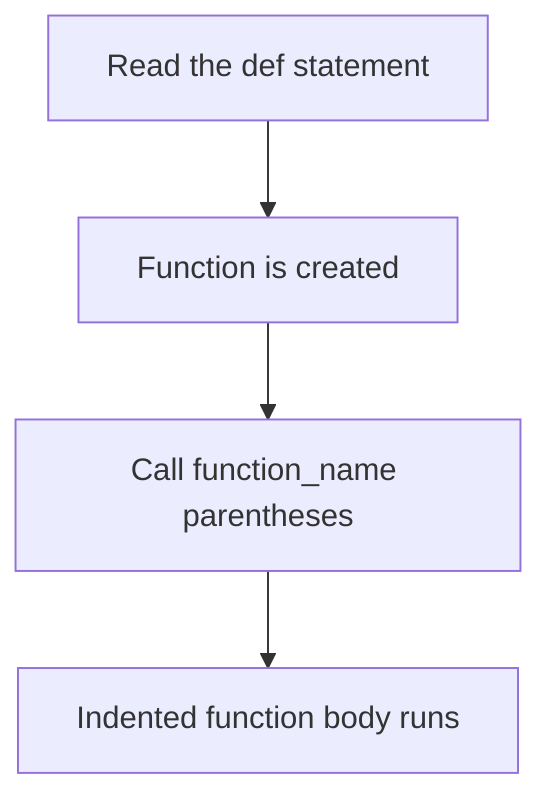
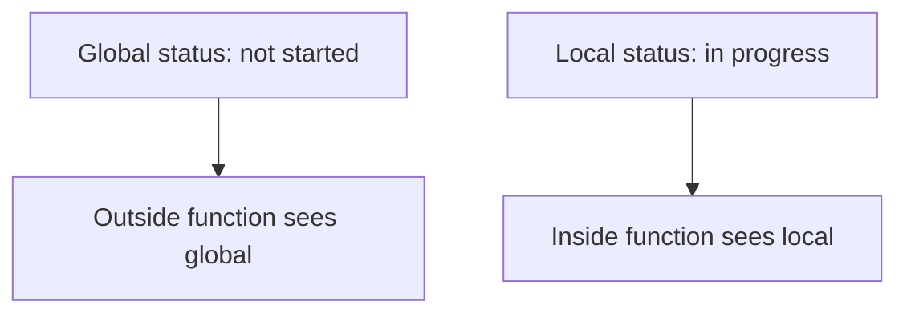
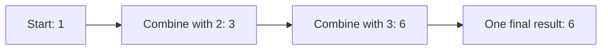

# Python Functions, Explained Beautifully

> **A visual, beginner-friendly deep dive into Python functions**  
> Learn to name reusable actions, pass information in, return results, and organize a program into clear pieces.

---

## The one-minute picture

A function is a **named, reusable block of code**. You define what it should do once, then call it whenever you need that action.



Think of a function like a small machine: give it information, let it perform a focused job, and use the result.

```python
def greet(name):
    return f"Hello, {name}!"

message = greet("Ada")
print(message)  # Hello, Ada!
```

---

## 1. Defining and calling a function

Use `def` to define a function. Give it a name, parentheses, and a colon. The indented lines underneath make up its body.

```python
def say_hello():
    print("Hello from Python!")
```

Defining a function does not run its body. To run it, **call** it by writing its name followed by parentheses:

```python
say_hello()  # now the function runs
```



A function can be called more than once:

```python
say_hello()
say_hello()
```

This avoids copying and pasting the same instructions in several places.

---

## 2. Parameters and arguments

A **parameter** is a named input written in the function definition. An **argument** is the actual value you supply when calling the function.

```python
def greet(name):  # name is a parameter
    print(f"Hello, {name}!")

greet("Ada")     # 'Ada' is an argument
```

The name `name` receives the argument while the function runs. You can call the same function with different arguments:

```python
greet("Ada")
greet("Grace")
```

### More than one parameter

Separate parameters with commas, and supply matching arguments when calling the function.

```python
def introduce(name, language):
    print(f"{name} is learning {language}.")

introduce("Ada", "Python")
```

Here `"Ada"` goes into `name`, and `"Python"` goes into `language`. The order matters when you pass arguments positionally.

---

## 3. `return`: give a result back

`return` sends a value out of the function to the code that called it. The caller can save that result, print it, or use it in another calculation.

```python
def add(first, second):
    result = first + second
    return result

total = add(4, 7)
print(total)  # 11
```

```text
Call:             add(4, 7)
Inside function:  first = 4, second = 7
Returned value:   11
Caller receives:  total = 11
```

A function can return a value without printing it. That makes it easier to reuse the result in different ways:

```python
subtotal = add(10, 5)
print(f"The answer is {subtotal}.")
print(subtotal * 2)
```

### `print` is not `return`

`print()` displays something for a person to see. `return` gives a value back to the program. They solve different jobs.

```python
def show_total(a, b):
    print(a + b)  # displays the result, but returns None

def calculate_total(a, b):
    return a + b  # sends the result back

visible = show_total(2, 3)      # prints 5; visible is None
usable = calculate_total(2, 3)  # usable is 5
```

Use `return` when other code needs to use the answer. Use `print` when you want to show a message or result.

### A function with no explicit return

If a function reaches the end without a `return` statement, Python returns `None` automatically.

```python
def announce(topic):
    print(f"Now studying: {topic}")

result = announce("Functions")  # displays a message; result is None
```

---

## 4. Returning early

When Python reaches `return`, it immediately leaves that function. Any lines after that return are not run on that path.

```python
def describe_score(score):
    if score < 0:
        return "Score cannot be negative."
    return f"Score: {score}"
```

Early returns can handle special cases first, making the normal path easier to read.

A function can return more than one piece of information by returning a tuple:

```python
def min_and_max(numbers):
    return min(numbers), max(numbers)

lowest, highest = min_and_max([4, 9, 2, 7])
# lowest is 2; highest is 9
```

Python groups the returned values as a tuple, and unpacking assigns them to the two names.

### Recursion: a function calling itself

A recursive function solves a problem by calling itself with a smaller version of that problem. It needs a **base case** that stops the calls; without one, the function keeps calling itself until Python raises `RecursionError`.

```python
def countdown(number):
    if number <= 0:                 # base case: stop
        return
    print(number)
    countdown(number - 1)           # recursive step: smaller input

countdown(3)  # prints 3, then 2, then 1
```

Recursion is useful for naturally nested structures and some mathematical problems. For simple repetition, a `for` or `while` loop is usually easier to follow.

---

## 5. Positional and keyword arguments

### Positional arguments

Values are matched to parameters by their position.

```python
def describe(topic, level):
    return f"{topic}: {level}"

describe("Lists", "beginner")
```

### Keyword arguments

Name the parameter when calling the function. This makes the meaning clear and lets you pass keyword arguments in a different order.

```python
describe(level="beginner", topic="Lists")
```

You can combine positional arguments followed by keyword arguments:

```python
def make_label(topic, level):
    return f"{topic} ({level})"

make_label("Functions", level="beginner")
```

Positional arguments must come before keyword arguments in a call.

---

## 6. Default parameter values

A parameter can have a default value. The caller may leave it out to use that default, or provide a different value.

```python
def greet(name, greeting="Hello"):
    return f"{greeting}, {name}!"

greet("Ada")                 # 'Hello, Ada!'
greet("Ada", "Welcome")     # 'Welcome, Ada!'
greet("Grace", greeting="Hi")
```

Parameters without defaults must come before parameters with defaults in the definition.

```python
def create_topic_card(topic, status="not started"):
    return f"{topic}: {status}"
```

### Avoid mutable default values

Do not use a list or dictionary as a default when the function will change it. That same default object is reused between calls.

```python
# Avoid this pattern:
# def add_topic(topic, topics=[]):
#     topics.append(topic)
#     return topics
```

Use `None` as the default and create a fresh list inside the function instead:

```python
def add_topic(topic, topics=None):
    if topics is None:
        topics = []
    topics.append(topic)
    return topics
```

Now each call without a supplied list starts with a new list.

---

## 7. Scope: where names are available

A variable created inside a function is usually **local** to that function. It exists there while the function runs and is not automatically available elsewhere.

```python
def make_message():
    message = "Keep practicing Python!"  # local variable
    return message

result = make_message()
print(result)  # works
# print(message)  # NameError: message was local to the function
```

A parameter is also a local name. This helps a function work independently with the inputs it receives.

Prefer returning a result over changing a global variable. Functions are easier to understand when their inputs and outputs are clear.

### Global scope

A name created outside all functions is in the **global scope** of the module. A function can read a global name if it does not create a local name with the same spelling.

```python
course_name = "Python"  # global name

def show_course():
    print(course_name)  # reads the global name

show_course()  # Python
```

Reading a global value is allowed, but assigning to that name inside a function is different: Python treats the name as local unless you explicitly declare it `global`.

```python
course_name = "Python"

def choose_course():
    course_name = "Dictionaries"  # creates a local name
    print(course_name)             # Dictionaries

choose_course()
print(course_name)                 # Python — global value is unchanged
```

### Local and global variables with the same name

The local variable **shadows** the global variable while the function runs. The two names have different scopes even though they are spelled the same.

```python
status = "global: not started"

def show_status():
    status = "local: in progress"
    print(status)

show_status()  # local: in progress
print(status)  # global: not started
```



### Changing a global variable with `global`

The `global` keyword tells Python that assignments to this name inside the function should update the module-level variable.

```python
completed = 0

def mark_complete():
    global completed
    completed += 1

mark_complete()
print(completed)  # 1
```

Use `global` sparingly. A function that takes input and returns a result is usually easier to test and reuse:

```python
def add_one(count):
    return count + 1

completed = add_one(completed)
```

### Enclosing scope and `nonlocal` (a preview)

When one function is defined inside another, the inner function can read names from the enclosing function. To assign to an enclosing function's name, use `nonlocal`.

```python
def make_counter():
    count = 0

    def next_count():
        nonlocal count
        count += 1
        return count

    return next_count

counter = make_counter()
counter()  # 1
counter()  # 2
```

For now, remember the simple lookup idea: Python checks a local name first, then enclosing functions, then the module's global names, and finally built-in names.

---

## 8. Functions and collections

Functions can accept and return lists, tuples, sets, and dictionaries just like other values.

```python
def count_topics(topics):
    return len(topics)

study_topics = ["Strings", "Lists", "Functions"]
count_topics(study_topics)  # 3
```

A function can use a loop to process a collection:

```python
def print_topics(topics):
    for topic in topics:
        print(f"- {topic}")
```

Functions can also return a new collection:

```python
def completed_topics(statuses):
    return [topic for topic, status in statuses.items() if status == "complete"]

progress = {"Strings": "complete", "Lists": "in progress"}
completed_topics(progress)  # ['Strings']
```

### Flexible positional arguments: `*args`

Use `*args` when a function should accept any number of extra positional arguments. Inside the function, `args` is a tuple. The name `args` is conventional; the `*` is what gathers the arguments.

```python
def add_all(*numbers):
    return sum(numbers)

add_all(2, 3)          # 5
add_all(2, 3, 4, 10)   # 19
```

Regular parameters can come before `*args`:

```python
def print_topics(course, *topics):
    for topic in topics:
        print(f"{course}: {topic}")

print_topics("Python", "Strings", "Lists", "Functions")
```

### Flexible keyword arguments: `**kwargs`

Use `**kwargs` to accept extra named arguments. Inside the function, `kwargs` is a dictionary mapping each keyword to its value.

```python
def show_profile(**details):
    for key, value in details.items():
        print(f"{key}: {value}")

show_profile(name="Ada", course="Python", level="beginner")
```

The names `args` and `kwargs` are conventions; the important syntax is one star to gather positional values and two stars to gather keyword values. You can combine them with named parameters:

```python
def describe_course(course, *topics, level="beginner", **extra):
    print(course, topics, level, extra)

describe_course("Python", "Strings", "Lists", level="intro", teacher="Grace")
```

Use these tools when flexibility is genuinely useful. For a function with a known set of inputs, explicit named parameters are clearer.

### Unpacking arguments with `*` and `**`

The same symbols can unpack an existing list/tuple or dictionary into a function call.

```python
def introduce(name, course):
    return f"{name} is learning {course}."

values = ("Ada", "Python")
introduce(*values)  # same as introduce('Ada', 'Python')

details = {"name": "Grace", "course": "Python"}
introduce(**details)  # same as introduce(name='Grace', course='Python')
```

The supplied items must match the function's parameters.

---

## 9. Docstrings: explain a function's purpose

A **docstring** is a string placed immediately inside a function. It describes what the function does and can mention its inputs and result.

```python
def rectangle_area(width, height):
    """Return the area of a rectangle."""
    return width * height
```

You can inspect a function's docstring with `help(rectangle_area)` or `rectangle_area.__doc__`.

Good function names and short docstrings make code easier to use without reading every line of the function body.

---

## 10. Lambda functions

A `lambda` creates a small anonymous function: an expression that can be called like a function but has no `def` name. Its form is `lambda parameters: expression`.

```python
double = lambda number: number * 2
double(5)  # 10
```

For a named function that you will reuse or that needs multiple statements, `def` is usually clearer:

```python
def double(number):
    return number * 2
```

Lambdas are most useful as short, one-expression helpers passed to another function—for example, as a sort key:

```python
topics = ["Sets", "Dictionaries", "Lists"]
sorted(topics, key=lambda topic: len(topic))
# ['Sets', 'Lists', 'Dictionaries']
```

A lambda can contain only one expression, not a block of statements or a `return` statement.

---

## 11. `map()`: transform every item

`map(function, iterable)` applies a function to each item and produces an iterator. Wrap it in `list()` when you want to see or store all results at once.

```python
scores = [70, 80, 90]
new_scores = list(map(lambda score: score + 5, scores))
# [75, 85, 95]
```

Here, the lambda runs once per score. A list comprehension often says the same thing more clearly in Python:

```python
new_scores = [score + 5 for score in scores]
```

Use `map()` when you already have a useful function to apply or when it makes the transformation easy to read.

---

## 12. `filter()`: keep matching items

`filter(function, iterable)` keeps items for which the function returns a truthy result. It also produces an iterator.

```python
scores = [55, 72, 90, 48, 83]
passing = list(filter(lambda score: score >= 60, scores))
# [72, 90, 83]
```

The equivalent list comprehension is often easier for beginners to read:

```python
passing = [score for score in scores if score >= 60]
```

The function supplied to `filter` is a test: keep an item when the test is true.

---

## 13. `reduce()`: combine a sequence into one result

`reduce()` repeatedly combines two values to build one final result. It lives in the `functools` module, so you must import it.

```python
from functools import reduce

numbers = [2, 3, 4]
product = reduce(lambda running_total, number: running_total * number, numbers)
# ((2 * 3) * 4) → 24
```

An optional third argument supplies the starting value. This is helpful for empty input and makes the starting point explicit:

```python
total = reduce(lambda running_total, number: running_total + number,
               [2, 3, 4], 0)
# 9
```

Prefer the built-in `sum(numbers)` for addition, and use a loop when the reduction logic needs explanation. `reduce()` is most useful when a real combine operation cannot be expressed clearly with a simpler tool.



---

## 14. Useful built-ins that work with functions

Python includes several tools that take a function or make it easy to inspect a result.

| Tool | What it does | Example |
|---|---|---|
| `sum(values)` | Adds numbers | `sum([2, 3, 4])` → `9` |
| `min(values)` / `max(values)` | Finds smallest / largest | `max([2, 9, 4])` → `9` |
| `any(values)` | True if at least one item is truthy | `any([False, True])` → `True` |
| `all(values)` | True if every item is truthy | `all([True, True])` → `True` |
| `sorted(values, key=...)` | Returns a sorted list; `key` calculates each item's sort key | `sorted(words, key=len)` |
| `enumerate(values)` | Pairs each item with an index | `enumerate(topics, start=1)` |
| `zip(a, b)` | Pairs items from iterables | `list(zip(names, scores))` |
| `callable(value)` | Checks whether a value can be called like a function | `callable(len)` → `True` |

Examples:

```python
scores = [80, 95, 68]
sum(scores)                       # 243
any(score == 100 for score in scores)  # False
all(score >= 60 for score in scores)   # True

topics = ["Sets", "Lists", "Dictionaries"]
sorted(topics, key=len)           # shortest name first
list(enumerate(topics, start=1))  # [(1, 'Sets'), (2, 'Lists'), (3, 'Dictionaries')]
list(zip(["Ada", "Grace"], [98, 100]))  # [('Ada', 98), ('Grace', 100)]
callable(len)                     # True
```

`key=len` passes the built-in `len` function itself; Python calls it for each item to decide sort order.

---

## 15. A practical mini-project: Python study helper

These small functions each do one clear job: make a message, count topics, and calculate completion progress.

```python
def topic_message(topic, status="not started"):
    """Return a short study-status message for one topic."""
    return f"{topic}: {status}"


def count_completed(progress):
    """Return how many topics have the status 'complete'."""
    return sum(status == "complete" for status in progress.values())


def completion_percent(progress):
    """Return completion as a percentage, or 0 for an empty tracker."""
    if not progress:
        return 0
    return count_completed(progress) / len(progress) * 100


study_progress = {
    "Strings": "complete",
    "Lists": "complete",
    "Tuples": "in progress",
    "Functions": "not started",
}

print(topic_message("Functions", "in progress"))
print(f"Completed topics: {count_completed(study_progress)}")
print(f"Progress: {completion_percent(study_progress):.0f}%")
```

Output:

```text
Functions: in progress
Completed topics: 2
Progress: 50%
```

Try changing a status, adding a topic, or calling `topic_message()` with just one argument to see its default value in action.

---

## 16. Common function mistakes

### Defining is not calling

`def greet():` creates the function. `greet()` runs it.

### Forgetting an argument

If a required parameter has no default, the call must provide an argument for it.

### Printing when you meant to return

A printed answer is visible, but it cannot be saved as the function's result. Return it if other code needs it.

### Forgetting `return`

A function without a return value gives back `None`.

### Putting code at the wrong indentation

The function body must be indented under its `def` line. When indentation ends, the function body ends.

### Mutable defaults that persist between calls

Use `None` as the default when you need a fresh list or dictionary on each call.

### Confusing local and global names

A local assignment does not update a global variable with the same name. Use a return value to pass the updated result back; reserve `global` for cases where shared module state is truly needed.

### Making a lambda too complicated

Lambdas are for short expressions. Give a longer operation a descriptive name with `def`.

### Forgetting that `map()` and `filter()` return iterators

They do not display a list directly. Convert with `list(...)` when you want to inspect or reuse all the results.

---

## 17. Quick reference map

```text
DEFINE       def name(parameters):
CALL         name(arguments)
RETURN       return value
DEFAULT      def greet(name, greeting="Hello"):
POSITIONAL   function("Ada", "Python")
KEYWORD      function(topic="Lists", level="beginner")
DOCSTRING    """Describe what the function does."""
VARARGS      def f(*args):       # extra positional values become a tuple
KWARGS       def f(**kwargs):    # extra named values become a dictionary
LAMBDA       lambda item: expression
TRANSFORM    map(function, items)
FILTER       filter(test, items)
REDUCE       functools.reduce(combine, items, initial)
SCOPE        local → enclosing → global → built-ins
```

### The most important mental checklist

1. **What one job should this function do?** Give it a clear name.
2. **What information does it need?** Make those inputs parameters.
3. **Should it show a message or give a value back?** Use `print` to display; `return` to provide a result.
4. **Does every path return what the caller expects?** Remember the implicit `None`.
5. **Does a default mutable value risk being reused?** Prefer `None` and create a fresh collection inside.
6. **Are names local or global?** A local assignment shadows; `global` explicitly changes a module-level name.
7. **Do I really need a flexible argument list or functional helper?** Choose the clearest option; explicit parameters and comprehensions are often easier to read.

---

## 18. Practice (answers below)

1. Which keyword begins a function definition?
2. In `def greet(name):`, what is `name` called?
3. In `greet("Ada")`, what is `"Ada"` called?
4. What is the difference between `print(value)` and `return value`?
5. What does a function return if it has no explicit `return`?
6. How do you call a function named `say_hello` with no inputs?
7. What does `greet("Ada")` use if `greet` defines `greeting="Hello"` as a default?
8. Where can a local variable created inside a function normally be used?
9. Why should you avoid a list as a default parameter value when the function changes it?
10. What does a docstring describe?
11. What type of collection is available inside a function as `args` when using `*args`?
12. What kind of values does `**kwargs` collect?
13. What does `lambda n: n * 2` calculate for `n = 4`?
14. What does `filter()` keep?
15. Which module provides `reduce()`?
16. In the same-name scope example, does assigning `status` locally change the global `status`?

<details>
<summary><strong>Show the answers</strong></summary>

1. `def`.
2. A parameter.
3. An argument.
4. `print` displays output; `return` sends a value back to the caller.
5. `None`.
6. `say_hello()`.
7. The default greeting, `"Hello"`.
8. Inside that function.
9. The same default list can be reused across calls.
10. The function's purpose (and often its inputs or result).
11. A tuple of extra positional arguments.
12. Extra keyword arguments in a dictionary.
13. `8`.
14. Items for which the supplied function returns a truthy value.
15. `functools`.
16. No. The local variable shadows the global name inside that function.

</details>

---

## Final idea

Functions give your code meaningful names and reusable actions. Define a focused job with `def`, pass in information through parameters, and use `return` when the caller needs a result. Small, clear functions make a program easier to read, change, and build on.
