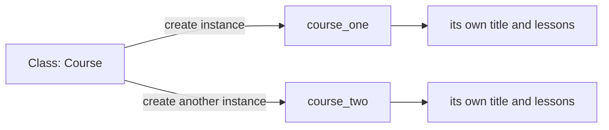

# Python Object-Oriented Programming, Explained Beautifully

> **A visual, beginner-friendly deep dive into classes and objects**  
> Learn to model related data and behavior, create objects, and build reusable program structures.

---

## The one-minute picture

Object-oriented programming (OOP) is a way to organize code around **objects**: values that bundle related data with actions that use that data.

A **class** describes what kind of object to create. An **object** is one particular instance of that class.



A useful everyday analogy is a blueprint and the items built from it:

- The **class** is the blueprint: it describes available information and actions.
- An **object** is one built item: it has its own actual values.
- **Attributes** are the object's stored information.
- **Methods** are functions defined on the class that describe what its objects can do.

---

## 1. Your first class and object

Define a class with `class`, followed by a class name and a colon. By convention, class names use `CapWords` (for example, `StudyTopic`).

```python
class StudyTopic:
    pass
```

`pass` is a placeholder: it lets Python accept an empty class body while you are learning. Create an object—also called an **instance**—by calling the class:

```python
first_topic = StudyTopic()
print(first_topic)
```

At this point, the object exists but has no useful topic information yet. We will add that next.

---

## 2. `__init__`: set up each new object

`__init__` is a special method Python calls automatically when you create an instance. It initializes that new object.

```python
class StudyTopic:
    def __init__(self, name, status):
        self.name = name
        self.status = status

first_topic = StudyTopic("Strings", "complete")
print(first_topic.name)    # Strings
print(first_topic.status)  # complete
```

When Python evaluates `StudyTopic("Strings", "complete")`, it creates a new object and calls `__init__` with that object plus the supplied information.

```text
StudyTopic("Strings", "complete")
          └────── arguments ──────┘

Inside __init__:
self.name   = "Strings"
self.status = "complete"
```

`__init__` initializes an already-created object; it is not the method that creates the object. For everyday beginner use, think of it as the setup step.

---

## 3. What is `self`?

`self` refers to the particular instance a method is working with. It lets methods read and update that object's attributes.

```python
class StudyTopic:
    def __init__(self, name):
        self.name = name

    def describe(self):
        print(f"I am studying {self.name}.")

strings = StudyTopic("Strings")
loops = StudyTopic("Loops")
strings.describe()  # I am studying Strings.
loops.describe()    # I am studying Loops.
```

When you call `strings.describe()`, Python passes `strings` as the first argument automatically. In a method definition, the first parameter is conventionally named `self`.

You write `self` in the method definition, but you do not pass it yourself when calling `strings.describe()`.

---

## 4. Attributes: data attached to an object

An **instance attribute** belongs to one object. Two objects created from the same class can hold different values.

```python
class Student:
    def __init__(self, name, score):
        self.name = name
        self.score = score

ada = Student("Ada", 98)
grace = Student("Grace", 100)

print(ada.name, ada.score)      # Ada 98
print(grace.name, grace.score)  # Grace 100
```

Changing an attribute changes that instance's stored data:

```python
ada.score = 99
print(ada.score)  # 99
grace.score       # still 100
```

This is one benefit of objects: related values travel together, and each object keeps its own state.

---

## 5. Methods: behavior attached to a class

A method is a function defined inside a class. It can use `self` to work with the current object's attributes.

```python
class Student:
    def __init__(self, name, score):
        self.name = name
        self.score = score

    def has_passed(self):
        return self.score >= 60

    def report(self):
        result = "passed" if self.has_passed() else "needs more practice"
        return f"{self.name}: {result} ({self.score})"

ada = Student("Ada", 98)
print(ada.has_passed())  # True
print(ada.report())      # Ada: passed (98)
```

A method can:

- read attributes;
- update attributes;
- call other methods;
- return a result or print a message.

Use `return` when the caller should decide what to do with the result.

---

## 6. Class attributes and instance attributes

A **class attribute** is defined directly in the class body and shared through the class. An **instance attribute** is usually defined with `self` inside `__init__` and belongs to each object.

```python
class StudyTopic:
    category = "Python topic"  # class attribute

    def __init__(self, name):
        self.name = name        # instance attribute

strings = StudyTopic("Strings")
loops = StudyTopic("Loops")

print(strings.category)  # Python topic
print(loops.category)    # Python topic
print(strings.name)      # Strings
print(loops.name)        # Loops
```

A class attribute is a good fit for shared information. Be careful with a mutable class attribute such as a list: all instances may see and modify the same list. Put per-object lists in `__init__` instead.

```python
class Course:
    def __init__(self, title):
        self.title = title
        self.lessons = []  # each course gets its own list
```

---

## 7. Encapsulation: keep related changes together

Encapsulation means bundling data and the operations that work with it. A class can provide methods that protect its state from invalid updates.

```python
class QuizScore:
    def __init__(self, score):
        self.score = score

    def update(self, new_score):
        if 0 <= new_score <= 100:
            self.score = new_score
            return True
        return False
```

```python
quiz = QuizScore(80)
quiz.update(95)   # True; score becomes 95
quiz.update(150)  # False; score stays 95
```

Python does not enforce strict private instance attributes in the same way as some languages. A leading underscore (such as `_score`) is a convention meaning “internal; please treat this as an implementation detail.”

---

## 8. Inheritance: specialize an existing class

Inheritance lets a new class reuse and specialize behavior from another class. The existing class is the **base** (or parent) class; the new class is the **derived** (or child) class.

```python
class Topic:
    def __init__(self, name):
        self.name = name

    def describe(self):
        return f"Topic: {self.name}"


class PracticeTopic(Topic):
    def __init__(self, name, exercise_count):
        super().__init__(name)
        self.exercise_count = exercise_count

    def describe(self):
        return f"{self.name}: {self.exercise_count} practice exercises"

practice = PracticeTopic("Loops", 8)
print(practice.describe())
```

`super().__init__(name)` calls the parent class's initializer so the inherited `name` attribute is set up.

### Overriding a method

When the child class defines a method with the same name as a parent method, it **overrides** that method. The child version runs on child instances.

Inheritance is most useful when there is a genuine “is a kind of” relationship. Do not create a parent class merely to share a few lines; a helper function or composition may be simpler.

### Polymorphism: the same action, different behavior

Polymorphism means different object types can respond to the same method call in their own way. The caller can ask each object to `describe()` without needing to know its exact class.

```python
class VideoLesson:
    def describe(self):
        return "Watch the lesson video"


class CodingLesson:
    def describe(self):
        return "Complete the coding exercise"


lessons = [VideoLesson(), CodingLesson()]
for lesson in lessons:
    print(lesson.describe())
```

Both objects provide `describe()`, but each does something different. In Python, this can work through inheritance or because unrelated objects happen to support the same method (often called duck typing).

---

## 9. Composition: objects that contain other objects

Composition means one object stores or uses another object. The relationship is “has a” rather than “is a.”

```python
class Lesson:
    def __init__(self, title, complete=False):
        self.title = title
        self.complete = complete


class Course:
    def __init__(self, title, lessons):
        self.title = title
        self.lessons = lessons

    def completed_count(self):
        return sum(lesson.complete for lesson in self.lessons)

lessons = [Lesson("Strings", True), Lesson("Lists")]
course = Course("Python Basics", lessons)
print(course.completed_count())  # 1
```

A course **has lessons**. Composition often keeps designs flexible and is a good default when one object simply owns or uses another.

---

## 10. Special methods: make objects work naturally with Python

Special methods have double underscores before and after their names. Python calls them for built-in operations.

### `__str__`: a readable display

```python
class StudyTopic:
    def __init__(self, name, status):
        self.name = name
        self.status = status

    def __str__(self):
        return f"{self.name} ({self.status})"

print(StudyTopic("Functions", "in progress"))
# Functions (in progress)
```

`print(object)` uses `__str__` when it is available. A `__repr__` method can provide a more developer-oriented representation, but it is fine to start with `__str__`.

### `__len__`: support `len(object)`

```python
class Playlist:
    def __init__(self, songs):
        self.songs = songs

    def __len__(self):
        return len(self.songs)

playlist = Playlist(["Song A", "Song B"])
len(playlist)  # 2
```

Special methods let your objects fit into familiar Python operations. Add them when they make the object's behavior natural and clear.

---

## 11. Class methods and static methods

Most methods use `self` and work with one particular instance. Python also supports methods that belong to the class itself or are related helper operations.

### `@classmethod`

A class method receives the class as its first argument, conventionally named `cls`. It is useful for alternate ways to create an instance or work with class-level information.

```python
class StudyTopic:
    def __init__(self, name, status):
        self.name = name
        self.status = status

    @classmethod
    def not_started(cls, name):
        return cls(name, "not started")

topic = StudyTopic.not_started("Dictionaries")
print(topic.status)  # not started
```

Using `cls(...)` rather than writing `StudyTopic(...)` means a subclass can inherit the class method and still create an instance of that subclass.

### `@staticmethod`

A static method receives neither `self` nor `cls` automatically. It is a helper placed in a class because it is conceptually related to that class.

```python
class StudyTopic:
    @staticmethod
    def is_valid_status(status):
        return status in {"not started", "in progress", "complete"}

StudyTopic.is_valid_status("complete")  # True
```

If a helper does not use class or instance data and does not need to live on the class conceptually, a regular module-level function may be simpler.

---

## 12. Properties: validate attribute access

A property lets code use attribute-style access while a method controls how a value is read or changed. This is useful for validation or for calculating a value from other attributes.

```python
class QuizScore:
    def __init__(self, score):
        self.score = score  # calls the property setter

    @property
    def score(self):
        return self._score

    @score.setter
    def score(self, value):
        if not 0 <= value <= 100:
            raise ValueError("score must be between 0 and 100")
        self._score = value

quiz = QuizScore(85)
quiz.score = 95
print(quiz.score)  # 95
```

The leading underscore in `_score` marks the underlying storage as internal by convention. The property keeps the public interface simple (`quiz.score`) while enforcing a rule. Do not add a property just to wrap every attribute; use one when it provides useful behavior.

---

## 13. Dataclasses for data-focused classes

When a class mainly stores data, `dataclasses` can generate common methods such as `__init__` and a readable representation.

```python
from dataclasses import dataclass

@dataclass
class TopicCard:
    name: str
    status: str = "not started"

card = TopicCard("OOP", "in progress")
print(card)  # TopicCard(name='OOP', status='in progress')
```

The field annotations describe the intended types; Python does not automatically enforce them at runtime. A regular class is still useful when initialization or behavior needs custom logic.

---

## 14. A practical mini-project: study tracker objects

This small design uses one `StudyTopic` object per topic. Each object stores its own name and status, and methods update or report that status.

```python
class StudyTopic:
    def __init__(self, name, status="not started"):
        self.name = name
        self.status = status

    def mark_complete(self):
        self.status = "complete"

    def report(self):
        return f"{self.name}: {self.status}"


topics = [
    StudyTopic("Strings", "complete"),
    StudyTopic("Lists", "in progress"),
    StudyTopic("OOP"),
]

topics[1].mark_complete()
for topic in topics:
    print(topic.report())
```

Output:

```text
Strings: complete
Lists: complete
OOP: not started
```

Each object has the same capabilities, but each stores its own topic name and status. Try creating another topic or adding a method such as `start()`.

---

## 15. When should you use a class?

A class is useful when your program has multiple entities that share the same kinds of data and behavior.

A simple variable or dictionary may be enough for one small record. A class becomes helpful when you want to:

- create many similar objects;
- keep each object's data and behavior together;
- validate or control how its data changes;
- give your program's concepts clear names.

Avoid making a class for every value. Use the simplest structure that keeps the code clear.

---

## 16. Common OOP surprises

### `self` is required in instance method definitions

The first parameter receives the current object. By convention it is named `self`.

### Do not pass `self` when calling an instance method

Call `student.report()`, not `student.report(student)`. Python supplies the instance automatically.

### `__init__` is setup, not a regular method you usually call yourself

Create instances by calling the class: `Student("Ada", 98)`.

### Each instance needs its own mutable attributes

Initialize per-object lists and dictionaries inside `__init__`, not as shared mutable class attributes.

### Inheritance is not the only way to reuse code

For a “has a” relationship, composition is often more natural. For a small shared calculation, a function may be enough.

### A class attribute may be shared

Mutable class attributes such as lists are shared through the class. Initialize per-instance collections in `__init__` instead.

### `@property` is not needed for every attribute

Use it when it adds useful behavior, such as validation or a calculated value. Plain attributes are clear for ordinary data.

---

## 17. Quick reference map

```text
CLASS          class Name:
CREATE         object_name = Name(arguments)
INITIALIZE     def __init__(self, parameters):
INSTANCE DATA  self.attribute = value
METHOD         def action(self, inputs):
CALL METHOD    object_name.action(arguments)
INHERIT        class Child(Parent):
PARENT SETUP   super().__init__(arguments)
DISPLAY        def __str__(self): return readable_text
CLASS METHOD   @classmethod; def make(cls, ...):
STATIC METHOD  @staticmethod; def helper(...)
PROPERTY       @property; optional @name.setter
DATA CLASS     @dataclass
```

### The most important mental checklist

1. **What kind of thing am I modeling?** That is a candidate class.
2. **What does each individual instance need to remember?** Those are instance attributes.
3. **What should each instance be able to do?** Those are methods.
4. **Is the relationship “is a kind of” or “has/uses”?** Consider inheritance or composition accordingly.
5. **Would a function or dictionary be simpler?** Prefer the simplest clear design.

---

## 18. Practice (answers below)

1. What is a class?
2. What is an object (instance)?
3. What does `self` refer to inside an instance method?
4. When does `__init__` run?
5. What is the difference between an instance attribute and a class attribute?
6. What does `super().__init__(...)` commonly do in a child class?
7. What does method overriding mean?
8. In “a course has lessons,” which design relationship is this?
9. What does `__str__` control?
10. When is a class useful compared with a single dictionary?
11. What does polymorphism let different objects do?
12. What first argument does a class method receive?
13. Does a static method automatically receive `self`?
14. What is one reason to use a property?
15. What can `@dataclass` generate for a data-focused class?

<details>
<summary><strong>Show the answers</strong></summary>

1. A definition or blueprint for creating objects with shared attributes and methods.
2. A particular object created from a class.
3. The current instance the method is working with.
4. Automatically when an instance is created by calling the class.
5. An instance attribute belongs to one object; a class attribute is shared through the class.
6. It calls the parent initializer to set up inherited attributes.
7. A child class provides its own implementation of a method inherited from a parent.
8. Composition (“has a”).
9. The readable text shown by `str(object)` and commonly by `print(object)`.
10. When you need many similar entities with their own data and related behavior.
11. Respond to the same method call with their own behavior.
12. The class itself, conventionally named `cls`.
13. No.
14. To validate or calculate a value while keeping attribute-style access.
15. Common methods such as `__init__` and a readable representation.

</details>

---

## Final idea

OOP organizes code around objects that carry both state and behavior. A class defines a shared structure, `__init__` sets up each instance, `self` gives methods access to that instance, and methods express what it can do. Start with small classes where data and actions naturally belong together; add inheritance or special methods only when they make the model clearer.
