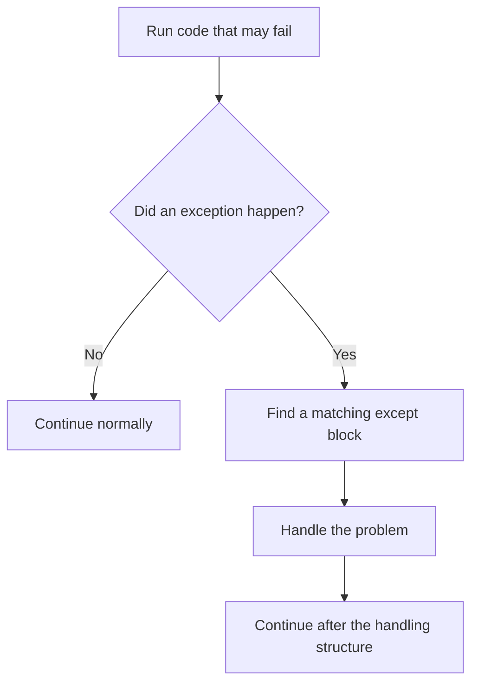

# Python Exception Handling, Explained Beautifully

> **A visual, beginner-friendly deep dive into errors and exceptions**  
> Learn to anticipate failures, respond clearly, clean up reliably, and raise meaningful errors of your own.

---

## The one-minute picture

An **exception** is Python's way of saying that something went wrong while the program was running—for example, dividing by zero, using a missing dictionary key, or converting invalid text to a number.

Without handling, an exception stops the current program path and displays a traceback. Exception handling lets you decide what the program should do instead.



```python
try:
    age = int("twenty")
except ValueError:
    print("Please enter the age as digits.")
```

Python attempts the conversion. Since `"twenty"` cannot become an integer, it raises `ValueError`; the matching `except` block runs instead of the program stopping with an unhandled traceback.

---

## 1. Errors and exceptions

Python reports different kinds of problems:

- **Syntax errors** happen when Python cannot understand the program's structure. The program cannot start until they are fixed.
- **Exceptions** happen while syntactically valid code is running. A program can catch and handle selected exceptions.

```python
# Syntax error: missing closing parenthesis, so Python cannot parse the file.
# print("Hello"

# Runtime exception: valid syntax, but this operation is not allowed.
# result = 10 / 0  # ZeroDivisionError
```

Exception handling is for expected runtime problems. It does not make syntax errors disappear, and it should not be used to hide bugs indiscriminately.

---

## 2. The simplest `try` and `except`

Put code that may fail inside `try`. Put the response to a specific expected exception in `except`.

```python
text = "42"

try:
    number = int(text)
except ValueError:
    print("That text is not a valid whole number.")
else:
    print(f"The number is {number}.")
```

The paths are:

```text
try block succeeds  → skip except → run else (if present)
try block raises    → find matching except → handle it
```

The `else` here is different from a conditional's `else`: in exception handling, it runs only when the `try` block succeeds without an exception.

---

## 3. Catch the exception you expect

Use a specific exception type so you handle the problem you know how to recover from.

```python
try:
    score = int(input_text)
except ValueError:
    print("Enter a whole-number score, such as 85.")
```

Avoid a bare `except:`. It catches almost everything, including exceptions that usually should not be swallowed, such as `KeyboardInterrupt`.

```python
# Avoid: too broad; can hide unrelated bugs.
# try:
#     do_work()
# except:
#     print("Something went wrong")
```

If you truly need a broad catch at an application boundary, catch `Exception`, and report or re-raise it thoughtfully:

```python
try:
    do_work()
except Exception as error:
    print(f"Unexpected problem: {error}")
    raise  # keep the traceback and let higher-level code decide
```

For everyday recovery, catch the narrowest exception that fits.

---

## 4. Common built-in exceptions

| Exception | Often means | Example |
|---|---|---|
| `ValueError` | Right kind of value, but invalid content | `int("hello")` |
| `TypeError` | Operation used with an inappropriate type | `"age" + 5` |
| `ZeroDivisionError` | Divided by zero | `10 / 0` |
| `IndexError` | Sequence position does not exist | `["a"][3]` |
| `KeyError` | Dictionary key does not exist | `{"name": "Ada"}["score"]` |
| `NameError` | Name has not been defined | `unknown_name` |
| `FileNotFoundError` | Requested file path is absent | `open("missing.txt")` |
| `AttributeError` | Object has no requested attribute | `5.append(2)` |
| `ImportError` / `ModuleNotFoundError` | Import cannot be completed | `import missing_package` |

Knowing the likely exception helps you write a precise `except` clause.

---

## 5. Multiple exception types

Use multiple `except` blocks when different problems need different responses.

```python
try:
    number = int(user_text)
    result = 100 / number
except ValueError:
    print("Enter a whole number.")
except ZeroDivisionError:
    print("The number must not be zero.")
else:
    print(f"Result: {result}")
```

Python checks the `except` blocks from top to bottom and runs the first matching one. If exceptions share a response, group them in a tuple:

```python
try:
    number = int(user_text)
except (ValueError, TypeError):
    print("Please provide text that represents a whole number.")
```

Keep the `try` block small. If unrelated operations are all inside one large `try`, it can be unclear which line caused the error and which recovery is appropriate.

---

## 6. `else`: code for the success path

An exception-handling `else` runs only if the `try` block completes without an exception. Put success-only work there to keep it separate from the risky operation.

```python
try:
    score = int(user_text)
except ValueError:
    print("That is not a valid score.")
else:
    print(f"Saved score: {score}")
```

This makes the structure explicit: attempt conversion; handle invalid input; otherwise use the converted score.

---

## 7. `finally`: cleanup that must happen

A `finally` block runs whether the `try` succeeds, an exception is handled, or an exception continues upward. It is meant for cleanup actions.

```python
file = None
try:
    file = open("notes.txt", encoding="utf-8")
    contents = file.read()
except FileNotFoundError:
    print("The notes file is not available.")
finally:
    if file is not None:
        file.close()
```

For files, prefer `with`, which closes the file automatically even if an exception occurs:

```python
try:
    with open("notes.txt", encoding="utf-8") as file:
        contents = file.read()
except FileNotFoundError:
    print("The notes file is not available.")
```

Other resources such as locks and network connections may also need reliable cleanup. Use context managers when available; use `finally` when you need explicit cleanup logic.

---

## 8. `raise`: signal that something is wrong

Use `raise` to create an exception when your code receives invalid input or reaches a situation it cannot handle correctly.

```python
def percentage(part, whole):
    if whole == 0:
        raise ValueError("whole must not be zero")
    return part / whole * 100
```

A good exception type and message explain what was wrong. Raise an exception rather than returning a made-up value when the caller needs to know that the operation failed.

### Re-raise an exception

Inside an `except` block, bare `raise` re-raises the current exception with its original traceback.

```python
try:
    number = int(user_text)
except ValueError:
    print("Could not parse the input; passing the error upward.")
    raise
```

Use this when you can add context or logging but cannot actually recover.

---

## 9. `assert`: check a programming assumption

An `assert` checks a condition that your code expects to be true. If it is false, Python raises `AssertionError`.

```python
score = 85
assert 0 <= score <= 100, "score should already be validated"
```

Assertions are for catching programmer mistakes or documenting internal assumptions—not for validating user input or enforcing rules that must always run. Python can disable assertions in optimized mode, so use regular `if` and `raise` for required validation.

```python
def set_score(score):
    if not 0 <= score <= 100:
        raise ValueError("score must be between 0 and 100")
```

---

## 10. Custom exceptions

Define a custom exception when your program has a meaningful category of error that callers may want to handle specifically. Custom exception classes usually inherit from `Exception`.

```python
class TopicNotFoundError(Exception):
    """Raised when a requested study topic is not tracked."""


def get_status(progress, topic):
    if topic not in progress:
        raise TopicNotFoundError(f"No progress recorded for {topic!r}")
    return progress[topic]
```

A caller can catch the specific error:

```python
progress = {"Strings": "complete"}

try:
    status = get_status(progress, "Dictionaries")
except TopicNotFoundError as error:
    print(error)
```

Start with built-in exception types for ordinary problems. Create a custom exception when the distinction makes your code's API clearer.

---

## 11. Exception objects and useful messages

Use `as name` to bind the caught exception to a variable. Its string form often contains helpful details.

```python
try:
    number = int("four")
except ValueError as error:
    print(f"Conversion failed: {error}")
```

Do not expose sensitive internal details to end users. In a real application, show a helpful safe message and record diagnostic details through an appropriate logging system.

---

## 12. EAFP and LBYL: try the operation or check first

Python code often follows **EAFP**: “Easier to Ask Forgiveness than Permission.” Try the operation and handle the expected failure.

```python
scores = {"Ada": 98}

try:
    ada_score = scores["Ada"]
except KeyError:
    ada_score = 0
```

Another style is **LBYL**: “Look Before You Leap.” Check first, then act.

```python
if "Ada" in scores:
    ada_score = scores["Ada"]
else:
    ada_score = 0
```

Both can be appropriate. Use the one that is clearer and safe for the operation. For dictionary lookup, `scores.get("Ada", 0)` may be clearest. For file operations or conversions, catching a specific exception is often natural.

---

## 13. A practical mini-project: safe score calculator

This function converts text to a score, checks the allowed range, and handles expected input problems without hiding unrelated programming errors.

```python
def read_score(text):
    try:
        score = int(text)
    except ValueError:
        return None, "Enter a whole number, such as 85."
    else:
        if not 0 <= score <= 100:
            return None, "Score must be from 0 to 100."
        return score, f"Score accepted: {score}"


for answer in ["85", "many", "120"]:
    score, message = read_score(answer)
    print(message)
```

Output:

```text
Score accepted: 85
Enter a whole number, such as 85.
Score must be from 0 to 100.
```

The function handles the specific conversion failure (`ValueError`) and represents an expected invalid answer with a clear result. In a larger application, you might choose to raise a custom exception instead, depending on how the caller should respond.

---

## 14. Common exception-handling mistakes

### Catching everything with bare `except`

It can swallow bugs and make a broken program look successful. Catch specific exceptions.

### Wrapping too much code in `try`

Keep the risky operation small so the handler knows what failed.

### Using exceptions for ordinary branching unnecessarily

If a simple condition answers the question clearly, use an `if`. Exceptions are most useful for exceptional or uncertain operations.

### Silently ignoring an exception

An empty `except` hides information and makes problems difficult to diagnose. Recover, explain, log appropriately, or re-raise.

### Using `assert` for user input validation

Assertions can be disabled. Validate required inputs with an `if` and `raise`.

### Returning from `finally`

Avoid `return` inside `finally`; it can override a return value or suppress an exception from the `try` block.

---

## 15. Quick reference map

```text
HANDLE          try: risky_work() / except SpecificError: recover()
SUCCESS PATH    else: runs when try completes without exception
CLEANUP         finally: runs on success or failure
RAISE           raise ValueError("helpful message")
CAPTURE DETAIL  except ValueError as error:
RE-RAISE        raise  # inside except, preserves current traceback
CUSTOM ERROR    class MyError(Exception): ...
ASSERT          assert condition, "internal assumption"
```

### The most important mental checklist

1. **What operation can fail?** Keep only that work in the `try` block.
2. **Which specific exception is expected?** Catch that type, not everything.
3. **Can the program recover?** Give a useful message, default, retry, or safe result.
4. **Does cleanup need to happen regardless?** Use `with` or `finally`.
5. **Is this user input validation or an internal assumption?** Use `if`/`raise` for validation and reserve `assert` for assumptions.

---

## 16. Practice (answers below)

1. What happens when an exception is raised and no matching handler exists?
2. Which exception does `int("hello")` raise?
3. When does an exception-handling `else` block run?
4. Does `finally` run when the `try` block succeeds?
5. Why should you avoid bare `except:`?
6. What does `raise ValueError("bad score")` do?
7. What should `assert` be used for?
8. How do you access an exception's message in a handler?
9. Why is `with open(...)` usually preferred over manually closing a file?
10. When might a custom exception be useful?

<details>
<summary><strong>Show the answers</strong></summary>

1. It propagates up the call stack and, if still unhandled, stops the program with a traceback.
2. `ValueError`.
3. Only if the `try` block completes without raising an exception.
4. Yes; `finally` runs on success and failure.
5. It can catch and hide unrelated errors, including signals that should usually propagate.
6. It raises a `ValueError` with the supplied message.
7. Checking internal programmer assumptions, not validating user input.
8. Use `except SomeError as error:` and inspect or display `error`.
9. The context manager closes the file automatically, including when an exception occurs.
10. When callers need to handle a domain-specific failure distinctly.

</details>

---

## Final idea

Exceptions are signals that an operation could not complete as expected. Handle the failures you can recover from with specific `except` blocks, use `else` for success-only work, and rely on `finally` or context managers for cleanup. Raise clear exceptions when your own code detects invalid situations, and avoid swallowing errors you do not understand.
