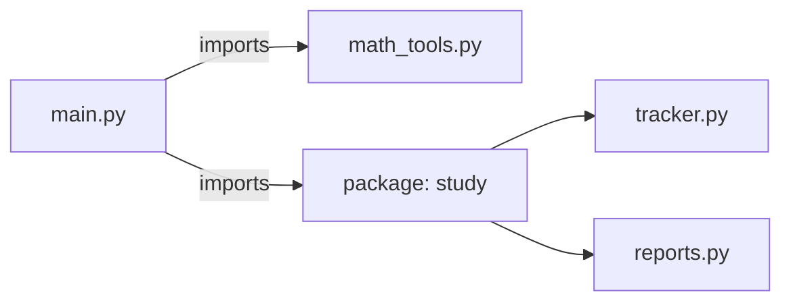
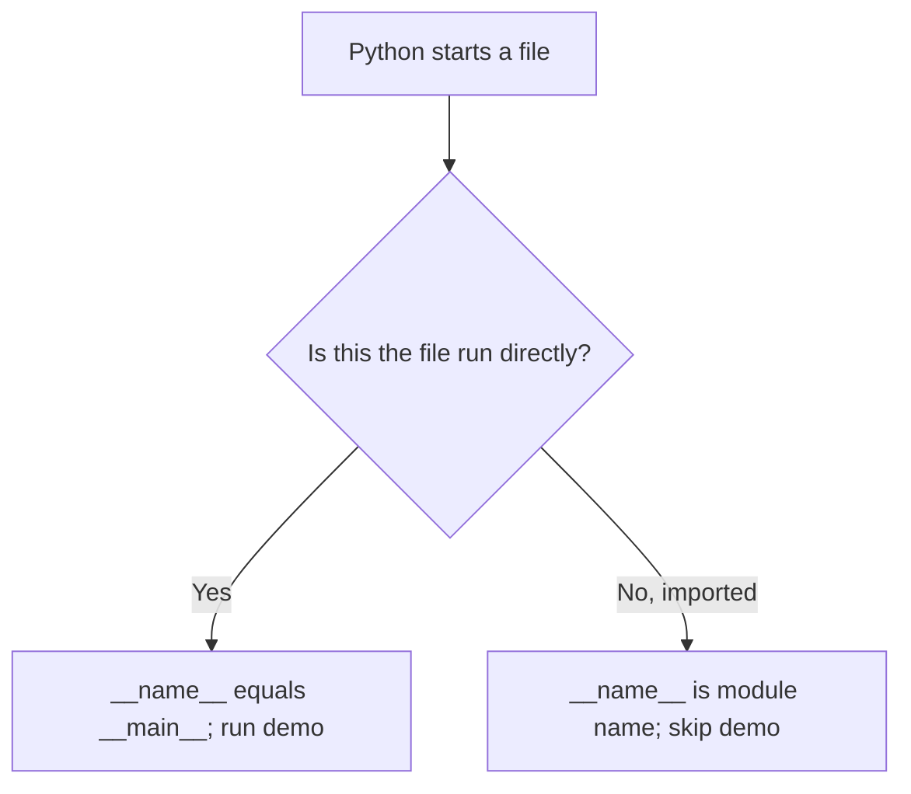

# Python Modules and Imports

> **A visual, beginner-friendly deep dive into organizing Python code**  
> Learn what modules and packages are, how imports work, and how to structure code that can be reused safely.

---

## The one-minute picture

A **module** is a Python file that can hold reusable code: variables, functions, and classes. An **import** makes names from a module available to another file.

A **package** is a way to organize related modules in directories. Importing lets a project stay divided into understandable pieces instead of one giant file.



Imagine a module as a toolbox: define useful tools once, then import and use them wherever needed.

---

## 1. A module is a Python file

Every `.py` file can be used as a module. Suppose a folder contains:

```text
project/
├── main.py
└── greetings.py
```

In `greetings.py`, define something reusable:

```python
# greetings.py
def greet(name):
    return f"Hello, {name}!"
```

In `main.py`, import the module and call its function:

```python
# main.py
import greetings

message = greetings.greet("Ada")
print(message)
```

When both files are in the same project folder, Python can usually find the sibling module during normal execution of `main.py`.

---

## 2. Three common import styles

Assume `math_tools.py` contains:

```python
# math_tools.py
def add(a, b):
    return a + b

PI_APPROX = 3.14
```

### Import the module

```python
import math_tools

math_tools.add(2, 3)
math_tools.PI_APPROX
```

The module prefix makes it clear where each name came from and helps avoid naming conflicts. This is often the best default style.

### Import selected names

```python
from math_tools import add, PI_APPROX

add(2, 3)
PI_APPROX
```

This is concise, but imported names appear directly in your file's namespace. Be careful not to overwrite them accidentally.

### Import with an alias

```python
import math_tools as mt
mt.add(2, 3)
```

Aliases are useful for long module names or widely accepted conventions, such as `import statistics as stats`. Prefer aliases that remain recognizable.

You can alias an individual name too:

```python
from math_tools import add as sum_values
sum_values(2, 3)
```

---

## 3. Avoid `from module import *`

A star import brings many names into the current namespace:

```python
# Avoid in most application code:
# from math_tools import *
```

It becomes unclear where names came from, and names can overwrite one another. Prefer `import module` or explicitly import the names you need.

---

## 4. Standard library modules

Python comes with a **standard library**: modules for common tasks that do not need a separate installation.

```python
import math
import random
import statistics
from pathlib import Path

print(math.sqrt(81))
print(statistics.mean([70, 80, 90]))
print(Path("notes.txt").suffix)
```

Use the official library instead of rebuilding common functionality yourself. A module's documentation explains available names and expected inputs.

---

## 5. What happens when Python imports a module?

For a normal import, Python generally:

1. looks for the module using its import search path;
2. loads and executes the module's top-level statements if needed;
3. creates a module object containing its names;
4. binds that module to the name you imported.

```python
# startup.py
print("This top-level statement runs when startup is first imported.")

def start():
    print("This function runs only when start() is called.")
```

```python
import startup
# Top-level print occurs during the first import.
# startup.start() is separate; it does not run automatically.
```

Python caches imported modules during a running process, so importing the same module again normally reuses the loaded module rather than rerunning all its top-level code.

**Good practice:** keep module-level code mostly to definitions and constants. Avoid actions such as prompting for input, starting a server, or changing files merely because the module was imported.

---

## 6. The `__name__ == "__main__"` pattern

Inside a module, Python sets the special variable `__name__`:

- to `"__main__"` when the file is run directly;
- to the module's import name when another file imports it.

This lets a file provide reusable definitions while keeping its demo or startup code from running during import.

```python
# greetings.py
def greet(name):
    return f"Hello, {name}!"


if __name__ == "__main__":
    # Runs when this file is executed directly, not when imported.
    print(greet("Ada"))
```



This pattern is common for small demos, command-line entry points, and simple self-checks.

---

## 7. A module can be run as a script

Run a file directly with Python:

```text
python greetings.py
```

When a project has a package, a module can also be run with `-m` from the directory above the package:

```text
python -m study
```

The `-m` form runs the named module using Python's import machinery and is often useful for packages and command-line tools.

---

## 8. Packages: folders that organize modules

A package groups related modules in a directory. A beginner-friendly structure looks like:

```text
study_project/
├── main.py
└── study/
    ├── __init__.py
    ├── tracker.py
    └── reports.py
```

`tracker.py` might contain topic-management logic:

```python
# study/tracker.py

def completed_count(progress):
    return sum(status == "complete" for status in progress.values())
```

`main.py` can import it using the package name:

```python
from study.tracker import completed_count

progress = {"Strings": "complete", "Lists": "in progress"}
print(completed_count(progress))
```

An `__init__.py` file makes the directory a traditional regular package and can hold package initialization code. Modern Python also supports namespace packages without it, but including an empty `__init__.py` is a clear, approachable default for a small project.

---

## 9. Absolute and relative imports inside packages

### Absolute imports

An absolute import starts at the package's top-level name. It is explicit and often easiest to understand.

```python
from study.tracker import completed_count
from study.reports import print_summary
```

### Relative imports

A relative import starts from the current package. One dot means the current package; two dots mean the parent package.

```python
# inside study/reports.py
from .tracker import completed_count
```

Relative imports are for code running as part of a package. Running `reports.py` directly can fail because Python may not know its package context. Run the package entry point instead, such as `python -m study`.

For a small beginner project, absolute imports are often easiest to follow. Use relative imports when they make internal package relationships simpler and the package is run in the proper context.

---

## 10. `__init__.py` and package interfaces

`__init__.py` can be empty, or it can expose a convenient package-level interface.

```python
# study/__init__.py
from .tracker import completed_count
```

Then another file may write:

```python
from study import completed_count
```

Do this intentionally. Re-exporting everything can make it harder to discover where code is defined. A package interface should expose names users are expected to rely on.

---

## 11. The import search path

Python searches for modules in locations listed in `sys.path`. These commonly include:

- the directory of the script being run (or the current environment's launch context);
- installed packages in the active Python environment;
- standard library locations.

You can inspect it:

```python
import sys
print(sys.path)
```

A project module is easiest to import when you run Python from the intended project root or use the correct package entry point. Avoid fixing imports by permanently adding arbitrary folders to `sys.path`; first check the project layout, current working directory, and how the program is launched.

---

## 12. Naming files and avoiding shadowing

Do not name your own file after a standard library module you want to import. A file named `random.py`, `statistics.py`, or `json.py` can shadow the real module and cause confusing import errors.

Prefer descriptive project names such as:

```text
study_tracker.py
score_tools.py
text_helpers.py
```

Also avoid naming files after third-party packages used by your project.

---

## 13. Circular imports

A circular import happens when module A imports module B while module B also imports module A. One module may be only partially initialized when the other tries to use it.

```text
module_a imports module_b
module_b imports module_a before module_a finishes loading
```

Symptoms often include `ImportError` or “partially initialized module” messages. Common fixes:

- move shared code into a third module that both can import;
- reorganize responsibilities so dependencies point in one direction;
- import inside a function only when there is a specific, well-understood reason.

Do not treat function-local imports as a general cure; a cleaner dependency structure is usually better.

---

## 14. Import errors and troubleshooting

### `ModuleNotFoundError`

Python could not find the requested module. Check spelling, package installation, active environment, file location, and how you launched the program.

### `ImportError`

Python found a module but could not import the requested name, or an import failed while loading it. Check that the name exists and look for circular imports or a local file shadowing another module.

### Importing the wrong file

If your script is named `json.py`, `random.py`, or another module's name, Python may load your file instead. Rename it and remove any stale `__pycache__` folder if needed.

### Module works directly but not as an import

Top-level code may depend on being run from a particular directory. Keep reusable definitions at module level, put demos under the main guard, and launch package modules with `python -m package.module` from the project root.

---

## 15. A practical mini-project: split a study tracker into modules

Project layout:

```text
study_project/
├── main.py
└── study/
    ├── __init__.py
    ├── tracker.py
    └── reports.py
```

`study/tracker.py`:

```python
def completed_count(progress):
    return sum(status == "complete" for status in progress.values())


def completion_percent(progress):
    if not progress:
        return 0
    return completed_count(progress) / len(progress) * 100
```

`study/reports.py`:

```python
def print_progress(progress):
    for topic, status in progress.items():
        print(f"- {topic}: {status}")
```

`main.py`:

```python
from study.tracker import completion_percent
from study.reports import print_progress


def main():
    progress = {
        "Strings": "complete",
        "Lists": "complete",
        "Modules": "in progress",
    }
    print_progress(progress)
    print(f"Completion: {completion_percent(progress):.0f}%")


if __name__ == "__main__":
    main()
```

The tracker calculates values, the reports module displays information, and `main.py` coordinates the program. Each module has one clear responsibility.

---

## 16. Common import mistakes

### Forgetting the module prefix

After `import math_tools`, call `math_tools.add(...)`, not `add(...)` (unless you imported `add` directly).

### Using star imports

`from module import *` hides where names came from and can cause collisions.

### Putting startup actions at module level

Imported top-level statements run. Guard demo or startup code with `if __name__ == "__main__":`.

### Running a package file from the wrong place

Run from the project root and use `python -m package.module` when package context is required.

### Naming your file after a module

A local `random.py` can prevent `import random` from importing the standard library module.

### Overusing `sys.path` edits

Fix the package structure or launch location before appending arbitrary paths.

---

## 17. Quick reference map

```text
IMPORT MODULE       import math
IMPORT NAMES        from math import sqrt, pi
ALIAS               import statistics as stats
PACKAGE IMPORT      from study.tracker import completed_count
RELATIVE IMPORT     from .tracker import completed_count
MAIN GUARD          if __name__ == "__main__":
RUN MODULE          python -m study
SEARCH PATH         import sys; sys.path
```

### The most important mental checklist

1. **Is the reusable code in a clearly named `.py` file?** That file is a module.
2. **Should I import the whole module or selected names?** Prefer clarity and avoid collisions.
3. **Does the package structure match the import path?** Run from the project root.
4. **Will top-level code run on import?** Keep side effects behind a main guard.
5. **Could a local filename shadow a module?** Avoid standard-library and dependency names.

---

## 18. Practice (answers below)

1. What is a Python module?
2. What does `import math` let you write to call a function from `math`?
3. What is one advantage of `import module` over importing a name directly?
4. What does `if __name__ == "__main__":` protect?
5. What is a package?
6. What does `from .tracker import completed_count` mean inside a package?
7. What commonly causes `ModuleNotFoundError`?
8. Why should you avoid naming your file `random.py` if you need `import random`?
9. What is a circular import?
10. When does module-level code run?

<details>
<summary><strong>Show the answers</strong></summary>

1. A Python file containing names such as functions, classes, and variables.
2. `math.function_name(...)`, for example `math.sqrt(9)`.
3. Names remain grouped under the module prefix, which makes their origin clear and reduces collisions.
4. Demo or startup code that should run only when that file is executed directly.
5. A directory that organizes related modules as an importable unit.
6. Import `completed_count` from `tracker.py` in the current package.
7. A misspelled name, missing installation, wrong environment, or incorrect project path/launch context.
8. The local file can shadow the standard library module.
9. Two modules depend on importing each other, potentially before either finishes loading.
10. When the module is first imported (or run directly); ordinary function bodies still wait until called.

</details>

---

## Final idea

Modules give code a home; imports connect those homes. Keep reusable definitions in modules, use packages to group related files, and protect run-only behavior with the main guard. A clear project structure makes names easier to find and code easier to reuse.
