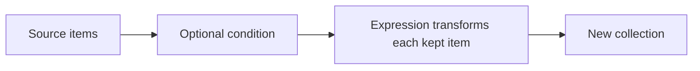

# Python Comprehensions, Explained Beautifully

> **A visual, beginner-friendly deep dive into comprehensions**  
> Learn to build lists, sets, and dictionaries from existing data in a clear, compact way.

---

## The one-minute picture

A comprehension creates a new collection by describing **what to put in it** and **where to get the values**. It can also filter values with a condition.



A basic list comprehension looks like this:

```python
numbers = [1, 2, 3, 4]
squares = [number * number for number in numbers]
# [1, 4, 9, 16]
```

Read it from left to right as: “make `number * number` for each `number` in `numbers`.”

---

## 1. The basic list comprehension

A list comprehension creates a new list. Its general shape is:

```python
[expression for item in iterable]
```

- `iterable`: the source to loop over, such as a list, string, or `range`;
- `item`: the current value on this pass;
- `expression`: the value to put in the new list for this item.

```python
topics = ["strings", "lists", "functions"]
capitalized = [topic.title() for topic in topics]
# ['Strings', 'Lists', 'Functions']
```

### The equivalent regular loop

A comprehension is a compact spelling of a common loop pattern:

```python
capitalized = []
for topic in topics:
    capitalized.append(topic.title())
```

Both versions build a new list. Use the comprehension when the transformation is short and easy to understand; use the loop when extra steps or explanations are needed.

---

## 2. Transforming values

The expression can calculate, format, or otherwise transform each item.

```python
scores = [72, 85, 91]
curved_scores = [score + 5 for score in scores]
# [77, 90, 96]

labels = [f"Score: {score}" for score in scores]
# ['Score: 72', 'Score: 85', 'Score: 91']
```

The source collection remains unchanged. A comprehension creates a new collection.

---

## 3. Filtering with `if`

Add an `if` after the `for` clause to include only items that pass a condition.

```python
scores = [55, 72, 91, 48, 83]
passing = [score for score in scores if score >= 60]
# [72, 91, 83]
```

Read it as: “make a list of `score` for each `score` in `scores`, keeping only scores greater than or equal to 60.”

The basic filter form is:

```python
[expression for item in iterable if condition]
```

The condition decides whether to **keep or skip** an item. It does not provide the output value.

---

## 4. Transforming with `if`/`else`

An `if`/`else` expression can choose the output value for every item. In this form, the conditional expression goes before the `for` clause:

```python
scores = [55, 72, 91]
labels = ["pass" if score >= 60 else "retry" for score in scores]
# ['retry', 'pass', 'pass']
```

Read it as: “for each score, put `pass` in the output if it is at least 60; otherwise put `retry`.”

Compare the two patterns:

```python
# Filter: some source items are omitted.
passing = [score for score in scores if score >= 60]

# Conditional expression: every source item produces an output value.
labels = ["pass" if score >= 60 else "retry" for score in scores]
```

Do not confuse this with the filter form. A trailing `if condition` filters; `value_a if condition else value_b` selects an output for every item.

---

## 5. Set comprehensions

Use braces with one expression and a `for` clause to make a set. Duplicate results collapse automatically.

```python
words = ["python", "PYTHON", "loops", "loops"]
lowercase_words = {word.lower() for word in words}
# {'python', 'loops'} (display order can vary)
```

Choose a set comprehension when you want unique results and do not need positional order.

---

## 6. Dictionary comprehensions

A dictionary comprehension creates key–value pairs. Its general shape is:

```python
{key_expression: value_expression for item in iterable}
```

```python
numbers = [1, 2, 3, 4]
squares = {number: number * number for number in numbers}
# {1: 1, 2: 4, 3: 9, 4: 16}
```

You can transform existing key–value pairs:

```python
prices = {"book": 12, "pen": 2}
prices_with_tax = {item: price * 1.1 for item, price in prices.items()}
```

You can also filter entries:

```python
scores = {"Ada": 98, "Grace": 100, "Linus": 55}
passing_scores = {name: score for name, score in scores.items() if score >= 60}
# {'Ada': 98, 'Grace': 100}
```

---

## 7. Nested comprehensions

A comprehension can contain more than one `for` clause. This is equivalent to nested loops: the later loop runs completely for each value from the earlier loop.

```python
pairs = [(row, column) for row in range(2) for column in range(3)]
# [(0, 0), (0, 1), (0, 2), (1, 0), (1, 1), (1, 2)]
```

The equivalent loops make the order visible:

```python
pairs = []
for row in range(2):
    for column in range(3):
        pairs.append((row, column))
```

### Flatten a nested list

```python
rows = [[1, 2], [3, 4], [5, 6]]
flattened = [number for row in rows for number in row]
# [1, 2, 3, 4, 5, 6]
```

Read the clauses in order: for each row, then for each number in that row, add the number.

Nested comprehensions are useful when the loop logic is still easy to scan. If you need a moment to decode them, a regular nested loop is clearer.

---

## 8. Multiple conditions

You can add multiple filters after the `for` clause. All conditions must be true for an item to be included.

```python
numbers = range(1, 21)
selected = [number for number in numbers if number % 2 == 0 if number > 10]
# [12, 14, 16, 18, 20]
```

This is similar to joining the conditions with `and`:

```python
selected = [number for number in numbers if number % 2 == 0 and number > 10]
```

Use whichever form reads most naturally.

---

## 9. Comprehensions and function calls

The expression can call a function, which is useful for applying existing logic.

```python
def word_length(word):
    return len(word)

topics = ["Strings", "Lists", "Comprehensions"]
lengths = [word_length(topic) for topic in topics]
# [7, 5, 13]
```

For simple transformations, direct expressions may be shorter. For meaningful or repeated logic, a named function gives the operation a clear name.

---

## 10. Generator expressions: produce values on demand

A generator expression looks like a list comprehension with parentheses instead of square brackets.

```python
squares = (number * number for number in range(1_000_000))
```

It does not immediately create a million-item list. It produces values one at a time as they are requested. This can save memory when processing a large sequence once.

```python
total = sum(number * number for number in range(5))
# 30
```

The expression passed to `sum()` is a generator expression. Use a list comprehension when you need to keep, index, or revisit all the results; use a generator expression when you can consume values once.

---

## 11. Readability: when a comprehension is too much

Comprehensions are not automatically better than loops. Prefer a regular loop when:

- the body needs several statements;
- conditions are complicated or nested deeply;
- you need logging, error handling, or side effects;
- the result is hard to understand at a glance.

Avoid using a comprehension only for an action such as printing, because the created list is then thrown away:

```python
# Avoid: creates an unused list just to call print.
# [print(topic) for topic in topics]

# Clearer:
for topic in topics:
    print(topic)
```


A good rule: if a comprehension does both a complicated transformation and several filters, expand it into a normal loop.

---

## 12. A practical mini-project: build a study report

Start with a dictionary of study scores. Use comprehensions to create a list of passing names, a dictionary of labels, and a set of unique statuses.

```python
scores = {"Ada": 98, "Grace": 100, "Linus": 55, "Guido": 82}

passing_names = [name for name, score in scores.items() if score >= 60]
score_labels = {name: "pass" if score >= 60 else "retry" for name, score in scores.items()}
unique_statuses = {status for status in score_labels.values()}

print(passing_names)
print(score_labels)
print(unique_statuses)
```

Possible output (set order can vary):

```text
['Ada', 'Grace', 'Guido']
{'Ada': 'pass', 'Grace': 'pass', 'Linus': 'retry', 'Guido': 'pass'}
{'pass', 'retry'}
```

This example demonstrates three different collection comprehensions. Each one answers a different question: which names passed, what label belongs to each learner, and which labels occur at all.

---

## 13. Common comprehension mistakes

### Putting a filter `if` in the wrong place

```python
# Filter goes after the for clause:
[score for score in scores if score >= 60]

# Conditional output goes before the for clause and needs else:
["pass" if score >= 60 else "retry" for score in scores]
```

### Forgetting that comprehensions create new collections

The original iterable is not changed just because you create a comprehension from it.

### Expecting uniqueness from a list comprehension

Lists keep duplicates. Use a set comprehension if unique values are the goal.

### Making the comprehension too complex

If it needs an explanation to parse, write a normal loop.

### Using a comprehension for side effects

Use a loop for printing, writing, or modifying external state; comprehensions are for creating a result.

---

## 14. Quick reference map

```text
LIST             [expression for item in iterable]
FILTERED LIST    [expression for item in iterable if condition]
IF/ELSE OUTPUT   [a if condition else b for item in iterable]
SET              {expression for item in iterable}
DICTIONARY       {key: value for item in iterable}
NESTED           [value for row in rows for value in row]
GENERATOR        (expression for item in iterable)
```

### The most important mental checklist

1. **What collection should I create?** List `[]`, set `{}`, dictionary `{key: value}`, or generator `()`.
2. **What does each source item become?** Write the output expression first.
3. **Should some items be omitted?** Add a trailing filter `if`.
4. **Should every item map to one of two results?** Use `a if condition else b` before the `for`.
5. **Is the result still easy to read?** If not, use a regular loop.

---

## 15. Practice (answers below)

1. What does `[n * 2 for n in [1, 2, 3]]` produce?
2. What does a filter `if` at the end of a list comprehension do?
3. What is the difference between a filter `if` and `value_a if condition else value_b`?
4. Which comprehension type removes duplicate results?
5. What does `{n: n * n for n in range(3)}` produce?
6. In `[value for row in rows for value in row]`, which loop is outermost?
7. What is the main difference between a list comprehension and a generator expression?
8. When is a regular loop clearer than a comprehension?

<details>
<summary><strong>Show the answers</strong></summary>

1. `[2, 4, 6]`.
2. It keeps only source items for which the condition is true.
3. A filter omits some items; a conditional expression gives every item one of two output values.
4. A set comprehension.
5. `{0: 0, 1: 1, 2: 4}`.
6. `for row in rows` is outermost; for each row, the inner `for value in row` runs.
7. A list comprehension builds the full list immediately; a generator expression produces values on demand.
8. When the logic has multiple steps, complex conditions, side effects, or is hard to scan.

</details>

---

## Final idea

A comprehension is a compact recipe for building a collection: choose an output expression, loop over a source, and optionally filter. Use list, set, dictionary, or generator forms according to the result you need. Keep the recipe readable—when the logic gets complicated, a regular loop is a strength, not a failure.
