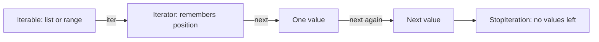
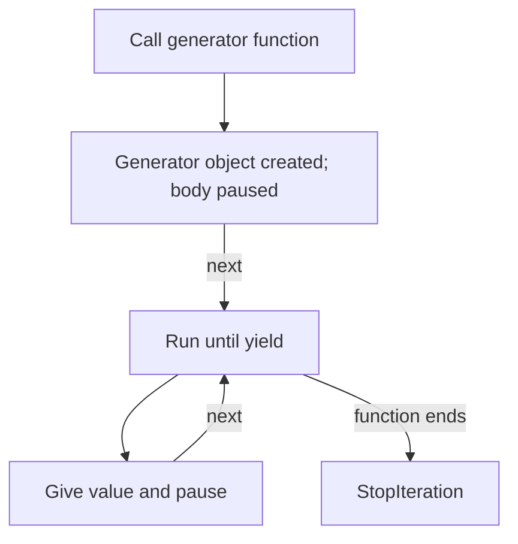

# Python Iterators and Generators

> **A visual, beginner-friendly deep dive into lazy sequences**  
> Learn how Python visits values one at a time, how iterators keep their place, and how generators make custom streams of data.

---

## The one-minute picture

An **iterable** is something Python can loop over, such as a list, string, tuple, dictionary, or file. An **iterator** is the object that remembers where it is and provides the next value. A **generator** is a convenient way to create an iterator.



A list stores all its items. An iterator can hand them out one at a time, and a generator can produce each value only when it is requested.

---

## 1. Iterable: something you can loop over

An **iterable** is an object that can provide an iterator. Many familiar Python values are iterable:

```python
for letter in "code":
    print(letter)

for score in [72, 85, 91]:
    print(score)

for number in range(3):
    print(number)
```

A `for` loop works with all of these even though a string, list, and range are different kinds of objects. Python asks each iterable for an iterator and requests values until there are no more.

Common iterables include:

- strings, lists, tuples, sets, and dictionaries;
- `range` objects;
- open files;
- generators.

An iterable can usually be looped over again to start a fresh traversal. An iterator is usually a one-pass object that moves forward as values are requested.

---

## 2. Iterator: an object that remembers its place

An iterator produces one value at a time and remembers which value should come next.

Get an iterator from an iterable with `iter()`, then request values with `next()`:

```python
topics = ["Strings", "Lists", "Generators"]
iterator = iter(topics)

print(next(iterator))  # Strings
print(next(iterator))  # Lists
print(next(iterator))  # Generators
```

Each call advances the same iterator. It does not start over.

```text
Initial:   [Strings, Lists, Generators]
             iterator is ready at the beginning
next() →   Strings    position moves forward
next() →   Lists      position moves forward
next() →   Generators position moves forward
```

### What happens when values run out?

After the final value, another `next()` raises `StopIteration`:

```python
iterator = iter(["only one"])
print(next(iterator))  # only one
# next(iterator)       # raises StopIteration
```

A `for` loop handles this signal for you: it stops cleanly when the iterator is exhausted.

---

## 3. The `for` loop is a friendly iterator driver

This loop:

```python
for topic in ["Strings", "Lists", "Generators"]:
    print(topic)
```

is conceptually similar to:

```python
iterator = iter(["Strings", "Lists", "Generators"])

while True:
    try:
        topic = next(iterator)
    except StopIteration:
        break
    print(topic)
```

You rarely need to write this lower-level version. It helps explain what Python is doing behind the scenes.

---

## 4. Iterable versus iterator

A list is an iterable, but it is not itself an iterator. Calling `iter(list)` creates an iterator for a pass through that list.

```python
topics = ["Strings", "Lists"]
first_pass = iter(topics)
second_pass = iter(topics)

next(first_pass)   # 'Strings'
next(first_pass)   # 'Lists'
next(second_pass)  # 'Strings' — this iterator has its own position
```

By contrast, an iterator is consumed as you use it:

```python
iterator = iter(["Strings", "Lists"])
list(iterator)  # ['Strings', 'Lists']
list(iterator)  # [] — already exhausted
```

If you need to loop over data multiple times, keep the original collection or create a fresh iterator from it. Do not expect an exhausted iterator to rewind itself.

---

## 5. Generators: easy ways to create iterators

A **generator** is an iterator that produces values on demand. Python gives you two common ways to make one: a generator function with `yield`, or a generator expression.

Generators are useful when:

- values can be calculated one by one;
- the full result could be large;
- you want to represent a stream of values;
- you want to pass values through a pipeline without building intermediate lists.

---

## 6. Generator functions and `yield`

A function containing `yield` is a generator function. Calling it creates a generator object; the body starts running when you request the first value.

```python
def count_up_to(limit):
    number = 1
    while number <= limit:
        yield number
        number += 1

counter = count_up_to(3)
print(next(counter))  # 1
print(next(counter))  # 2
print(next(counter))  # 3
```

`yield` sends out one value and pauses the function, preserving its local variables and current position. When the next value is requested, execution resumes just after that `yield`.



### `return` versus `yield`

- `return value` ends a normal function and gives one result back.
- `yield value` pauses a generator and gives one item; the generator can later continue and yield more.

A generator function can also use `return` to finish. Any values yielded before that remain available; the return value is not normally collected by a regular `for` loop.

---

## 7. Generator expressions

A generator expression looks like a list comprehension with parentheses instead of square brackets.

```python
squares = (number * number for number in range(1, 6))
print(next(squares))  # 1
print(next(squares))  # 4
```

A list comprehension builds all results immediately:

```python
square_list = [number * number for number in range(1, 6)]
```

A generator expression waits and produces results as they are requested:

```python
square_generator = (number * number for number in range(1, 6))
```

Pass a generator expression directly to a function such as `sum()` when the results only need to be consumed once:

```python
total = sum(number * number for number in range(1, 6))
# 55
```

The parentheses are optional when the generator expression is the only argument to a function call.

---

## 8. Lazy evaluation: values appear when needed

A generator is **lazy**: it does not calculate every value at creation time. It calculates a value when the next one is requested.

```python
def announce_numbers(limit):
    for number in range(limit):
        print(f"Preparing {number}")
        yield number

numbers = announce_numbers(3)  # no output yet; generator body has not run
first = next(numbers)           # now it prepares and yields 0
```

This can save memory, especially for large or unbounded sequences. The tradeoff is that a generator is consumed as it runs and usually cannot be indexed or revisited like a list.

```python
# A list supports positions and repeated traversal:
values = [10, 20, 30]
values[0]  # 10

# A generator produces a stream; it has no ordinary numeric indexes.
```

---

## 9. Generator pipelines

You can connect generators and iterable operations to process data in stages. Each stage can pass values along without storing every intermediate collection.

```python
numbers = range(1, 11)
evens = (number for number in numbers if number % 2 == 0)
squares = (number * number for number in evens)
total = sum(squares)
# 220
```

Conceptually:

```text
1..10 → keep even values → square each value → add results
```

Pipelines are powerful, but give intermediate steps meaningful names when that improves readability.

---

## 10. `yield from`: delegate to another iterable

`yield from` yields every value from another iterable or generator. It is useful for flattening simple nested generators or composing generator functions.

```python
def all_topics():
    yield from ["Strings", "Lists"]
    yield from ["Tuples", "Sets"]

list(all_topics())
# ['Strings', 'Lists', 'Tuples', 'Sets']
```

This is a concise alternative to writing a `for` loop and yielding each item yourself.

---

## 11. A generator that reads a file line by line

Files are iterable. Looping over a file gives one line at a time; this avoids loading the whole file into memory.

```python
with open("topics.txt", encoding="utf-8") as file:
    for line in file:
        print(line.rstrip())
```

You can write a generator that filters and transforms lines as they are read:

```python
def completed_topics(path):
    with open(path, encoding="utf-8") as file:
        for line in file:
            topic, status = line.rstrip("\n").split(",")
            if status == "complete":
                yield topic
```

The file remains open while the generator is being consumed, and closes when iteration finishes. If a consumer might stop early, consider managing the file lifetime carefully; a context manager in the caller or returning an iterator from inside a `with` has lifecycle implications.

---

## 12. Building your own iterator (advanced preview)

Most programs should use a generator function rather than manually implementing the iterator protocol. A custom iterator defines:

- `__iter__()` to return an iterator (often `self`);
- `__next__()` to return the next item or raise `StopIteration` when done.

```python
class CountUpTo:
    def __init__(self, limit):
        self.current = 1
        self.limit = limit

    def __iter__(self):
        return self

    def __next__(self):
        if self.current > self.limit:
            raise StopIteration
        value = self.current
        self.current += 1
        return value

list(CountUpTo(3))  # [1, 2, 3]
```

This makes the protocol visible, but it requires manual state management. A generator function expresses the same idea more simply:

```python
def count_up_to(limit):
    for number in range(1, limit + 1):
        yield number
```

---

## 13. A practical mini-project: stream completed topics

Given a list of study records, yield only the names of completed topics. The generator produces each result one at a time.

```python
records = [
    ("Strings", "complete"),
    ("Lists", "in progress"),
    ("Tuples", "complete"),
    ("Generators", "not started"),
]


def completed_topics(topic_records):
    for topic, status in topic_records:
        if status == "complete":
            yield topic


completed = completed_topics(records)
print(next(completed))  # Strings
print(list(completed)) # ['Tuples'] — remaining results are consumed
```

If you need to reuse the result several times, save it as a list:

```python
completed = list(completed_topics(records))
```

---

## 14. Common iterator and generator surprises

### A generator function does not run when called

Calling a function containing `yield` creates a generator. Its body runs only when a value is requested.

### Iterators are consumed

After all values have been requested, the iterator is exhausted. Create a new iterator or generator to start again.

### `next()` eventually raises `StopIteration`

A `for` loop handles this automatically. If you call `next()` manually, use a default or catch the exception when exhaustion is possible:

```python
iterator = iter(["one"])
print(next(iterator, "finished"))  # one
print(next(iterator, "finished"))  # finished
```

### Generators do not behave like lists

They are generally one-pass, cannot be indexed, and do not report length with `len()`.

### Do not store a huge list when you only need one pass

A generator can save memory by producing values on demand. But for small data, a list may be clearer and easier to inspect.

---

## 15. Quick reference map

```text
ITERABLE       something you can loop over
MAKE ITERATOR  iterator = iter(iterable)
NEXT VALUE     value = next(iterator)
GENERATOR      def values(): yield item
GENERATOR EXP  (expression for item in iterable)
PAUSE/RESUME   yield sends one value and resumes later
DELEGATE       yield from iterable
EXHAUSTED      next() raises StopIteration; for loops stop automatically
```

### The most important mental checklist

1. **Can I loop over it?** It is iterable.
2. **Does it remember progress?** It is an iterator.
3. **Do I need every result stored, or one at a time?** Choose a list or generator accordingly.
4. **Will I need to traverse it again?** Generators are usually consumed once.
5. **Could a `for` loop handle iteration for me?** Prefer it over manual `next()` for ordinary iteration.

---

## 16. Practice (answers below)

1. What is an iterable?
2. What does `iter(values)` return?
3. What does `next(iterator)` do?
4. What happens when an iterator has no values left?
5. Does a generator function run its body fully when called?
6. What does `yield` do?
7. What is one memory benefit of a generator?
8. Can you normally index a generator like a list?
9. What is the difference between `[x * 2 for x in values]` and `(x * 2 for x in values)`?
10. What protocol methods does a manual iterator typically implement?

<details>
<summary><strong>Show the answers</strong></summary>

1. An object Python can get an iterator from, so it can be looped over.
2. An iterator for that iterable.
3. Returns the next item and advances the iterator.
4. `next()` raises `StopIteration`; a `for` loop stops automatically.
5. No. Calling it creates a generator; execution proceeds when values are requested.
6. It yields a value and pauses the generator so it can resume later.
7. It can produce values one at a time instead of storing the complete result.
8. No, generators generally do not support indexing.
9. The first builds a list immediately; the second produces values lazily as a generator.
10. `__iter__()` and `__next__()`.

</details>

---

## Final idea

Iteration is Python's standard way to request values one at a time. An iterable can provide an iterator; the iterator remembers its place; a generator is a convenient iterator that can pause at `yield` and resume later. Use generators when on-demand processing helps, and use lists when you need a reusable, indexable collection.
