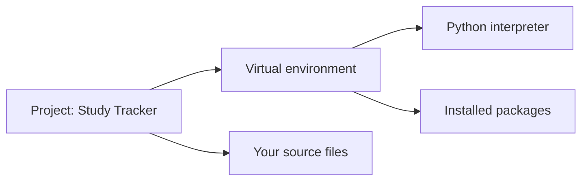

# Python Packages and Virtual Environments

> **A beginner-friendly guide to installing Python tools without tangling projects together**  
> Learn the difference between modules and packages, create an isolated environment, install dependencies, and run a project reliably.

---

## The one-minute picture

A **package** is reusable Python code you can install and import. A **virtual environment** is an isolated space for one project’s Python packages. It lets projects use different dependency versions without interfering with one another.



Think of each project as a workshop. Its virtual environment is that workshop’s own shelf of tools: adding or changing tools for one project does not rearrange the shelves used by another project.

---

## 1. Module, package, and distribution: what is the difference?

These words are related, but they mean different things:

- **Module**: usually one Python file, such as `helpers.py`.
- **Package (Python import package)**: a directory that organizes importable Python modules, such as `study_tools/`.
- **Distribution package**: an installable project published or shared for installation, commonly installed with `pip`. Its installation name may differ from the name you import.

For example, you might install a distribution named `beautifulsoup4`, then write `import bs4`. Install names and import names are not guaranteed to match.

---

## 2. Why use a virtual environment?

Without isolation, packages installed for one project may affect another. A virtual environment gives a project its own interpreter context and installed packages.

```text
Project A                 Project B
venv                      venv
├── package 1, version 1  ├── package 1, version 2
└── package 2             └── package 3
```

Benefits:

- project dependencies stay separate;
- one project can use a different package version from another;
- a project’s dependencies are easier to document and recreate;
- experiments are less likely to change your global Python setup.

A virtual environment does not copy every Python installation detail into the project. It uses a base Python interpreter and isolates the environment's package installation context.

---

## 3. Check that Python is available

In a terminal, check the Python version:

```text
python --version
```

On some systems, use:

```text
python3 --version
```

On Windows, the Python launcher may also work:

```text
py --version
```

Use a recent supported Python version suitable for your project. If a command is not found, Python may not be installed or may not be available on your shell's PATH.

---

## 4. Create a project and virtual environment

Move into your project folder, then use Python's built-in `venv` module to create an environment named `.venv`:

```text
mkdir study_tracker
cd study_tracker
python -m venv .venv
```

If your system uses `python3`, substitute that command:

```text
python3 -m venv .venv
```

The folder `.venv` contains the environment's interpreter and package area. The leading dot convention makes it less visually prominent on many systems, but any name can be used.

Typical layout:

```text
study_tracker/
├── .venv/              # generated environment; usually not committed
├── main.py
└── requirements.txt    # optional dependency list
```

Create the environment using the Python version you intend the project to use.

---

## 5. Activate the environment

Activation adjusts the current terminal session so `python` and `pip` point to the environment. The commands differ by shell and operating system.

### macOS or Linux: Bash/Zsh

```text
source .venv/bin/activate
```

### Windows: Command Prompt

```text
.venv\Scripts\activate.bat
```

### Windows: PowerShell

```text
.venv\Scripts\Activate.ps1
```

After activation, the environment name often appears at the beginning of the prompt, for example `(.venv)`. This is a visual hint; you can verify the selected interpreter with:

```text
python --version
```

To leave the environment, run:

```text
deactivate
```

Activation is convenient, but not strictly required. You can call the environment's interpreter directly if your workflow prefers that.

---

## 6. Install a package with `pip`

`pip` installs Python distributions into the currently selected environment. Activate `.venv` first, then install a package:

```text
python -m pip install requests
```

Using `python -m pip` helps ensure that `pip` belongs to the same interpreter selected by `python`.

Check the installation:

```text
python -m pip show requests
```

List installed packages:

```text
python -m pip list
```

Use package documentation to learn its import name and API. Installing a package and importing it are related but separate steps.

```python
import requests

response = requests.get("https://example.com")
print(response.status_code)
```

This example needs an internet connection when run. Many packages can be used without making network requests; installation alone does not imply any specific behavior.

---

## 7. Save project dependencies

A simple project can record dependencies in `requirements.txt`:

```text
requests==2.32.0
```

The exact version above is just an example. Use the version your project has chosen and verified.

Install listed dependencies into the active environment with:

```text
python -m pip install -r requirements.txt
```

For a small tutorial project, you can create this file yourself. To capture all currently installed packages, `pip freeze` can write a snapshot:

```text
python -m pip freeze > requirements.txt
```

Be deliberate with `pip freeze`: it records all packages visible in that environment, including indirect dependencies. For larger or distributed projects, dependency management tools may maintain version constraints and lock files more carefully.

---

## 8. Use a package in your code

After installation into the active environment, import the package using its documented import name:

```python
import requests
```

Some packages expose selected names:

```python
from pathlib import Path  # pathlib is in Python's standard library
```

If you see `ModuleNotFoundError`, the package may not be installed in the interpreter currently running your program. Check which Python is active and install with that interpreter's `python -m pip`.

---

## 9. Run your project with the environment's Python

With the environment activated:

```text
python main.py
```

Without activation, call the environment interpreter directly:

### macOS or Linux

```text
.venv/bin/python main.py
```

### Windows

```text
.venv\Scripts\python.exe main.py
```

This explicit form is useful in scripts, editors, and automation because it removes ambiguity about which Python runs the program.

---

## 10. Choose the virtual environment in VS Code

VS Code can use the project's environment as its Python interpreter.

1. Open the project folder (the one containing `.venv`) in VS Code.
2. Open the Command Palette.
3. Choose **Python: Select Interpreter**.
4. Select the Python interpreter inside the project's `.venv`.
5. Open a new terminal if the existing terminal has the wrong environment active.

Interpreter paths typically look like `.venv/bin/python` on macOS/Linux or `.venv\Scripts\python.exe` on Windows. Selecting an interpreter helps running, debugging, and language features use the same environment.

---

## 11. Keep generated environment files out of version control

Virtual environments can be large and machine-specific. Usually, do not commit `.venv/` to Git. Instead, commit your source code and dependency description.

A `.gitignore` can include:

```text
.venv/
__pycache__/
```

A collaborator can recreate the environment with `venv` and install the listed dependencies. A virtual environment is generally rebuilt on another machine rather than copied across operating systems.

---

## 12. A practical mini-project: isolated package demo

From a terminal, create and activate the environment, then install a small package:

```text
mkdir package_demo
cd package_demo
python -m venv .venv
source .venv/bin/activate          # macOS/Linux
# Windows PowerShell: .venv\Scripts\Activate.ps1
python -m pip install rich
```

Create `main.py`:

```python
from rich import print

print("[bold green]Environment is ready![/bold green]")
```

Run it:

```text
python main.py
```

Record the dependency:

```text
python -m pip freeze > requirements.txt
```

The point of the exercise is the workflow: create an isolated environment, install into it, import the package, run the project with its interpreter, and record dependencies.

---

## 13. Common problems and fixes

### `python` or `python3` is not found

Python may not be installed or may not be on PATH. Use the command available for your system (`python`, `python3`, or `py`) and ensure the intended Python installation is selected.

### `No module named ...` after installing

The package may have been installed into a different Python environment. Activate the project's `.venv`, then run `python -m pip install package-name` and launch with that same `python`.

### PowerShell blocks the activation script

Some Windows setups restrict scripts. You can use the Command Prompt activation command or run `.venv\Scripts\python.exe` directly. If changing PowerShell execution policy is needed, follow your organization's guidance rather than making a broad system change casually.

### `pip` is not found

Try `python -m pip --version`. Some Python installations need pip bootstrapped or repaired through their documented setup.

### Wrong Python version in the environment

A virtual environment uses the Python interpreter that created it. Create a new environment with the desired interpreter if you need a different version.

### Environment folder was moved or copied

Virtual environments are not generally portable. Recreate `.venv` at the new location and reinstall dependencies.

### Package name differs from import name

Check the package's documentation. The name used after `pip install` may not be the name used after `import`.

---

## 14. Quick reference map

```text
CREATE ENV       python -m venv .venv
ACTIVATE macOS   source .venv/bin/activate
ACTIVATE Win CMD .venv\Scripts\activate.bat
ACTIVATE PowerShell .venv\Scripts\Activate.ps1
INSTALL          python -m pip install package-name
SAVE DEPENDENCIES python -m pip freeze > requirements.txt
INSTALL LIST     python -m pip install -r requirements.txt
RUN              python main.py
DEACTIVATE       deactivate
```

### The most important mental checklist

1. **Am I in the project folder?** Create `.venv` there.
2. **Which interpreter is active?** Make sure it is the project's environment.
3. **Am I installing with that same interpreter?** Prefer `python -m pip`.
4. **Will another person need these dependencies?** Record them in a dependency file.
5. **Should `.venv` go in Git?** Usually no; commit source and dependency descriptions instead.

---

## 15. Practice (answers below)

1. What is a virtual environment for?
2. What command creates `.venv` using the current Python?
3. Why is `python -m pip install ...` often safer than just `pip install ...`?
4. Does installing a distribution guarantee its import name is identical?
5. What does `requirements.txt` commonly record?
6. Should you normally commit `.venv/` to Git?
7. What command installs dependencies from `requirements.txt`?
8. How do you leave an activated environment?
9. What does VS Code's selected interpreter control?
10. Why might a virtual environment not work after being copied to another machine?

<details>
<summary><strong>Show the answers</strong></summary>

1. It isolates a project's interpreter context and installed packages from other projects.
2. `python -m venv .venv` (or use the appropriate `python3`/`py` command).
3. It runs pip through the selected Python interpreter, helping install into the intended environment.
4. No; distribution and import names can differ.
5. Project dependencies, often with version constraints.
6. Usually not; recreate it and install dependencies instead.
7. `python -m pip install -r requirements.txt`.
8. `deactivate`.
9. Which interpreter VS Code uses to run, debug, and analyze the project.
10. Environments contain paths and interpreter details specific to their original machine and location.

</details>

---

## Final idea

Packages provide reusable tools; virtual environments keep each project's installed tools separate. Create an environment inside the project, install packages through its Python interpreter, record dependencies, and make sure your editor and terminal run the same environment. That simple routine prevents a large share of beginner package problems.
